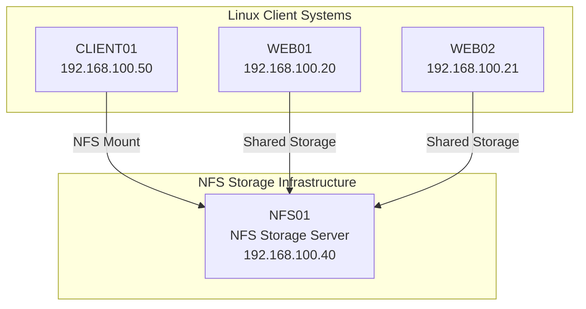
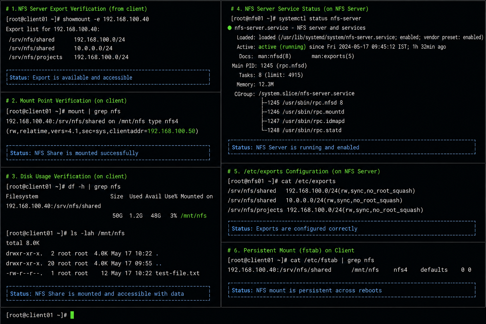

# NFS Shared Storage Architecture

Import the following Mermaid diagram into draw.io.



Recommended draw.io styling:

- Use dark enterprise theme
- Use green for storage server
- Use blue for client systems
- Use arrows showing NFS traffic flow
- Add title:
  Enterprise NFS Shared Storage Architecture

Operational Notes:

- Shared directory:
  /srv/nfs/shared

- NFS export file:
  /etc/exports

- NFS service:
  nfs-server

- Persistent mounts configured using:
  /etc/fstab

Validation Commands:

```bash
showmount -e 192.168.100.40
mount | grep nfs
systemctl status nfs-server
df -h
```

Screenshot Reference:



