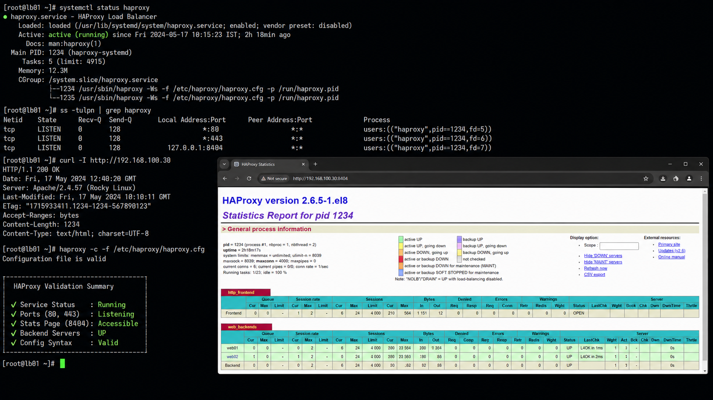

# HAProxy Load Balancer Architecture

## Overview

This document explains the HAProxy load balancing architecture used in enterprise Linux environments running RHEL 9.6.

HAProxy is commonly used for:

- reverse proxy services
- traffic distribution
- backend load balancing
- high availability
- web application scaling
- infrastructure resilience

The lab environment demonstrates a production-style load balancing workflow using HAProxy with Apache backend servers.

---

## HAProxy Traffic Flow

```text
Client Requests
        ↓
HAProxy Load Balancer
        ↓
Backend Web Servers
        ↓
Shared Storage / Application Data
```

---

## Enterprise Architecture Layout

| Component | Purpose |
|---|---|
| HAProxy Server | Traffic distribution and reverse proxy |
| Apache Web Servers | Backend application hosting |
| Shared Storage | Centralized application data |
| Client Systems | Web application access |

---

## Example Infrastructure

| Hostname | Role | IP Address |
|---|---|---|
| LB01 | HAProxy Load Balancer | 192.168.100.30 |
| WEB01 | Apache Backend Server | 192.168.100.20 |
| WEB02 | Apache Backend Server | 192.168.100.21 |
| NFS01 | Shared Storage Server | 192.168.100.40 |

---

## Administrative Validation

```bash
systemctl status haproxy
haproxy -c -f /etc/haproxy/haproxy.cfg
ss -tulpn | grep haproxy
curl http://192.168.100.30
```

---

## Enterprise Operations

Typical operational tasks include:

- validating backend server health
- monitoring frontend listeners
- testing failover behavior
- validating traffic distribution
- troubleshooting application availability
- verifying SSL termination

---

## Operational Notes

HAProxy is frequently used in enterprise environments because it provides:

- application scalability
- high availability
- centralized traffic management
- backend redundancy
- simplified maintenance windows

Administrators should validate:

- backend server availability
- listener configuration
- frontend/backend mapping
- service startup state
- firewall accessibility
- application response validation

---

## Screenshot Reference


