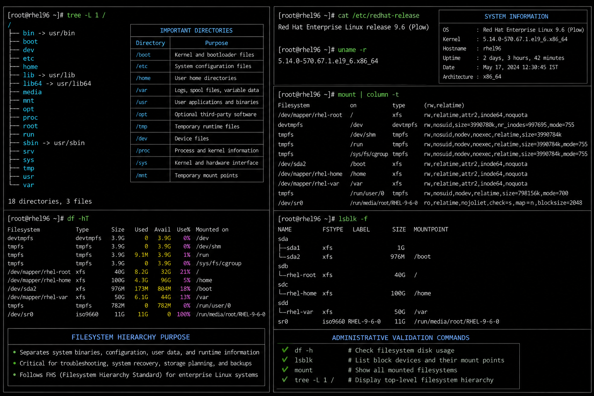

# Linux Filesystem Hierarchy

## Overview

This diagram represents the standard Linux filesystem hierarchy used in enterprise Linux environments such as Red Hat Enterprise Linux (RHEL) 9.6.

The filesystem hierarchy separates:
- boot files
- system binaries
- configuration files
- runtime data
- user data
- temporary storage
- application data

This structure is critical for:
- troubleshooting
- system recovery
- storage planning
- backup operations
- enterprise Linux administration

---

## Filesystem Layout

```text
/
├── /boot
├── /etc
├── /home
├── /var
├── /usr
├── /opt
├── /tmp
├── /dev
├── /proc
├── /sys
└── /mnt
```

---

## Important Directories

| Directory | Purpose |
|---|---|
| `/boot` | Kernel and bootloader files |
| `/etc` | System configuration files |
| `/home` | User home directories |
| `/var` | Logs, spool files, variable data |
| `/usr` | User applications and binaries |
| `/opt` | Optional third-party software |
| `/tmp` | Temporary runtime files |
| `/dev` | Device files |
| `/proc` | Process and kernel information |
| `/sys` | Kernel and hardware interface |
| `/mnt` | Temporary mount points |

---

## Administrative Validation

```bash
df -h
lsblk
mount
tree -L 1 /
```

---

## Operational Notes

Understanding the Linux filesystem hierarchy is essential for:

- incident response
- disk troubleshooting
- log analysis
- boot recovery
- backup operations
- Linux hardening
- storage expansion
- enterprise administration

---

## Screenshot Reference


