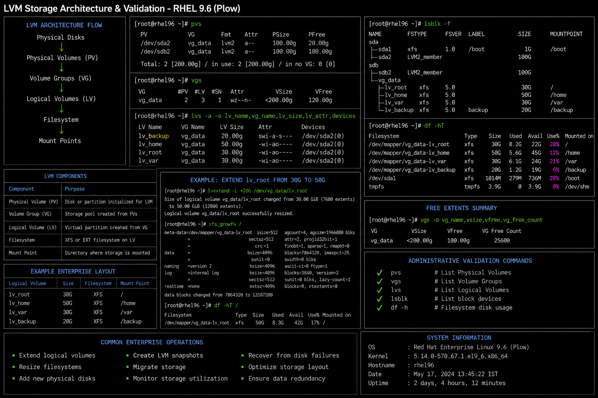

# LVM Storage Architecture

## Overview

This document explains the Logical Volume Manager (LVM) architecture used in enterprise Linux environments running RHEL 9.6.

LVM provides flexible storage management for:

- dynamic disk expansion
- filesystem growth
- enterprise storage management
- snapshot operations
- storage abstraction
- disaster recovery workflows

LVM is widely used in enterprise Linux infrastructure because it allows storage to be resized and managed without major downtime.

---

## LVM Architecture Flow

```text
Physical Disks
   ↓
Physical Volumes (PV)
   ↓
Volume Groups (VG)
   ↓
Logical Volumes (LV)
   ↓
Filesystem
   ↓
Mount Points
```

---

## LVM Components

| Component | Purpose |
|---|---|
| Physical Volume (PV) | Disk or partition initialized for LVM |
| Volume Group (VG) | Storage pool created from PVs |
| Logical Volume (LV) | Virtual partition created from VG |
| Filesystem | XFS or EXT filesystem created on LV |
| Mount Point | Directory where storage is mounted |

---

## Example Enterprise Layout

| Logical Volume | Mount Point |
|---|---|
| lv_root | `/` |
| lv_home | `/home` |
| lv_var | `/var` |
| lv_backup | `/backup` |

---

## Administrative Validation

```bash
pvs
vgs
lvs
lsblk
df -h
```

---

## Common Enterprise Operations

Typical LVM administration tasks include:

- extending logical volumes
- resizing filesystems
- adding physical disks
- creating storage snapshots
- migrating storage
- recovering damaged storage layouts

---

## Operational Notes

LVM is commonly used in enterprise environments because it allows:

- storage scalability
- flexible disk management
- simplified expansion workflows
- safer storage maintenance
- improved disaster recovery planning

Administrators should validate:

- available free extents
- volume group health
- logical volume mappings
- filesystem integrity
- mount consistency

---

## Screenshot Reference


