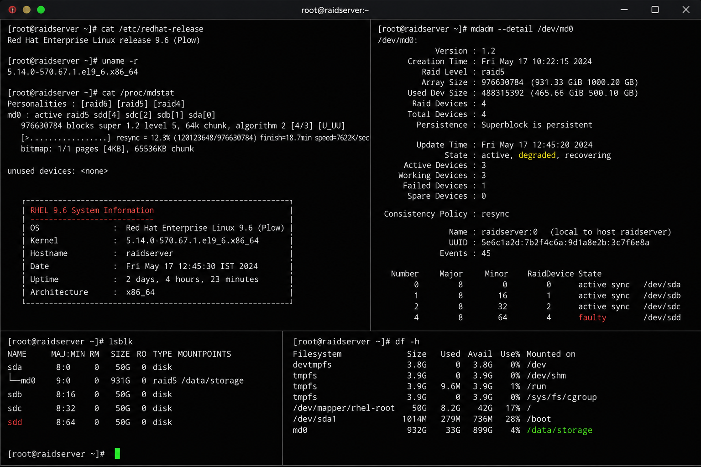

# RAID Levels Overview

## Overview

This document explains common RAID levels used in enterprise Linux infrastructure environments running RHEL 9.6.

RAID (Redundant Array of Independent Disks) improves:

- storage availability
- performance
- redundancy
- fault tolerance
- enterprise storage reliability

Linux RAID configurations are commonly managed using:

```bash
mdadm
```

---

## RAID Level Comparison

| RAID Level | Minimum Disks | Redundancy | Performance | Description |
|---|---|---|---|---|
| RAID 0 | 2 | None | High | Disk striping without redundancy |
| RAID 1 | 2 | High | Medium | Disk mirroring |
| RAID 5 | 3 | Medium | Good | Striping with parity |
| RAID 6 | 4 | High | Good | Dual parity protection |
| RAID 10 | 4 | High | Excellent | Mirroring + striping |

---

## Enterprise RAID Usage

| RAID Level | Common Enterprise Usage |
|---|---|
| RAID 1 | Operating system disks |
| RAID 5 | General file storage |
| RAID 6 | Critical storage arrays |
| RAID 10 | Database and virtualization workloads |

---

## RAID Architecture Example

```text
Physical Disks
   ↓
mdadm RAID Array
   ↓
Filesystem
   ↓
Mount Point
```

---

## Administrative Validation

```bash
cat /proc/mdstat
mdadm --detail /dev/md0
lsblk
df -h
```

---

## Enterprise RAID Operations

Common enterprise RAID tasks include:

- monitoring degraded arrays
- replacing failed disks
- rebuilding RAID arrays
- validating synchronization
- expanding RAID storage
- monitoring storage performance

---

## Operational Notes

Enterprise administrators should routinely validate:

- RAID synchronization state
- failed disk alerts
- filesystem integrity
- available storage capacity
- rebuild progress
- mount consistency

RAID monitoring is critical for:

- disaster recovery planning
- storage resilience
- business continuity
- infrastructure reliability

---

## Screenshot Reference



