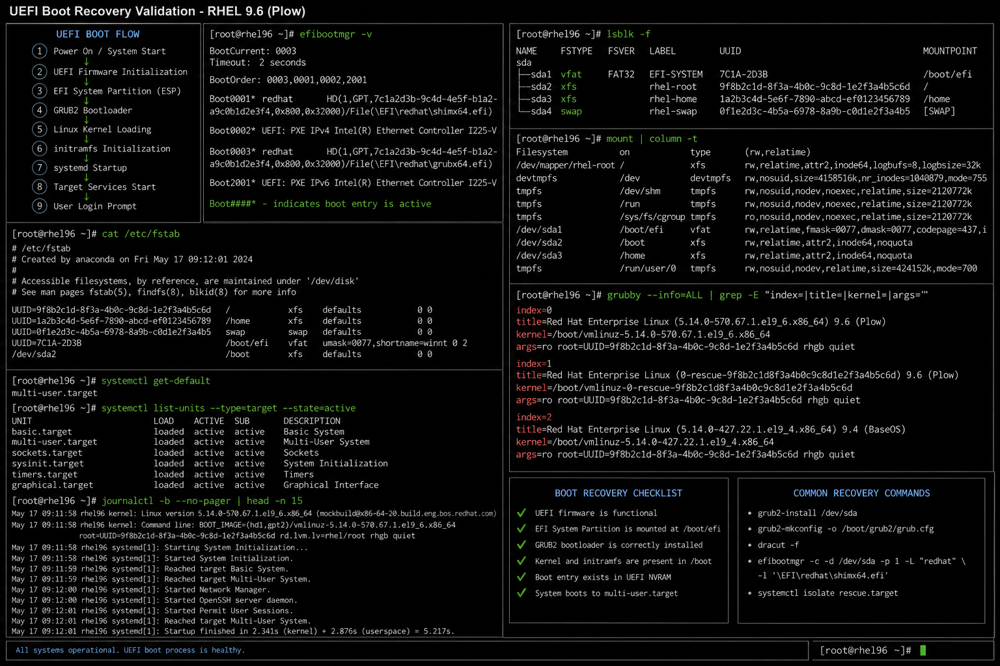

# UEFI Boot Process Flow

## Overview

This document explains the enterprise Linux UEFI boot workflow used in Red Hat Enterprise Linux 9.6 environments.

Understanding the Linux boot process is critical for:

- boot recovery
- GRUB troubleshooting
- disaster recovery
- kernel troubleshooting
- enterprise Linux administration
- infrastructure incident response

---

## UEFI Boot Flow

```text
Power On
   ↓
UEFI Firmware Initialization
   ↓
EFI System Partition (ESP)
   ↓
GRUB2 Bootloader
   ↓
Linux Kernel Loading
   ↓
initramfs Initialization
   ↓
systemd Startup
   ↓
Target Services Start
   ↓
User Login Prompt
```

---

## Boot Components

| Component | Purpose |
|---|---|
| UEFI Firmware | Hardware initialization and boot management |
| EFI System Partition | Stores EFI boot files |
| GRUB2 | Linux bootloader |
| Linux Kernel | Core operating system |
| initramfs | Temporary root filesystem during boot |
| systemd | Service and process manager |
| Target Units | System startup targets and services |

---

## Important Paths

| Path | Description |
|---|---|
| `/boot` | Kernel and boot files |
| `/boot/efi` | EFI System Partition mount point |
| `/etc/default/grub` | GRUB configuration |
| `/boot/grub2/grub.cfg` | GRUB generated configuration |
| `/etc/fstab` | Filesystem mount configuration |

---

## Administrative Validation

```bash
efibootmgr
lsblk
cat /etc/fstab
systemctl get-default
journalctl -b
```

---

## Recovery Operations

Common enterprise recovery tasks include:

- GRUB recovery
- initramfs rebuild
- EFI boot entry recreation
- root password reset
- kernel rollback
- rescue mode troubleshooting

---

## Operational Notes

UEFI boot troubleshooting is commonly required during:

- failed system upgrades
- corrupted bootloader states
- storage migration
- filesystem corruption
- virtualization migration
- kernel update failures

Enterprise administrators should always validate:

- EFI partition mounts
- GRUB configuration
- boot entry consistency
- kernel integrity
- filesystem UUID mappings

---

## Screenshot Reference



