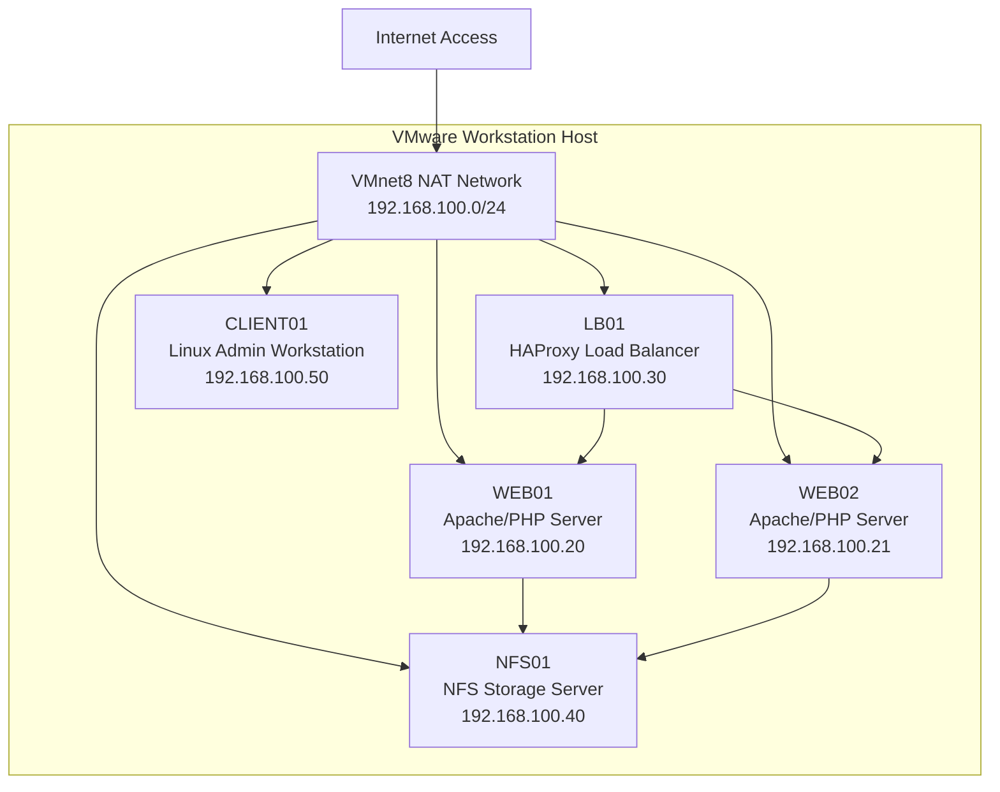

# VMware Enterprise Linux Lab Network Topology

Import the following Mermaid diagram into draw.io.



Recommended draw.io styling:

- Use dark enterprise theme
- Use blue for infrastructure servers
- Use orange for HAProxy node
- Use green for client workstation
- Use directional arrows for traffic flow
- Add title:
  VMware Enterprise Linux Infrastructure Lab

Infrastructure Notes:

- Hypervisor:
  VMware Workstation

- Network Type:
  NAT (VMnet8)

- Linux Distribution:
  Red Hat Enterprise Linux 9.6

- Core Services:
  - HAProxy
  - Apache HTTP Server
  - NFS Shared Storage

Operational Workflow:

- CLIENT01 validates infrastructure access
- LB01 distributes traffic to backend servers
- WEB01 and WEB02 host applications
- NFS01 provides centralized storage

Administrative Validation Commands:

```bash
ip addr
ping 192.168.100.30
ss -tulpn
systemctl status haproxy
showmount -e 192.168.100.40
```

Screenshot Reference:


