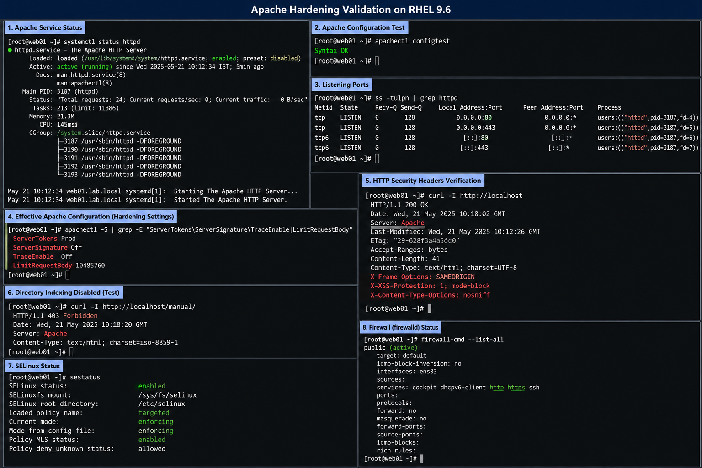

# Apache HTTP Server Security Hardening

## Objective

Configure enterprise-style Apache HTTP Server hardening controls on RHEL 9.6 to reduce attack surface, improve baseline security, and align with operational security practices used in production Linux environments.

---

# Why It Matters

Apache hardening helps protect Linux web servers from:

- information disclosure
- directory browsing
- HTTP method abuse
- malicious uploads
- web reconnaissance
- insecure default configurations

Enterprise administrators should apply baseline hardening before exposing web services to internal or external networks.

---

# Environment Information

| Component | Value |
|---|---|
| Operating System | RHEL 9.6 |
| Web Server | Apache HTTP Server |
| Service Name | `httpd` |
| Configuration File | `/etc/httpd/conf/httpd.conf` |
| Firewall Service | `firewalld` |
| SELinux Mode | Enforcing |

---

# Hardening Configuration

## Apache Security Configuration

```apache
# Hide Apache version information
ServerTokens Prod
ServerSignature Off

# Disable HTTP TRACE method
TraceEnable Off

# Restrict filesystem root access
<Directory />
    AllowOverride None
    Require all denied
</Directory>

# Secure default web root permissions
<Directory "/var/www/html">

    Options -Indexes +FollowSymLinks

    AllowOverride None

    Require all granted

</Directory>

# Disable directory listing globally
IndexIgnore *

# Limit HTTP request body size
LimitRequestBody 10485760

# Security-related HTTP headers
Header always append X-Frame-Options SAMEORIGIN
Header set X-XSS-Protection "1; mode=block"
Header set X-Content-Type-Options nosniff

# Timeout hardening
Timeout 60
KeepAlive On
MaxKeepAliveRequests 100
KeepAliveTimeout 5

# Logging configuration
ErrorLog logs/hardening-error.log

LogLevel warn
```

---

# Configuration Deployment Procedure

## Backup Existing Configuration

```bash
sudo cp /etc/httpd/conf/httpd.conf /etc/httpd/conf/httpd.conf.bak
```

## Edit Apache Configuration

```bash
sudo vi /etc/httpd/conf/httpd.conf
```

## Validate Apache Configuration

```bash
sudo apachectl configtest
```

## Restart Apache Service

```bash
sudo systemctl restart httpd
```

## Verify Service Status

```bash
sudo systemctl status httpd
```

---

# Firewall Validation

## Allow HTTP And HTTPS Services

```bash
sudo firewall-cmd --add-service=http --permanent
sudo firewall-cmd --add-service=https --permanent
sudo firewall-cmd --reload
```

## Validate Firewall Configuration

```bash
sudo firewall-cmd --list-all
```

---

# SELinux Validation

## Verify SELinux Mode

```bash
getenforce
```

## Restore Web Content Contexts

```bash
sudo restorecon -Rv /var/www/html
```

## Verify HTTPD SELinux Contexts

```bash
sudo semanage fcontext -l | grep httpd
```

---

# Verification

## Validate Apache Listener

```bash
ss -tulpn | grep httpd
```

## Test Local Web Access

```bash
curl http://localhost
```

## Verify HTTP Security Headers

```bash
curl -I http://localhost
```

---

# Common Issues And Fixes

| Issue | Cause | Resolution |
|---|---|---|
| Apache service fails to start | Invalid configuration syntax | Run `apachectl configtest` |
| HTTP access blocked | Firewall restrictions | Allow HTTP service in `firewalld` |
| Permission denied errors | SELinux context mismatch | Run `restorecon` |
| Directory listing visible | `Indexes` option enabled | Disable directory indexing |

---

# Operational Quality Notes

This hardening configuration is designed for enterprise-style Linux administration environments running RHEL 9.6.

Administrators should always validate:

- Apache configuration syntax
- firewall accessibility
- SELinux permissions
- service startup state
- backend application functionality
- log file generation

Configuration changes should be documented before production deployment.

---

# Screenshot Capture

| Screenshot Requirement | Filename |
|---|---|
| Apache hardening validation | `apache-hardening-validation.png` |

---

# Screenshot Reference


