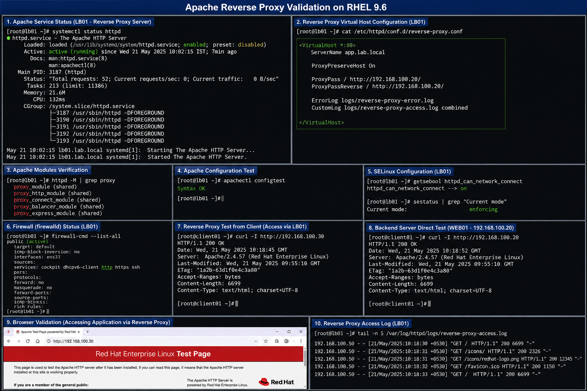

# Apache Reverse Proxy Configuration

## Objective

Configure Apache HTTP Server as a reverse proxy in a RHEL 9.6 enterprise Linux environment to forward client requests to backend application servers while improving traffic management and operational flexibility.

---

# Why It Matters

Reverse proxy deployments are commonly used in enterprise environments for:

- backend application publishing
- centralized traffic routing
- load balancing preparation
- SSL termination
- application isolation
- simplified infrastructure management

Apache reverse proxy services improve scalability and operational control across multi-server environments.

---

# Environment Information

| Component | Value |
|---|---|
| Operating System | RHEL 9.6 |
| Web Server | Apache HTTP Server |
| Backend Server | `WEB01` |
| Backend IP Address | `192.168.100.20` |
| Proxy Server | `LB01` |
| Proxy Service | `httpd` |

---

# Apache Reverse Proxy Configuration

## Reverse Proxy Virtual Host

```apache
<VirtualHost *:80>

    ServerName app.lab.local

    ProxyPreserveHost On

    ProxyPass / http://192.168.100.20/
    ProxyPassReverse / http://192.168.100.20/

    ErrorLog logs/reverse-proxy-error.log
    CustomLog logs/reverse-proxy-access.log combined

</VirtualHost>
```

---

# Required Apache Modules

## Enable Proxy Modules

```bash
sudo httpd -M | grep proxy
```

## Verify Installed Modules

```bash
proxy_module
proxy_http_module
```

---

# Deployment Procedure

## Backup Existing Configuration

```bash
sudo cp /etc/httpd/conf/httpd.conf /etc/httpd/conf/httpd.conf.bak
```

## Create Reverse Proxy Configuration

```bash
sudo vi /etc/httpd/conf.d/reverse-proxy.conf
```

## Validate Apache Configuration

```bash
sudo apachectl configtest
```

## Restart Apache Service

```bash
sudo systemctl restart httpd
```

---

# Firewall Validation

## Allow HTTP Traffic

```bash
sudo firewall-cmd --add-service=http --permanent
sudo firewall-cmd --reload
```

## Validate Firewall Rules

```bash
sudo firewall-cmd --list-all
```

---

# SELinux Validation

## Verify SELinux Mode

```bash
getenforce
```

## Allow Network Proxy Connections

```bash
sudo setsebool -P httpd_can_network_connect on
```

## Verify SELinux Boolean

```bash
getsebool httpd_can_network_connect
```

---

# Verification

## Validate Apache Listener

```bash
ss -tulpn | grep httpd
```

## Test Reverse Proxy Access

```bash
curl http://192.168.100.30
```

## Verify Backend Connectivity

```bash
curl http://192.168.100.20
```

## Validate Apache Service Status

```bash
systemctl status httpd
```

---

# Common Issues And Fixes

| Issue | Cause | Resolution |
|---|---|---|
| Proxy returns 503 | Backend server unavailable | Verify backend Apache service |
| Permission denied errors | SELinux blocking proxy traffic | Enable `httpd_can_network_connect` |
| Apache fails to restart | Invalid syntax | Run `apachectl configtest` |
| Client cannot connect | Firewall restrictions | Allow HTTP service in `firewalld` |

---

# Operational Quality Notes

This reverse proxy deployment is designed for enterprise-style Linux infrastructure environments using RHEL 9.6.

Enterprise administrators should validate:

- backend server availability
- reverse proxy mappings
- firewall accessibility
- SELinux configuration
- application response validation
- Apache service stability

Reverse proxy services should be monitored regularly for backend connectivity failures and abnormal response behavior.

---

# Screenshot Capture

| Screenshot Requirement | Filename |
|---|---|
| Apache reverse proxy validation | `apache-reverse-proxy-validation.png` |

---

# Screenshot Reference


