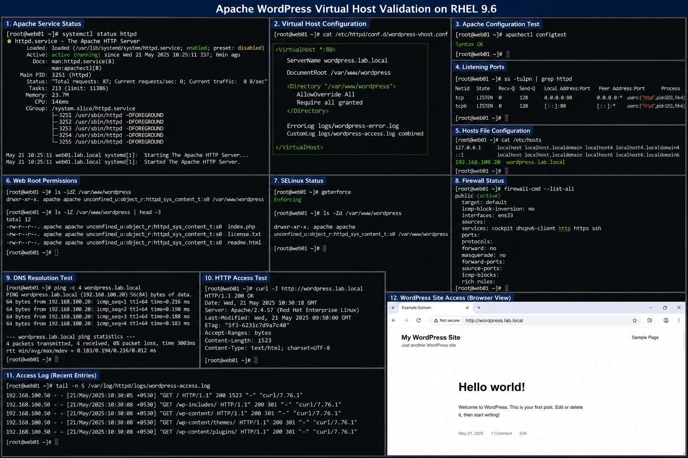

# Apache WordPress Virtual Host Configuration

## Objective

Deploy and configure an Apache virtual host for a WordPress application in a RHEL 9.6 enterprise Linux environment using production-style web server configuration and operational validation procedures.

---

# Why It Matters

Virtual hosts allow Apache HTTP Server to host multiple applications securely and efficiently on the same server.

Enterprise environments use virtual hosts for:

- application separation
- domain-based hosting
- centralized web management
- application scalability
- secure multi-site deployments
- operational flexibility

WordPress deployments are commonly used for internal portals, documentation platforms, and business web applications.

---

# Environment Information

| Component | Value |
|---|---|
| Operating System | RHEL 9.6 |
| Web Server | Apache HTTP Server |
| Application | WordPress |
| Virtual Host Name | `wordpress.lab.local` |
| Web Root | `/var/www/wordpress` |
| Service Name | `httpd` |

---

# Apache Virtual Host Configuration

## WordPress Virtual Host

```apache
<VirtualHost *:80>

    ServerName wordpress.lab.local

    DocumentRoot /var/www/wordpress

    <Directory "/var/www/wordpress">

        AllowOverride All

        Require all granted

    </Directory>

    ErrorLog logs/wordpress-error.log
    CustomLog logs/wordpress-access.log combined

</VirtualHost>
```

---

# Deployment Procedure

## Create WordPress Web Root

```bash
sudo mkdir -p /var/www/wordpress
```

## Configure Permissions

```bash
sudo chown -R apache:apache /var/www/wordpress
sudo chmod -R 755 /var/www/wordpress
```

## Create Apache Configuration File

```bash
sudo vi /etc/httpd/conf.d/wordpress-vhost.conf
```

## Validate Apache Configuration

```bash
sudo apachectl configtest
```

## Restart Apache Service

```bash
sudo systemctl restart httpd
```

---

# DNS Validation

## Add Local Host Entry

```bash
sudo vi /etc/hosts
```

## Example Host Mapping

```text
192.168.100.20 wordpress.lab.local
```

## Validate DNS Resolution

```bash
ping wordpress.lab.local
```

---

# Firewall Validation

## Allow HTTP Traffic

```bash
sudo firewall-cmd --add-service=http --permanent
sudo firewall-cmd --reload
```

## Verify Firewall Configuration

```bash
sudo firewall-cmd --list-all
```

---

# SELinux Validation

## Verify SELinux Mode

```bash
getenforce
```

## Restore WordPress Contexts

```bash
sudo restorecon -Rv /var/www/wordpress
```

## Verify HTTPD Contexts

```bash
ls -Zd /var/www/wordpress
```

---

# Verification

## Validate Apache Listener

```bash
ss -tulpn | grep httpd
```

## Test Virtual Host Access

```bash
curl http://wordpress.lab.local
```

## Validate Apache Service Status

```bash
systemctl status httpd
```

## Verify Website Access

Open browser and navigate to:

```text
http://wordpress.lab.local
```

---

# Common Issues And Fixes

| Issue | Cause | Resolution |
|---|---|---|
| Apache fails to start | Invalid virtual host syntax | Run `apachectl configtest` |
| Access denied errors | Incorrect filesystem permissions | Validate ownership and SELinux |
| Website not accessible | Firewall restrictions | Allow HTTP service |
| WordPress page not loading | DNS resolution issue | Verify `/etc/hosts` entry |

---

# Operational Quality Notes

This virtual host deployment follows enterprise Linux administration practices used in RHEL 9.6 environments.

Enterprise administrators should validate:

- Apache configuration syntax
- virtual host mappings
- DNS resolution
- firewall accessibility
- SELinux contexts
- application ownership and permissions

WordPress deployments should also be monitored for:

- unauthorized plugin installation
- weak permissions
- exposed admin interfaces
- outdated packages

---

# Screenshot Capture

| Screenshot Requirement | Filename |
|---|---|
| Apache WordPress virtual host validation | `apache-wordpress-vhost-validation.png` |

---

# Screenshot Reference


