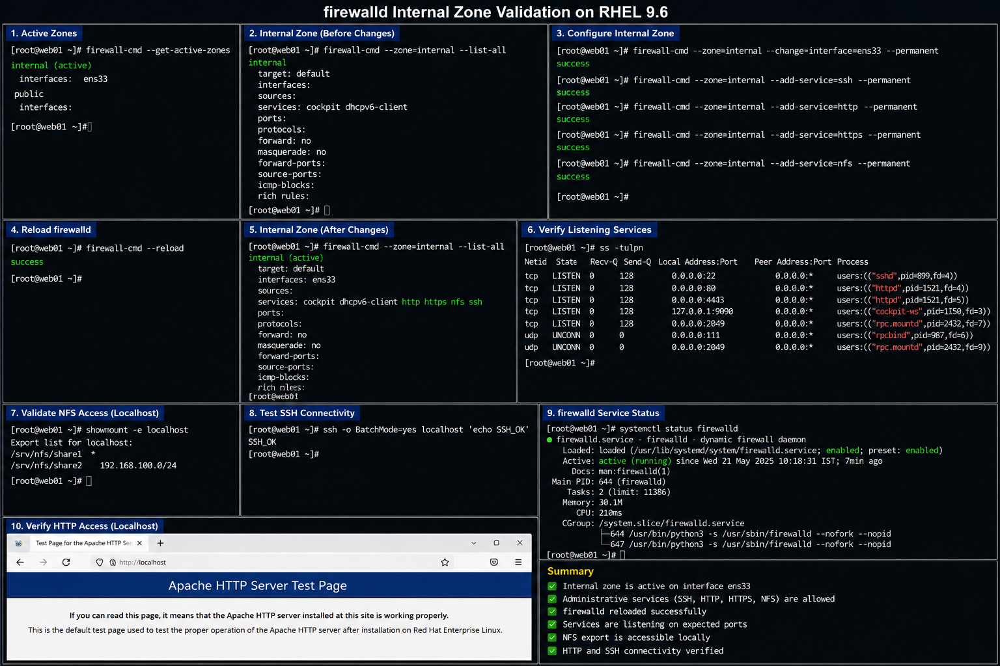

# firewalld Internal Zone Configuration

## Objective

Configure the `internal` firewalld zone in a RHEL 9.6 enterprise Linux environment to securely manage trusted internal network traffic while limiting unnecessary exposure to external systems.

---

# Why It Matters

The `internal` zone is typically assigned to trusted enterprise network segments.

Enterprise administrators use the internal zone to:

- separate trusted internal traffic
- allow administrative services securely
- restrict external exposure
- improve network segmentation
- support infrastructure communication
- maintain operational security boundaries

Improper internal zone configuration can expose administrative services or disrupt infrastructure communication.

---

# Environment Information

| Component | Value |
|---|---|
| Operating System | RHEL 9.6 |
| Firewall Service | `firewalld` |
| Zone Name | `internal` |
| Firewall Backend | `nftables` |
| Network Interface | `ens33` |

---

# Internal Zone Configuration

## View Active Zones

```bash
sudo firewall-cmd --get-active-zones
```

## View Internal Zone Configuration

```bash
sudo firewall-cmd --zone=internal --list-all
```

## Assign Interface To Internal Zone

```bash
sudo firewall-cmd --zone=internal --change-interface=ens33 --permanent
```

## Allow Administrative Services

```bash
sudo firewall-cmd --zone=internal --add-service=ssh --permanent
sudo firewall-cmd --zone=internal --add-service=http --permanent
sudo firewall-cmd --zone=internal --add-service=https --permanent
sudo firewall-cmd --zone=internal --add-service=nfs --permanent
```

## Reload firewalld Configuration

```bash
sudo firewall-cmd --reload
```

---

# Example Internal Zone Output

```text
internal (active)

  target: default

  interfaces: ens33

  services: cockpit dhcpv6-client http https nfs ssh

  ports:

  protocols:

  forward: no

  masquerade: no

  rich rules:
```

---

# Administrative Validation

## Verify Internal Zone Rules

```bash
sudo firewall-cmd --zone=internal --list-all
```

## Verify Listening Services

```bash
ss -tulpn
```

## Validate NFS Access

```bash
showmount -e localhost
```

## Validate SSH Connectivity

```bash
ssh localhost
```

---

# Service Management

## Verify firewalld Status

```bash
sudo systemctl status firewalld
```

## Restart firewalld

```bash
sudo systemctl restart firewalld
```

## Enable firewalld At Boot

```bash
sudo systemctl enable firewalld
```

---

# Common Issues And Fixes

| Issue | Cause | Resolution |
|---|---|---|
| Internal services unreachable | Service not allowed in zone | Add service to internal zone |
| Incorrect interface assignment | Wrong zone mapping | Verify active interfaces |
| Rules disappear after reboot | Missing `--permanent` flag | Reapply permanent rules |
| NFS connectivity failure | Missing NFS service rule | Allow NFS in internal zone |

---

# Operational Quality Notes

This configuration reflects enterprise firewall segmentation practices commonly used in RHEL 9.6 environments.

Enterprise administrators should validate:

- internal interface assignments
- administrative service accessibility
- trusted network segmentation
- firewall persistence
- NFS connectivity
- exposed internal services

Firewall changes should always be validated from trusted client systems after deployment.

---

# Screenshot Capture

| Screenshot Requirement | Filename |
|---|---|
| firewalld internal zone validation | `firewalld-internal-zone-validation.png` |

---

# Screenshot Reference


