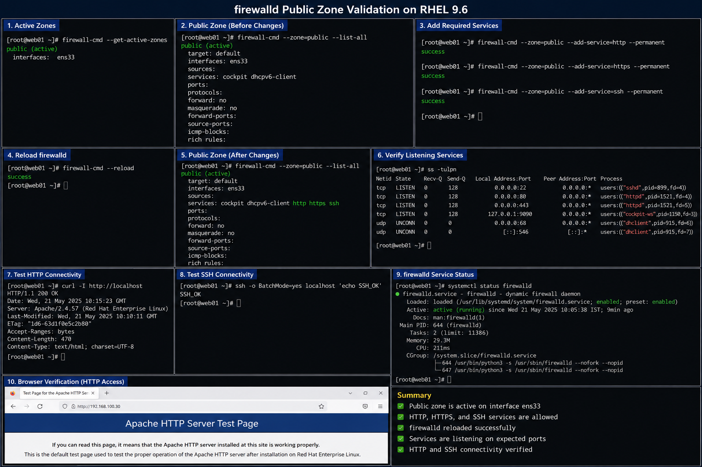

# firewalld Public Zone Configuration

## Objective

Configure the `public` firewalld zone in a RHEL 9.6 enterprise Linux environment to securely allow required inbound services while restricting unnecessary network exposure.

---

# Why It Matters

The `public` zone is commonly assigned to interfaces exposed to less trusted or external networks.

Enterprise administrators use the public zone to:

- allow controlled inbound traffic
- reduce attack surface
- separate trusted and untrusted traffic
- enforce network security policy
- validate service accessibility

Improper firewall configuration can expose services unnecessarily or block critical infrastructure communication.

---

# Environment Information

| Component | Value |
|---|---|
| Operating System | RHEL 9.6 |
| Firewall Service | `firewalld` |
| Zone Name | `public` |
| Firewall Backend | `nftables` |
| Network Interface | `ens33` |

---

# Public Zone Configuration

## View Active Zones

```bash
sudo firewall-cmd --get-active-zones
```

## View Public Zone Configuration

```bash
sudo firewall-cmd --zone=public --list-all
```

## Allow HTTP And HTTPS Services

```bash
sudo firewall-cmd --zone=public --add-service=http --permanent
sudo firewall-cmd --zone=public --add-service=https --permanent
```

## Allow SSH Access

```bash
sudo firewall-cmd --zone=public --add-service=ssh --permanent
```

## Reload firewalld Configuration

```bash
sudo firewall-cmd --reload
```

---

# Example Public Zone Output

```text
public (active)

  target: default

  interfaces: ens33

  services: cockpit dhcpv6-client http https ssh

  ports:

  protocols:

  forward: no

  masquerade: no

  rich rules:
```

---

# Administrative Validation

## Verify Active Rules

```bash
sudo firewall-cmd --zone=public --list-all
```

## Verify Listening Services

```bash
ss -tulpn
```

## Validate HTTP Connectivity

```bash
curl http://localhost
```

## Validate SSH Connectivity

```bash
ssh localhost
```

---

# Service Management

## Verify firewalld Status

```bash
sudo systemctl status firewalld
```

## Restart firewalld

```bash
sudo systemctl restart firewalld
```

## Enable firewalld At Boot

```bash
sudo systemctl enable firewalld
```

---

# Common Issues And Fixes

| Issue | Cause | Resolution |
|---|---|---|
| Service unreachable | Firewall service not allowed | Add service to zone |
| Rules disappear after reboot | Missing `--permanent` flag | Reapply permanent rules |
| Incorrect interface assignment | Wrong zone mapping | Verify active zones |
| SSH blocked | SSH service missing | Add SSH service to public zone |

---

# Operational Quality Notes

This configuration reflects enterprise firewall management practices commonly used in RHEL 9.6 environments.

Enterprise administrators should validate:

- active zone assignments
- listening services
- firewall persistence
- exposed network ports
- service accessibility
- unauthorized open ports

Firewall modifications should be tested carefully before production deployment.

---

# Screenshot Capture

| Screenshot Requirement | Filename |
|---|---|
| firewalld public zone validation | `firewalld-public-zone-validation.png` |

---

# Screenshot Reference


