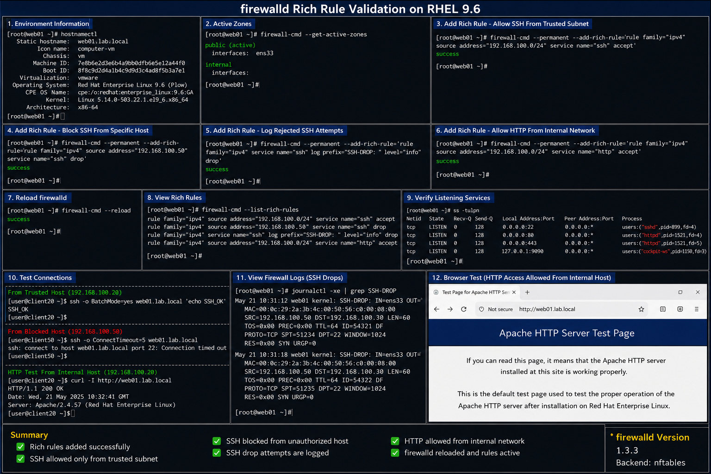

# firewalld Rich Rule Examples

## Objective

Implement advanced firewalld rich rules in a RHEL 9.6 enterprise Linux environment to provide granular network filtering, source-based access control, logging, and traffic restriction policies.

---

# Why It Matters

Rich rules allow enterprise administrators to create advanced firewall policies beyond basic service-based filtering.

Rich rules are commonly used for:

- source IP restrictions
- network segmentation
- administrative access control
- logging suspicious activity
- limiting management access
- enforcing enterprise security policy

These controls improve visibility and reduce unauthorized access exposure.

---

# Environment Information

| Component | Value |
|---|---|
| Operating System | RHEL 9.6 |
| Firewall Service | `firewalld` |
| Firewall Backend | `nftables` |
| Interface | `ens33` |
| Trusted Management Network | `192.168.100.0/24` |

---

# Rich Rule Examples

## Allow SSH Only From Trusted Subnet

```bash
sudo firewall-cmd \
--permanent \
--add-rich-rule='rule family="ipv4" \
source address="192.168.100.0/24" \
service name="ssh" accept'
```

---

## Block SSH From Specific Host

```bash
sudo firewall-cmd \
--permanent \
--add-rich-rule='rule family="ipv4" \
source address="192.168.100.50" \
service name="ssh" drop'
```

---

## Log Rejected SSH Attempts

```bash
sudo firewall-cmd \
--permanent \
--add-rich-rule='rule family="ipv4" \
service name="ssh" \
log prefix="SSH-DROP: " level="info" \
drop'
```

---

## Allow HTTP Access From Internal Network

```bash
sudo firewall-cmd \
--permanent \
--add-rich-rule='rule family="ipv4" \
source address="192.168.100.0/24" \
service name="http" accept'
```

---

## Reload firewalld Configuration

```bash
sudo firewall-cmd --reload
```

---

# Administrative Validation

## View Rich Rules

```bash
sudo firewall-cmd --list-rich-rules
```

## Verify Active Zones

```bash
sudo firewall-cmd --get-active-zones
```

## Verify Listening Services

```bash
ss -tulpn
```

## Validate SSH Connectivity

```bash
ssh localhost
```

---

# Log Validation

## View Firewall Logs

```bash
sudo journalctl -xe | grep SSH-DROP
```

## Monitor Real-Time Logs

```bash
sudo tail -f /var/log/messages
```

---

# Common Issues And Fixes

| Issue | Cause | Resolution |
|---|---|---|
| Rules not applied | firewalld not reloaded | Run `firewall-cmd --reload` |
| SSH blocked unexpectedly | Incorrect source rule | Validate source subnet |
| Logging not visible | Journal filtering issue | Review `journalctl` output |
| Duplicate rules | Repeated rule insertion | Remove duplicate rich rules |

---

# Operational Quality Notes

This configuration reflects enterprise Linux firewall management practices used in RHEL 9.6 environments.

Enterprise administrators should validate:

- source network restrictions
- firewall logging visibility
- administrative access policies
- unauthorized access attempts
- firewall persistence
- rule ordering and behavior

Rich rules should be tested carefully before deployment into production environments.

---

# Screenshot Capture

| Screenshot Requirement | Filename |
|---|---|
| firewalld rich rule validation | `firewalld-rich-rule-validation.png` |

---

# Screenshot Reference


