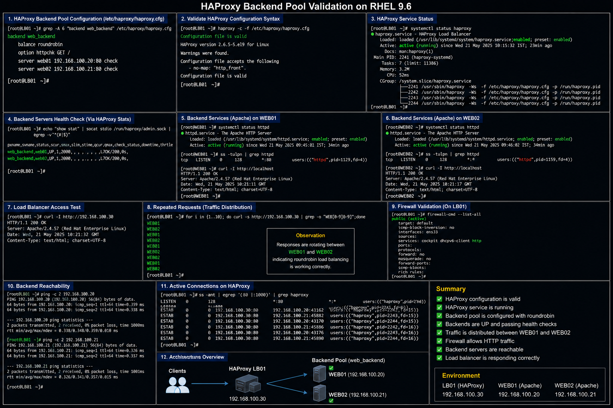

# HAProxy Backend Pool Configuration

## Objective

Configure and validate HAProxy backend server pools in a RHEL 9.6 enterprise Linux environment to ensure proper traffic distribution, backend health monitoring, and high availability operations.

---

# Why It Matters

Backend pools are critical to enterprise load balancing because they:

- distribute application traffic
- improve application availability
- support failover operations
- reduce single points of failure
- improve scalability
- allow backend health validation

Improper backend configuration can cause service outages, failed requests, or uneven traffic distribution.

---

# Environment Information

| Component | Value |
|---|---|
| Operating System | RHEL 9.6 |
| Load Balancer | HAProxy |
| Frontend Server | `LB01` |
| Backend Servers | `WEB01`, `WEB02` |
| Backend Network | `192.168.100.0/24` |
| Backend Service | Apache HTTP Server |

---

# HAProxy Backend Pool Configuration

## Backend Pool Definition

```haproxy
backend web_backend

    balance roundrobin

    option httpchk GET /

    server web01 192.168.100.20:80 check

    server web02 192.168.100.21:80 check
```

---

# Deployment Procedure

## Edit HAProxy Configuration

```bash
sudo vi /etc/haproxy/haproxy.cfg
```

## Validate Configuration Syntax

```bash
sudo haproxy -c -f /etc/haproxy/haproxy.cfg
```

## Restart HAProxy Service

```bash
sudo systemctl restart haproxy
```

## Verify Backend Services

```bash
curl http://192.168.100.20
curl http://192.168.100.21
```

---

# Backend Health Validation

## Verify Apache Services On Backend Servers

```bash
systemctl status httpd
```

## Verify Listening Ports

```bash
ss -tulpn | grep httpd
```

## Test Backend Connectivity

```bash
curl -I http://192.168.100.20
curl -I http://192.168.100.21
```

---

# Load Balancing Validation

## Test HAProxy Access

```bash
curl http://192.168.100.30
```

## Repeated Validation Requests

```bash
for i in {1..10}; do curl http://192.168.100.30; done
```

## Verify Backend Rotation

Validate backend responses rotate between:

```text
WEB01
WEB02
```

---

# Firewall Validation

## Allow HTTP Traffic

```bash
sudo firewall-cmd --add-service=http --permanent
sudo firewall-cmd --reload
```

## Verify Firewall Configuration

```bash
sudo firewall-cmd --list-all
```

---

# Verification

## Verify HAProxy Service

```bash
systemctl status haproxy
```

## Verify Backend Reachability

```bash
ping 192.168.100.20
ping 192.168.100.21
```

## Verify Active Connections

```bash
ss -ant
```

---

# Common Issues And Fixes

| Issue | Cause | Resolution |
|---|---|---|
| Backend marked DOWN | Apache service unavailable | Restart backend HTTP service |
| Uneven traffic distribution | Incorrect balancing mode | Verify `roundrobin` configuration |
| Connection timeout | Firewall restrictions | Allow HTTP service |
| Health checks failing | Invalid health check path | Verify backend application response |

---

# Operational Quality Notes

This backend pool configuration reflects enterprise HAProxy deployment practices commonly used in RHEL 9.6 environments.

Enterprise administrators should validate:

- backend server health
- traffic distribution
- health check responses
- service availability
- firewall accessibility
- application response times

Backend server failures should be monitored continuously to ensure application availability.

---

# Screenshot Capture

| Screenshot Requirement | Filename |
|---|---|
| HAProxy backend pool validation | `haproxy-backend-pool-validation.png` |

---

# Screenshot Reference


