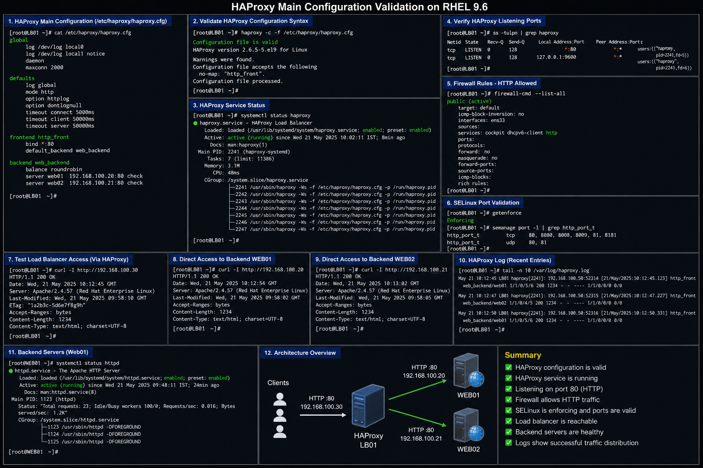

# HAProxy Main Configuration

## Objective

Configure HAProxy as an enterprise load balancer in a RHEL 9.6 environment to distribute client traffic across backend web servers while improving availability, scalability, and operational resilience.

---

# Why It Matters

HAProxy is widely used in enterprise Linux environments for:

- load balancing
- reverse proxy services
- high availability
- backend failover
- traffic distribution
- application scalability

Enterprise administrators use HAProxy to improve service reliability and reduce single points of failure.

---

# Environment Information

| Component | Value |
|---|---|
| Operating System | RHEL 9.6 |
| Load Balancer | HAProxy |
| Frontend Server | `LB01` |
| Backend Servers | `WEB01`, `WEB02` |
| Frontend IP | `192.168.100.30` |
| Service Name | `haproxy` |

---

# HAProxy Main Configuration

## Main HAProxy Configuration

```haproxy
global

    log /dev/log local0

    log /dev/log local1 notice

    daemon

    maxconn 2000

defaults

    log global

    mode http

    option httplog

    option dontlognull

    timeout connect 5000ms

    timeout client 50000ms

    timeout server 50000ms

frontend http_front

    bind *:80

    default_backend web_backend

backend web_backend

    balance roundrobin

    server web01 192.168.100.20:80 check

    server web02 192.168.100.21:80 check
```

---

# Deployment Procedure

## Install HAProxy

```bash
sudo dnf install haproxy -y
```

## Backup Existing Configuration

```bash
sudo cp /etc/haproxy/haproxy.cfg /etc/haproxy/haproxy.cfg.bak
```

## Edit HAProxy Configuration

```bash
sudo vi /etc/haproxy/haproxy.cfg
```

## Validate Configuration Syntax

```bash
sudo haproxy -c -f /etc/haproxy/haproxy.cfg
```

## Restart HAProxy Service

```bash
sudo systemctl restart haproxy
```

---

# Firewall Validation

## Allow HTTP Traffic

```bash
sudo firewall-cmd --add-service=http --permanent
sudo firewall-cmd --reload
```

## Verify Firewall Rules

```bash
sudo firewall-cmd --list-all
```

---

# SELinux Validation

## Verify SELinux Mode

```bash
getenforce
```

## Validate HAProxy Port Access

```bash
sudo semanage port -l | grep http_port_t
```

---

# Verification

## Verify HAProxy Service Status

```bash
systemctl status haproxy
```

## Verify Listening Ports

```bash
ss -tulpn | grep haproxy
```

## Test Load Balancer Access

```bash
curl http://192.168.100.30
```

## Validate Backend Connectivity

```bash
curl http://192.168.100.20
curl http://192.168.100.21
```

---

# Common Issues And Fixes

| Issue | Cause | Resolution |
|---|---|---|
| HAProxy service fails | Invalid syntax | Run `haproxy -c -f` |
| Backend servers unreachable | Backend Apache failure | Verify backend HTTP services |
| Connection refused | Firewall restrictions | Allow HTTP service |
| SELinux denial | Incorrect policy | Validate SELinux contexts |

---

# Operational Quality Notes

This configuration reflects enterprise load balancing practices commonly used in RHEL 9.6 environments.

Enterprise administrators should validate:

- backend server health
- frontend listener availability
- load balancing behavior
- firewall accessibility
- service startup state
- backend failover functionality

HAProxy logs should be monitored regularly for:

- backend failures
- connection spikes
- abnormal response times
- service interruptions

---

# Screenshot Capture

| Screenshot Requirement | Filename |
|---|---|
| HAProxy main configuration validation | `haproxy-main-validation.png` |

---

# Screenshot Reference


