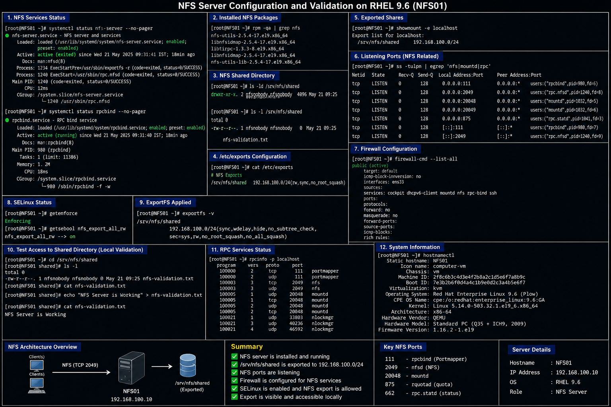
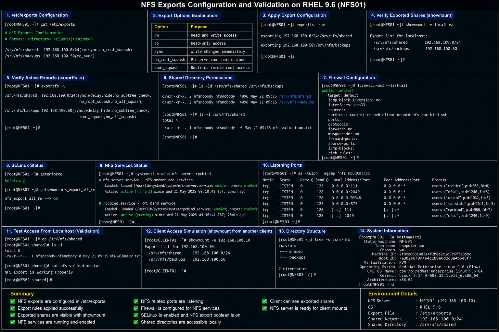

# NFS Configuration Templates

## Overview

This directory contains enterprise-style NFS configuration documentation used in the RHEL 9.6 Linux infrastructure lab environment.

The configurations demonstrate:

- NFS server deployment
- shared storage exports
- client-side NFS mounts
- export validation
- firewall and SELinux integration
- enterprise Linux storage administration workflows

These documents are designed for:

- enterprise Linux administration
- infrastructure operations
- storage troubleshooting
- operational validation
- portfolio documentation

---

# Environment Information

| Component | Value |
|---|---|
| Operating System | RHEL 9.6 |
| NFS Service | `nfs-server` |
| NFS Server | `NFS01` |
| Client System | `CLIENT01` |
| Shared Network | `192.168.100.0/24` |
| Shared Storage Path | `/srv/nfs/shared` |

---

# Configuration Files

| File | Purpose |
|---|---|
| `nfs-server-configuration.md` | NFS server deployment and validation |
| `nfs-exports-configuration.md` | NFS export rules and access control |
| `nfs-mount-examples.md` | NFS client mounts and persistence validation |

---

# Enterprise Operational Areas

The NFS configurations in this directory cover:

- centralized shared storage
- export management
- client mount persistence
- shared filesystem access
- firewall validation
- SELinux integration
- storage permissions
- enterprise Linux file sharing workflows

---

# Administrative Validation Commands

## Verify NFS Service Status

```bash
systemctl status nfs-server
```

## Verify Exported Shares

```bash
showmount -e localhost
```

## Verify Active Exports

```bash
exportfs -v
```

## Verify Mounted Filesystems

```bash
mount | grep nfs
```

## Verify Listening Ports

```bash
ss -tulpn | grep nfs
```

## Verify Firewall Configuration

```bash
firewall-cmd --list-all
```

---

# Common Enterprise Troubleshooting Areas

| Area | Validation |
|---|---|
| Export not visible | Verify `/etc/exports` and run `exportfs -rav` |
| Client mount failure | Validate NFS server accessibility |
| Permission denied | Review export options and ownership |
| SELinux denial | Verify NFS SELinux booleans |
| Firewall restrictions | Allow NFS-related services |
| Persistent mount failure | Validate `/etc/fstab` configuration |

---

# Operational Quality Notes

These configurations are designed to simulate enterprise Linux storage administration practices commonly used in RHEL 9.6 environments.

Enterprise administrators should always validate:

- NFS export visibility
- client mount persistence
- shared storage permissions
- firewall accessibility
- SELinux policy state
- NFS service health
- storage availability
- client connectivity

Shared storage environments should be monitored regularly for stale mounts, export changes, and unauthorized access attempts.

---

# Screenshot Capture

| Screenshot Requirement | Filename |
|---|---|
| NFS server validation | `nfs-server-validation.png` |
| NFS exports validation | `nfs-exports-validation.png` |
| NFS client mount validation | `nfs-client-mount-validation.png` |

---

# Screenshot References







