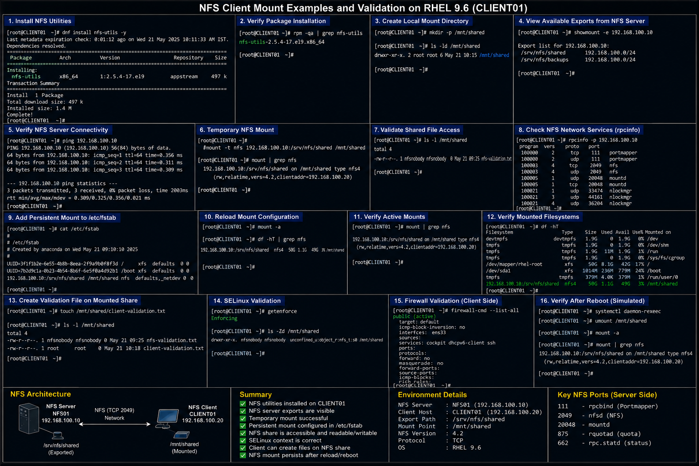

# NFS Client Mount Examples

## Objective

Configure and validate NFS client mounts in a RHEL 9.6 enterprise Linux environment to ensure reliable access to centralized shared storage hosted on enterprise NFS servers.

---

# Why It Matters

NFS client mounts are widely used in enterprise Linux environments for:

- centralized shared storage access
- application data availability
- shared user directories
- backup repositories
- multi-server content synchronization
- infrastructure administration

Proper client mount configuration ensures stable and secure access to network-based storage resources.

---

# Environment Information

| Component | Value |
|---|---|
| Operating System | RHEL 9.6 |
| NFS Server | `NFS01` |
| NFS Server IP | `192.168.100.10` |
| Client System | `CLIENT01` |
| Export Path | `/srv/nfs/shared` |
| Local Mount Path | `/mnt/shared` |

---

# NFS Client Installation

## Install NFS Utilities

```bash
sudo dnf install nfs-utils -y
```

## Verify Package Installation

```bash
rpm -qa | grep nfs-utils
```

---

# Create Local Mount Directory

## Create Mount Point

```bash
sudo mkdir -p /mnt/shared
```

## Verify Directory

```bash
ls -ld /mnt/shared
```

---

# Temporary NFS Mount

## Mount NFS Share

```bash
sudo mount -t nfs 192.168.100.10:/srv/nfs/shared /mnt/shared
```

## Verify Mounted Filesystem

```bash
mount | grep nfs
```

## Validate Shared File Access

```bash
ls -l /mnt/shared
```

---

# Persistent NFS Mount

## Edit `/etc/fstab`

```bash
sudo vi /etc/fstab
```

## Example Persistent Mount Entry

```bash
192.168.100.10:/srv/nfs/shared /mnt/shared nfs defaults,_netdev 0 0
```

## Reload Mount Configuration

```bash
sudo mount -a
```

## Verify Persistent Mount

```bash
df -hT | grep nfs
```

---

# NFS Export Validation

## View Available Exports

```bash
showmount -e 192.168.100.10
```

## Validate NFS Server Connectivity

```bash
ping 192.168.100.10
```

---

# Firewall Validation

## Verify NFS Services Allowed On Server

```bash
sudo firewall-cmd --list-all
```

## Verify Client Connectivity

```bash
rpcinfo -p 192.168.100.10
```

---

# SELinux Validation

## Verify SELinux Mode

```bash
getenforce
```

## Verify Mount Context

```bash
ls -Zd /mnt/shared
```

---

# Verification

## Verify Active Mounts

```bash
mount | grep nfs
```

## Verify Mounted Filesystems

```bash
df -hT
```

## Create Validation File

```bash
touch /mnt/shared/client-validation.txt
```

## Validate Shared File Access

```bash
ls -l /mnt/shared
```

---

# Common Issues And Fixes

| Issue | Cause | Resolution |
|---|---|---|
| Mount failed | NFS service unavailable | Verify NFS server status |
| Permission denied | Incorrect export permissions | Validate `/etc/exports` |
| Connection timeout | Firewall restriction | Allow NFS services |
| Mount disappears after reboot | Missing `/etc/fstab` entry | Configure persistent mount |

---

# Operational Quality Notes

This NFS client configuration reflects enterprise Linux shared storage administration practices commonly used in RHEL 9.6 environments.

Enterprise administrators should validate:

- export visibility
- mount persistence
- shared file access
- client connectivity
- firewall accessibility
- SELinux contexts

NFS mounts should be monitored regularly for:

- stale mounts
- connectivity interruptions
- permission issues
- export changes

---

# Screenshot Capture

| Screenshot Requirement | Filename |
|---|---|
| NFS client mount validation | `nfs-client-mount-validation.png` |

---

# Screenshot Reference


