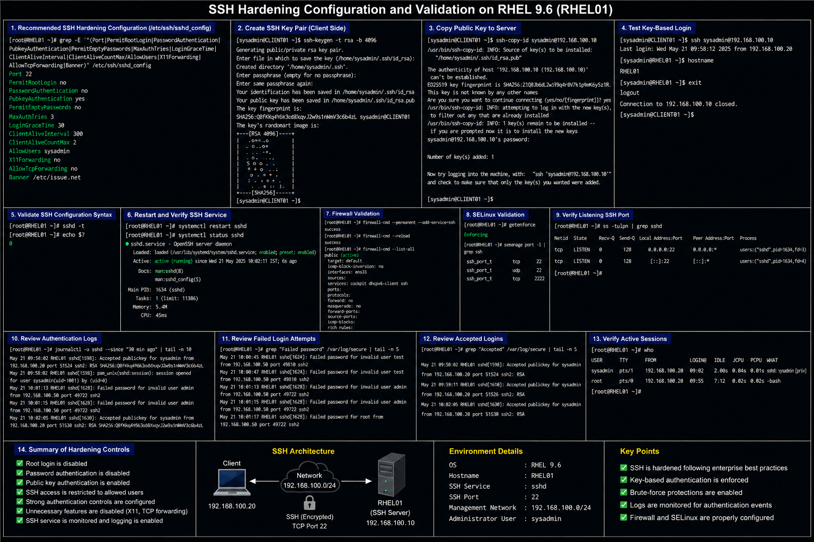

# SSH Configuration Templates

## Overview

This directory contains enterprise-style SSH configuration documentation used in the RHEL 9.6 Linux infrastructure lab environment.

The configurations demonstrate:

- SSH server deployment
- SSH hardening
- login banner configuration
- authentication security
- firewall and SELinux validation
- enterprise remote administration workflows

These documents are designed for:

- enterprise Linux administration
- infrastructure security operations
- remote access hardening
- operational validation
- portfolio documentation

---

# Environment Information

| Component | Value |
|---|---|
| Operating System | RHEL 9.6 |
| SSH Service | `sshd` |
| Configuration File | `/etc/ssh/sshd_config` |
| Management Network | `192.168.100.0/24` |
| SSH Port | `22` |

---

# Configuration Files

| File | Purpose |
|---|---|
| `sshd-configuration.md` | OpenSSH server deployment and validation |
| `ssh-hardening.md` | Enterprise SSH hardening and key authentication |
| `ssh-banner.md` | SSH warning banner configuration and validation |

---

# Enterprise Operational Areas

The SSH configurations in this directory cover:

- secure remote administration
- SSH service hardening
- key-based authentication
- SSH logging and monitoring
- firewall validation
- SELinux integration
- authentication controls
- enterprise Linux remote access workflows

---

# Administrative Validation Commands

## Verify SSH Service Status

```bash
systemctl status sshd
```

## Validate SSHD Configuration Syntax

```bash
sshd -t
```

## Verify Listening SSH Ports

```bash
ss -tulpn | grep sshd
```

## Verify Firewall Rules

```bash
firewall-cmd --list-all
```

## Verify SELinux SSH Context

```bash
semanage port -l | grep ssh
```

## Review SSH Authentication Logs

```bash
journalctl -u sshd
```

---

# Common Enterprise Troubleshooting Areas

| Area | Validation |
|---|---|
| SSH connection refused | Verify SSH service state |
| Authentication failure | Validate credentials or SSH keys |
| Firewall restrictions | Verify SSH service access |
| SSHD restart failure | Validate configuration syntax |
| Banner not displayed | Verify `Banner` directive |
| SSH key authentication failure | Validate `.ssh` permissions |

---

# Operational Quality Notes

These configurations are designed to simulate enterprise Linux SSH administration and hardening practices commonly used in RHEL 9.6 environments.

Enterprise administrators should always validate:

- SSH service availability
- authentication restrictions
- firewall accessibility
- SSH logging visibility
- SELinux policy state
- active administrator sessions
- SSH key authentication
- remote access policies

SSH logs should be reviewed regularly for brute-force activity, unauthorized access attempts, and abnormal authentication behavior.

---

# Screenshot Capture

| Screenshot Requirement | Filename |
|---|---|
| SSHD configuration validation | `sshd-configuration-validation.png` |
| SSH hardening validation | `ssh-hardening-validation.png` |
| SSH banner validation | `ssh-banner-validation.png` |

---

# Screenshot References





