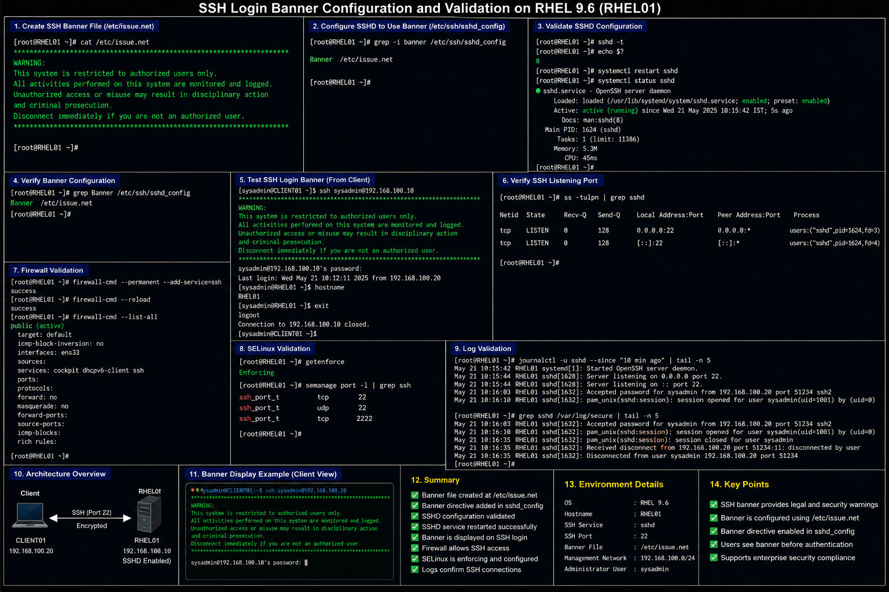

# SSH Login Banner Configuration

## Objective

Configure and validate an enterprise SSH login banner in a RHEL 9.6 environment to provide authorized access warnings and support organizational security policy requirements.

---

# Why It Matters

SSH login banners are commonly used in enterprise Linux environments to:

- display authorized-use warnings
- support legal compliance
- discourage unauthorized access
- identify monitored systems
- reinforce organizational security policy
- provide operational system notices

Login banners are often required in enterprise and regulated environments as part of security hardening standards.

---

# Environment Information

| Component | Value |
|---|---|
| Operating System | RHEL 9.6 |
| SSH Service | `sshd` |
| Banner File | `/etc/issue.net` |
| SSH Configuration File | `/etc/ssh/sshd_config` |
| SSH Port | `22` |

---

# SSH Banner Configuration

## Create SSH Banner File

```bash
sudo vi /etc/issue.net
```

## Example Enterprise Warning Banner

```text
***************************************************************************

WARNING:

This system is restricted to authorized users only.

All activities performed on this system are monitored and logged.

Unauthorized access or misuse may result in disciplinary action
and criminal prosecution.

Disconnect immediately if you are not an authorized user.

***************************************************************************
```

---

# Configure SSHD To Use Banner

## Edit SSH Configuration

```bash
sudo vi /etc/ssh/sshd_config
```

## Add Banner Directive

```text
Banner /etc/issue.net
```

---

# Validate SSH Configuration

## Verify SSHD Syntax

```bash
sudo sshd -t
```

## Restart SSH Service

```bash
sudo systemctl restart sshd
```

## Verify SSH Service Status

```bash
systemctl status sshd
```

---

# Administrative Validation

## Verify Banner Configuration

```bash
grep Banner /etc/ssh/sshd_config
```

## Test SSH Login Banner

```bash
ssh sysadmin@192.168.100.10
```

## Verify SSH Listening Port

```bash
ss -tulpn | grep sshd
```

---

# Firewall Validation

## Allow SSH Service

```bash
sudo firewall-cmd --permanent --add-service=ssh
sudo firewall-cmd --reload
```

## Verify Firewall Rules

```bash
sudo firewall-cmd --list-all
```

---

# SELinux Validation

## Verify SELinux Mode

```bash
getenforce
```

## Verify SSH Port Context

```bash
sudo semanage port -l | grep ssh
```

---

# Log Validation

## Review SSH Logs

```bash
sudo journalctl -u sshd
```

## Review Authentication Events

```bash
sudo grep sshd /var/log/secure
```

---

# Common Issues And Fixes

| Issue | Cause | Resolution |
|---|---|---|
| Banner not displayed | Missing Banner directive | Add `Banner /etc/issue.net` |
| SSHD restart failure | Invalid configuration syntax | Run `sshd -t` |
| SSH blocked | Firewall restriction | Allow SSH service |
| Incorrect banner file path | Invalid banner location | Verify `/etc/issue.net` |

---

# Operational Quality Notes

This SSH banner configuration reflects enterprise Linux security administration practices commonly used in RHEL 9.6 environments.

Enterprise administrators should validate:

- SSH banner visibility
- warning message accuracy
- SSH service availability
- firewall accessibility
- SSH authentication logging
- compliance policy requirements

SSH warning banners should be reviewed periodically to ensure compliance with organizational security standards.

---

# Screenshot Capture

| Screenshot Requirement | Filename |
|---|---|
| SSH banner validation | `ssh-banner-validation.png` |

---

# Screenshot Reference


