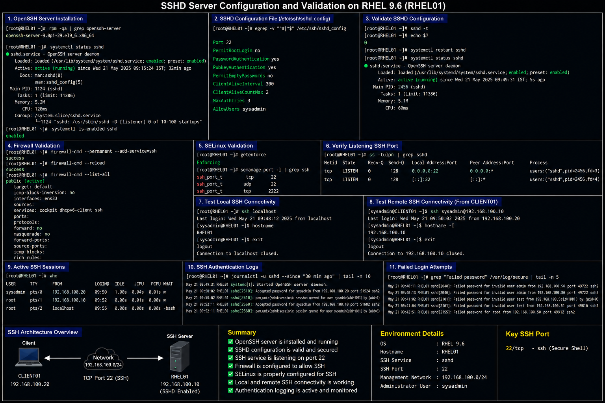

# SSHD Server Configuration

## Objective

Configure and validate the OpenSSH server daemon in a RHEL 9.6 enterprise Linux environment to provide secure remote administration access for authorized infrastructure administrators.

---

# Why It Matters

SSH is the primary remote administration protocol used in enterprise Linux environments.

Enterprise administrators use SSH for:

- secure remote management
- server administration
- operational troubleshooting
- automation workflows
- infrastructure maintenance
- secure command execution

Improper SSH configuration can expose systems to brute-force attacks, unauthorized access, or insecure authentication methods.

---

# Environment Information

| Component | Value |
|---|---|
| Operating System | RHEL 9.6 |
| SSH Service | `sshd` |
| Configuration File | `/etc/ssh/sshd_config` |
| Management Network | `192.168.100.0/24` |
| SSH Port | `22` |

---

# OpenSSH Installation

## Verify OpenSSH Server Package

```bash
rpm -qa | grep openssh-server
```

## Install OpenSSH Server

```bash
sudo dnf install openssh-server -y
```

## Enable SSH Service

```bash
sudo systemctl enable --now sshd
```

---

# SSHD Configuration

## Edit SSH Configuration File

```bash
sudo vi /etc/ssh/sshd_config
```

## Example Enterprise Configuration

```text
Port 22

PermitRootLogin no

PasswordAuthentication yes

PubkeyAuthentication yes

PermitEmptyPasswords no

ClientAliveInterval 300

ClientAliveCountMax 2

MaxAuthTries 3

AllowUsers sysadmin
```

---

# Validate SSH Configuration

## Verify SSHD Syntax

```bash
sudo sshd -t
```

## Restart SSH Service

```bash
sudo systemctl restart sshd
```

## Verify SSH Service Status

```bash
systemctl status sshd
```

---

# Firewall Validation

## Allow SSH Service

```bash
sudo firewall-cmd --permanent --add-service=ssh
sudo firewall-cmd --reload
```

## Verify Firewall Rules

```bash
sudo firewall-cmd --list-all
```

---

# SELinux Validation

## Verify SELinux Mode

```bash
getenforce
```

## Verify SSH Port Context

```bash
sudo semanage port -l | grep ssh
```

---

# Administrative Validation

## Verify Listening SSH Port

```bash
ss -tulpn | grep sshd
```

## Test Local SSH Connectivity

```bash
ssh localhost
```

## Test Remote SSH Connectivity

```bash
ssh sysadmin@192.168.100.10
```

## Verify SSH Login Sessions

```bash
who
```

---

# Log Validation

## View SSH Authentication Logs

```bash
sudo journalctl -u sshd
```

## Monitor Failed Login Attempts

```bash
sudo grep "Failed password" /var/log/secure
```

---

# Common Issues And Fixes

| Issue | Cause | Resolution |
|---|---|---|
| SSH connection refused | SSH service not running | Start `sshd` service |
| Authentication failed | Incorrect credentials | Verify account access |
| SSH blocked | Firewall restriction | Allow SSH service |
| SSHD restart failure | Invalid configuration syntax | Run `sshd -t` |

---

# Operational Quality Notes

This SSH configuration reflects enterprise Linux remote administration practices commonly used in RHEL 9.6 environments.

Enterprise administrators should validate:

- SSH service availability
- authentication restrictions
- firewall accessibility
- allowed administrator accounts
- active login sessions
- SSH log activity

SSH logs should be monitored regularly for:

- brute-force attacks
- failed authentication attempts
- unexpected remote access
- unauthorized login behavior

---

# Screenshot Capture

| Screenshot Requirement | Filename |
|---|---|
| SSHD configuration validation | `sshd-configuration-validation.png` |

---

# Screenshot Reference


