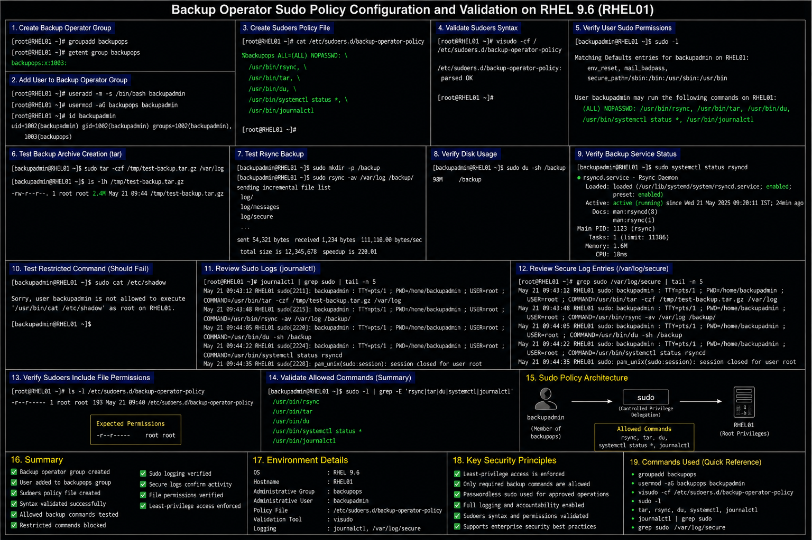

# Backup Operator Sudo Policy Configuration

## Objective

Configure restricted sudo access for backup operators in a RHEL 9.6 enterprise Linux environment to support backup operations, storage validation, and service monitoring while maintaining least-privilege administrative controls.

---

# Why It Matters

Backup operators often require elevated access for:

- backup execution
- archive management
- filesystem validation
- storage monitoring
- service verification
- backup log review

Enterprise Linux environments should restrict backup privileges only to commands required for operational backup workflows.

---

# Environment Information

| Component | Value |
|---|---|
| Operating System | RHEL 9.6 |
| Administrative Group | `backupops` |
| Configuration File | `/etc/sudoers.d/backup-operator-policy` |
| Validation Tool | `visudo` |
| Backup Tools | `tar`, `rsync`, `systemctl` |

---

# Create Backup Operator Group

## Create Administrative Group

```bash
sudo groupadd backupops
```

## Add User To Group

```bash
sudo usermod -aG backupops backupadmin
```

## Verify Group Membership

```bash
id backupadmin
```

---

# Create Sudoers Policy File

## Create Dedicated Include File

```bash
sudo vi /etc/sudoers.d/backup-operator-policy
```

## Example Backup Operator Policy

```text
%backupops ALL=(ALL) NOPASSWD: \
/usr/bin/rsync, \
/usr/bin/tar, \
/usr/bin/du, \
/usr/bin/systemctl status *, \
/usr/bin/journalctl
```

---

# Validate Sudoers Configuration

## Verify Sudoers Syntax

```bash
sudo visudo -cf /etc/sudoers.d/backup-operator-policy
```

## Verify User Sudo Permissions

```bash
sudo -l
```

---

# Administrative Validation

## Test Backup Archive Creation

```bash
sudo tar -czf /tmp/test-backup.tar.gz /var/log
```

## Test Rsync Backup

```bash
sudo rsync -av /var/log /backup/
```

## Verify Disk Usage

```bash
sudo du -sh /backup
```

## Verify Backup Service Status

```bash
sudo systemctl status rsyncd
```

---

# Security Validation

## Test Restricted Command

```bash
sudo cat /etc/shadow
```

## Expected Result

```text
Sorry, user backupadmin is not allowed to execute '/usr/bin/cat /etc/shadow'
```

---

# Logging Validation

## Review Sudo Logs

```bash
sudo journalctl | grep sudo
```

## Review Secure Log Entries

```bash
sudo grep sudo /var/log/secure
```

---

# File Permission Validation

## Verify Sudoers Include File Permissions

```bash
ls -l /etc/sudoers.d/backup-operator-policy
```

## Expected Permissions

```text
-r--r----- root root
```

---

# Common Issues And Fixes

| Issue | Cause | Resolution |
|---|---|---|
| Backup command denied | Missing sudoers rule | Verify include file |
| Sudo syntax error | Invalid configuration | Validate with `visudo` |
| User missing group membership | Incorrect group assignment | Verify `backupops` group |
| Overprivileged access | Broad sudoers entry | Restrict allowed commands |

---

# Operational Quality Notes

This sudo delegation model reflects enterprise Linux backup administration practices commonly used in RHEL 9.6 environments.

Enterprise administrators should validate:

- least-privilege access
- restricted backup operations
- sudo logging visibility
- backup operator accountability
- sudoers syntax integrity
- administrative group membership

Backup-related administrative access should be reviewed regularly to prevent unnecessary privilege expansion.

---

# Screenshot Capture

| Screenshot Requirement | Filename |
|---|---|
| Backup operator sudo policy validation | `backup-operator-policy-validation.png` |

---

# Screenshot Reference



