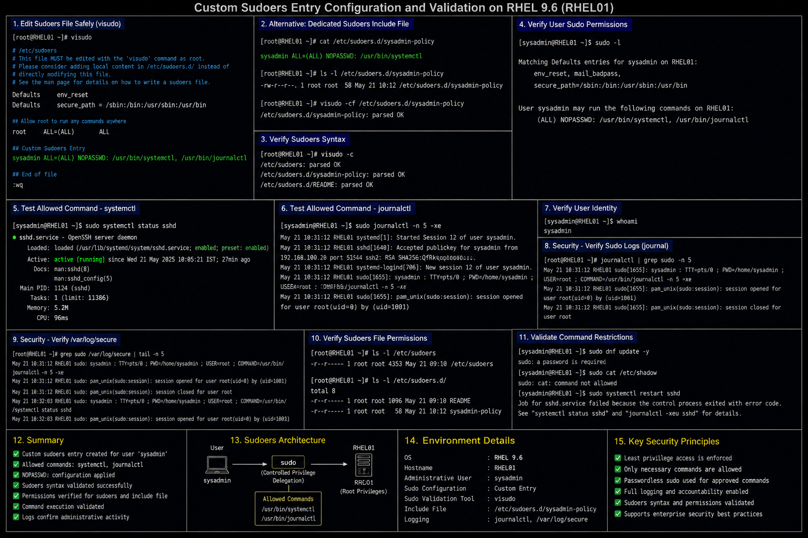

# Custom Sudoers Entry Configuration

## Objective

Configure and validate custom sudo privilege delegation in a RHEL 9.6 enterprise Linux environment to allow controlled administrative command execution for authorized users.

---

# Why It Matters

The `sudo` framework is widely used in enterprise Linux environments to:

- delegate administrative privileges
- reduce direct root usage
- improve accountability
- support operational separation of duties
- enforce least-privilege access
- log administrative actions

Improper sudo configuration can expose systems to privilege escalation or unauthorized administrative access.

---

# Environment Information

| Component | Value |
|---|---|
| Operating System | RHEL 9.6 |
| Configuration File | `/etc/sudoers` |
| Sudo Validation Tool | `visudo` |
| Administrative User | `sysadmin` |
| Target Commands | `systemctl`, `dnf`, `journalctl` |

---

# Sudoers Configuration

## Edit Sudoers File Safely

```bash
sudo visudo
```

## Example Custom Sudoers Entry

```text
sysadmin ALL=(ALL) NOPASSWD: /usr/bin/systemctl, /usr/bin/journalctl
```

---

# Sudoers Entry Explanation

| Component | Purpose |
|---|---|
| `sysadmin` | Allowed user |
| `ALL` | Allowed host |
| `(ALL)` | Allowed target user |
| `NOPASSWD` | Disable password prompt |
| `/usr/bin/systemctl` | Allowed command |
| `/usr/bin/journalctl` | Allowed command |

---

# Alternative Sudoers Include File

## Create Dedicated Sudoers File

```bash
sudo vi /etc/sudoers.d/sysadmin-policy
```

## Example Include Configuration

```text
sysadmin ALL=(ALL) NOPASSWD: /usr/bin/systemctl
```

## Validate Include File Syntax

```bash
sudo visudo -cf /etc/sudoers.d/sysadmin-policy
```

---

# Administrative Validation

## Verify User Sudo Permissions

```bash
sudo -l
```

## Test Allowed Command

```bash
sudo systemctl status sshd
```

## Test Journal Access

```bash
sudo journalctl -xe
```

## Verify User Identity

```bash
whoami
```

---

# Security Validation

## Verify Sudo Logs

```bash
sudo journalctl | grep sudo
```

## Verify Administrative Activity

```bash
sudo grep sudo /var/log/secure
```

## Verify Sudoers File Permissions

```bash
ls -l /etc/sudoers
```

---

# Common Issues And Fixes

| Issue | Cause | Resolution |
|---|---|---|
| Sudo command denied | Incorrect sudoers syntax | Validate with `visudo` |
| User not recognized | Incorrect username | Verify local user account |
| Sudo syntax error | Invalid sudoers entry | Restore syntax using `visudo` |
| Command not permitted | Missing full binary path | Use absolute command path |

---

# Operational Quality Notes

This sudoers configuration reflects enterprise Linux privilege delegation practices commonly used in RHEL 9.6 environments.

Enterprise administrators should validate:

- least-privilege access
- allowed command scope
- sudo logging visibility
- administrative accountability
- sudoers syntax integrity
- include file permissions

Administrative command delegation should always be limited to operationally required actions.

---

# Screenshot Capture

| Screenshot Requirement | Filename |
|---|---|
| Custom sudoers entry validation | `custom-sudoers-validation.png` |

---

# Screenshot Reference


