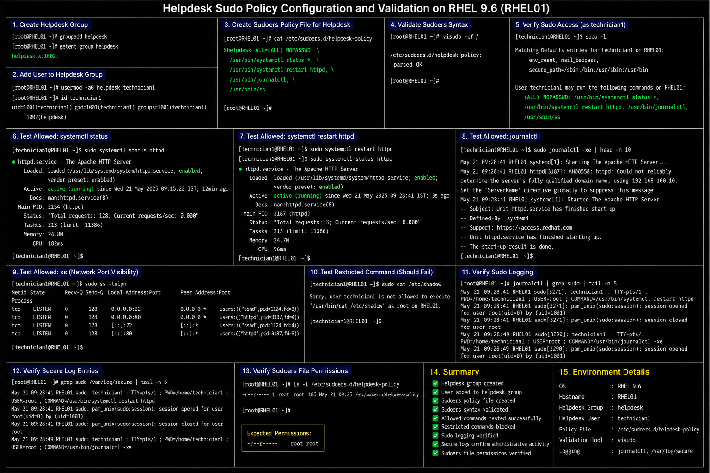

# Helpdesk Sudo Policy Configuration

## Objective

Configure restricted sudo privileges for helpdesk personnel in a RHEL 9.6 enterprise Linux environment to support operational troubleshooting while maintaining least-privilege access controls.

---

# Why It Matters

Enterprise helpdesk teams often require limited administrative access for:

- restarting approved services
- viewing logs
- checking system status
- basic operational troubleshooting
- validating network services
- supporting end-user incidents

Least-privilege sudo delegation reduces operational risk while still enabling support workflows.

---

# Environment Information

| Component | Value |
|---|---|
| Operating System | RHEL 9.6 |
| Administrative Group | `helpdesk` |
| Configuration File | `/etc/sudoers.d/helpdesk-policy` |
| Validation Tool | `visudo` |
| Approved Commands | `systemctl`, `journalctl`, `ss` |

---

# Create Helpdesk Administrative Group

## Create Group

```bash
sudo groupadd helpdesk
```

## Add User To Group

```bash
sudo usermod -aG helpdesk technician1
```

## Verify Group Membership

```bash
id technician1
```

---

# Create Sudoers Policy File

## Create Dedicated Sudoers Include File

```bash
sudo vi /etc/sudoers.d/helpdesk-policy
```

## Example Helpdesk Policy

```text
%helpdesk ALL=(ALL) NOPASSWD: \
/usr/bin/systemctl status *, \
/usr/bin/systemctl restart httpd, \
/usr/bin/journalctl, \
/usr/sbin/ss
```

---

# Validate Sudoers Configuration

## Verify Sudoers Syntax

```bash
sudo visudo -cf /etc/sudoers.d/helpdesk-policy
```

## Verify Sudo Access

```bash
sudo -l
```

---

# Administrative Validation

## Test Allowed Service Status Command

```bash
sudo systemctl status httpd
```

## Test Allowed Service Restart

```bash
sudo systemctl restart httpd
```

## Test Journal Access

```bash
sudo journalctl -xe
```

## Verify Network Port Visibility

```bash
sudo ss -tulpn
```

---

# Security Validation

## Test Restricted Command

```bash
sudo cat /etc/shadow
```

## Expected Result

```text
Sorry, user technician1 is not allowed to execute '/usr/bin/cat /etc/shadow'
```

---

# Sudo Logging Validation

## Review Sudo Activity Logs

```bash
sudo journalctl | grep sudo
```

## Review Secure Log Entries

```bash
sudo grep sudo /var/log/secure
```

---

# File Permission Validation

## Verify Sudoers Include Permissions

```bash
ls -l /etc/sudoers.d/helpdesk-policy
```

## Expected Permissions

```text
-r--r----- root root
```

---

# Common Issues And Fixes

| Issue | Cause | Resolution |
|---|---|---|
| Helpdesk command denied | Missing sudoers entry | Verify include file |
| Sudo syntax error | Invalid configuration | Validate using `visudo` |
| User missing group membership | User not added to group | Verify `helpdesk` membership |
| Unauthorized command access | Overly broad rule | Restrict allowed commands |

---

# Operational Quality Notes

This sudo delegation model reflects enterprise Linux operational support practices commonly used in RHEL 9.6 environments.

Enterprise administrators should validate:

- least-privilege access
- restricted command scope
- sudo logging visibility
- group membership controls
- sudoers syntax integrity
- operational accountability

Helpdesk administrative privileges should be reviewed regularly to prevent privilege creep.

---

# Screenshot Capture

| Screenshot Requirement | Filename |
|---|---|
| Helpdesk sudo policy validation | `helpdesk-sudo-policy-validation.png` |

---

# Screenshot Reference


