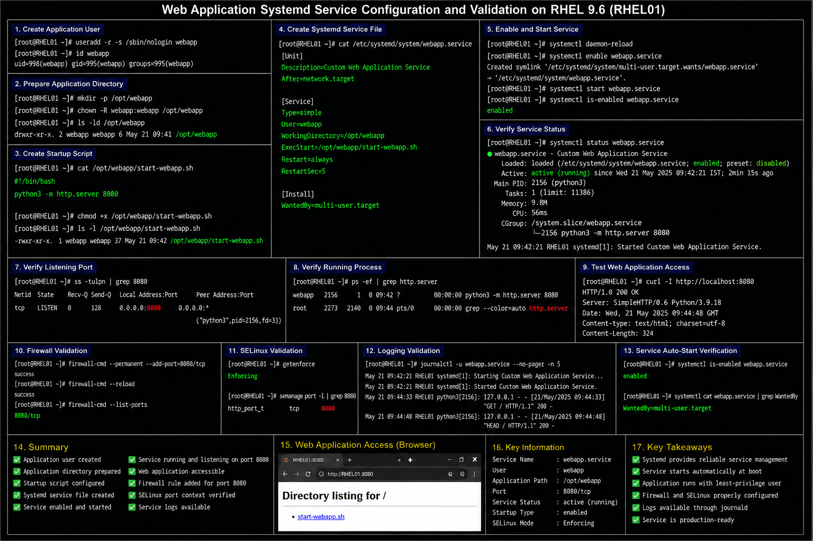
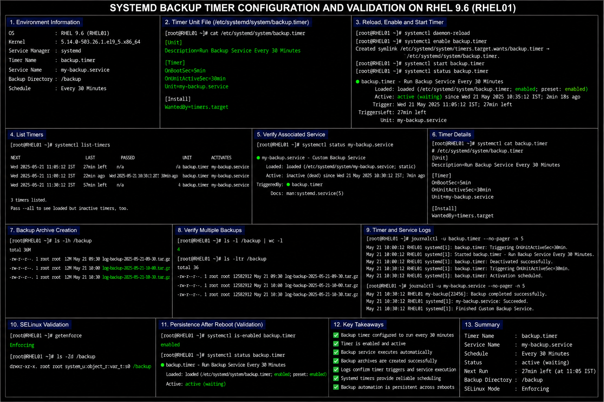

# Systemd Service Configuration Templates

## Overview

This directory contains enterprise-style systemd service and timer configuration documentation used in the RHEL 9.6 Linux infrastructure lab environment.

The configurations demonstrate:

- custom service deployment
- application lifecycle management
- automated backup workflows
- recurring task scheduling
- operational monitoring
- centralized service logging

These documents are designed for:

- enterprise Linux administration
- infrastructure operations
- service management
- operational automation
- portfolio documentation

---

# Environment Information

| Component | Value |
|---|---|
| Operating System | RHEL 9.6 |
| Service Manager | `systemd` |
| Service Directory | `/etc/systemd/system/` |
| Logging Framework | `journald` |
| Startup Target | `multi-user.target` |

---

# Configuration Files

| File | Purpose |
|---|---|
| `webapp-service.md` | Custom web application service deployment |
| `my-backup-service.md` | Backup automation service |
| `backup-timer.md` | Automated recurring backup scheduling |
| `monitoring-service.md` | Infrastructure monitoring service |

---

# Enterprise Operational Areas

The systemd configurations in this directory cover:

- service lifecycle management
- automated startup persistence
- operational automation
- recurring maintenance scheduling
- centralized logging
- service monitoring
- process supervision
- enterprise Linux infrastructure management

---

# Administrative Validation Commands

## Reload Systemd Configuration

```bash
systemctl daemon-reload
```

## Verify Service Status

```bash
systemctl status <service-name>
```

## Verify Enabled Services

```bash
systemctl list-unit-files --type=service
```

## Verify Active Timers

```bash
systemctl list-timers
```

## Review Service Logs

```bash
journalctl -u <service-name>
```

## Verify Running Processes

```bash
ps -ef
```

---

# Common Enterprise Troubleshooting Areas

| Area | Validation |
|---|---|
| Service fails to start | Verify `ExecStart` path |
| Repeated service restarts | Review `journalctl` logs |
| Timer not executing | Verify timer activation |
| Missing logs | Validate journald visibility |
| Service not enabled | Verify startup persistence |
| Permission denied | Validate ownership and execution permissions |

---

# Operational Quality Notes

These configurations are designed to simulate enterprise Linux operational management practices commonly used in RHEL 9.6 environments.

Enterprise administrators should always validate:

- service startup persistence
- operational logging visibility
- timer scheduling behavior
- process ownership
- automation reliability
- service restart handling
- resource utilization
- monitoring visibility

Systemd-managed services should be monitored regularly for failed executions, abnormal restart behavior, and infrastructure health issues.

---

# Screenshot Capture

| Screenshot Requirement | Filename |
|---|---|
| Web application service validation | `webapp-service-validation.png` |
| Custom backup service validation | `my-backup-service-validation.png` |
| Backup timer validation | `backup-timer-validation.png` |
| Monitoring service validation | `monitoring-service-validation.png` |

---

# Screenshot References







