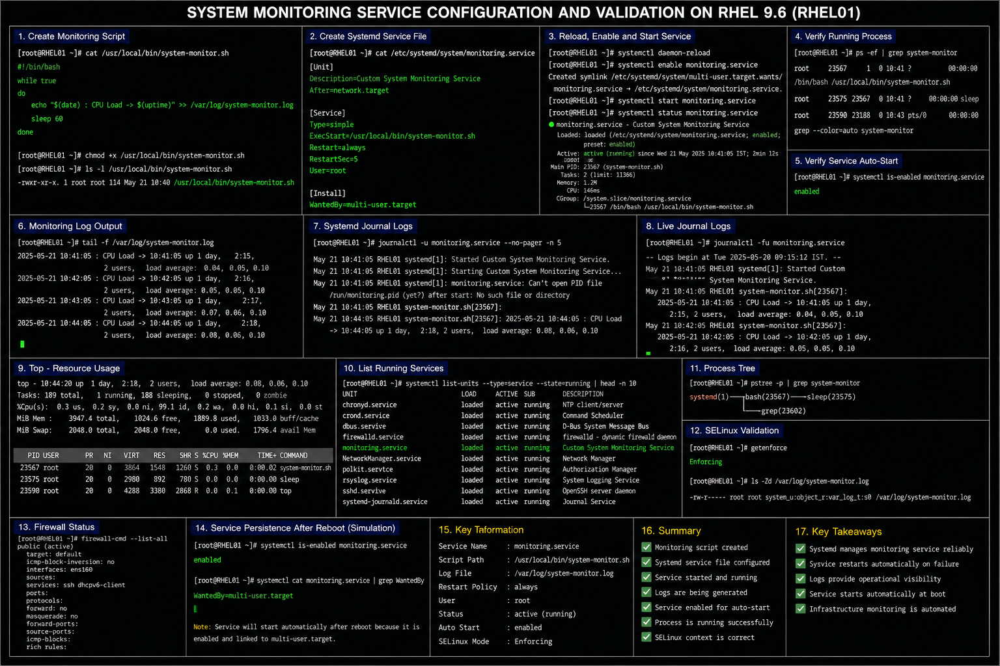

# System Monitoring Service Configuration

## Objective

Create and manage a custom monitoring service using systemd in a RHEL 9.6 enterprise Linux environment to support operational visibility, process validation, and infrastructure monitoring workflows.

---

# Why It Matters

Enterprise Linux environments commonly use custom monitoring services for:

- infrastructure health monitoring
- operational visibility
- service validation
- process supervision
- alert generation
- automated operational checks

Systemd provides centralized management and logging for monitoring workflows.

---

# Environment Information

| Component | Value |
|---|---|
| Operating System | RHEL 9.6 |
| Service Manager | `systemd` |
| Service Name | `monitoring.service` |
| Monitoring Script | `/usr/local/bin/system-monitor.sh` |
| Log File | `/var/log/system-monitor.log` |

---

# Prepare Monitoring Script

## Create Monitoring Script File

```bash
sudo vi /usr/local/bin/system-monitor.sh
```

## Example Monitoring Script

```bash
#!/bin/bash

while true
do
    echo "$(date) : CPU Load -> $(uptime)" >> /var/log/system-monitor.log
    sleep 60
done
```

## Make Script Executable

```bash
sudo chmod +x /usr/local/bin/system-monitor.sh
```

---

# Create Systemd Service File

## Create Service Unit

```bash
sudo vi /etc/systemd/system/monitoring.service
```

## Example Service Configuration

```ini
[Unit]

Description=Custom System Monitoring Service

After=network.target

[Service]

Type=simple

ExecStart=/usr/local/bin/system-monitor.sh

Restart=always

RestartSec=5

User=root

[Install]

WantedBy=multi-user.target
```

---

# Reload Systemd Configuration

## Reload Daemon

```bash
sudo systemctl daemon-reload
```

## Enable Monitoring Service

```bash
sudo systemctl enable monitoring.service
```

## Start Monitoring Service

```bash
sudo systemctl start monitoring.service
```

---

# Administrative Validation

## Verify Service Status

```bash
systemctl status monitoring.service
```

## Verify Running Process

```bash
ps -ef | grep system-monitor
```

## Verify Service Auto-Start

```bash
systemctl is-enabled monitoring.service
```

---

# Logging Validation

## Review Monitoring Logs

```bash
tail -f /var/log/system-monitor.log
```

## Review Systemd Logs

```bash
journalctl -u monitoring.service
```

## Follow Live Logs

```bash
journalctl -fu monitoring.service
```

---

# Resource Validation

## Verify CPU Usage

```bash
top
```

## Verify Running Services

```bash
systemctl list-units --type=service
```

## Verify Process Tree

```bash
pstree -p
```

---

# SELinux Validation

## Verify SELinux Mode

```bash
getenforce
```

## Verify Log File Context

```bash
ls -Zd /var/log/system-monitor.log
```

---

# Common Issues And Fixes

| Issue | Cause | Resolution |
|---|---|---|
| Monitoring service fails | Invalid script path | Verify `ExecStart` |
| No logs generated | Log file permission issue | Verify `/var/log` access |
| Service repeatedly restarts | Script crash | Review `journalctl` logs |
| Service not enabled | Missing enable step | Run `systemctl enable` |

---

# Operational Quality Notes

This monitoring deployment reflects enterprise Linux operational monitoring practices commonly used in RHEL 9.6 environments.

Enterprise administrators should validate:

- monitoring process availability
- service restart behavior
- operational log generation
- startup persistence
- logging visibility
- resource usage monitoring

Monitoring services should be reviewed regularly to ensure operational visibility and infrastructure stability.

---

# Screenshot Capture

| Screenshot Requirement | Filename |
|---|---|
| Monitoring service validation | `monitoring-service-validation.png` |

---

# Screenshot Reference



