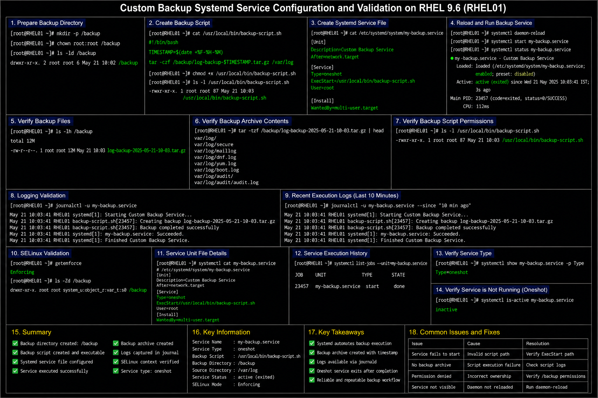

# Custom Backup Systemd Service

## Objective

Create and manage a custom backup service using systemd in a RHEL 9.6 enterprise Linux environment to automate operational backup workflows and improve administrative consistency.

---

# Why It Matters

Enterprise Linux environments commonly use custom systemd services for:

- automated backups
- operational scripting
- scheduled maintenance
- centralized logging
- service lifecycle management
- infrastructure automation

Systemd-based backup workflows improve reliability and reduce manual operational tasks.

---

# Environment Information

| Component | Value |
|---|---|
| Operating System | RHEL 9.6 |
| Service Manager | `systemd` |
| Service Name | `my-backup.service` |
| Backup Directory | `/backup` |
| Source Directory | `/var/log` |
| Backup Script Path | `/usr/local/bin/backup-script.sh` |

---

# Prepare Backup Directory

## Create Backup Path

```bash
sudo mkdir -p /backup
```

## Configure Ownership

```bash
sudo chown root:root /backup
```

## Verify Directory

```bash
ls -ld /backup
```

---

# Create Backup Script

## Create Backup Script File

```bash
sudo vi /usr/local/bin/backup-script.sh
```

## Example Backup Script

```bash
#!/bin/bash

TIMESTAMP=$(date +%F-%H-%M)

tar -czf /backup/log-backup-$TIMESTAMP.tar.gz /var/log
```

## Make Script Executable

```bash
sudo chmod +x /usr/local/bin/backup-script.sh
```

---

# Create Systemd Service Unit

## Create Service File

```bash
sudo vi /etc/systemd/system/my-backup.service
```

## Example Service Configuration

```ini
[Unit]

Description=Custom Backup Service

After=network.target

[Service]

Type=oneshot

ExecStart=/usr/local/bin/backup-script.sh

User=root
```

---

# Reload Systemd Configuration

## Reload Daemon

```bash
sudo systemctl daemon-reload
```

## Start Backup Service

```bash
sudo systemctl start my-backup.service
```

## Verify Service Status

```bash
systemctl status my-backup.service
```

---

# Administrative Validation

## Verify Backup Files

```bash
ls -lh /backup
```

## Verify Backup Archive Contents

```bash
tar -tzf /backup/log-backup-*.tar.gz | head
```

## Verify Backup Script Permissions

```bash
ls -l /usr/local/bin/backup-script.sh
```

---

# Logging Validation

## Review Service Logs

```bash
journalctl -u my-backup.service
```

## Review Recent Execution Logs

```bash
journalctl -u my-backup.service --since "10 min ago"
```

---

# SELinux Validation

## Verify SELinux Mode

```bash
getenforce
```

## Verify Backup Directory Context

```bash
ls -Zd /backup
```

---

# Common Issues And Fixes

| Issue | Cause | Resolution |
|---|---|---|
| Backup service fails | Invalid script path | Verify `ExecStart` |
| No backup archive created | Script execution failure | Validate backup script |
| Permission denied | Incorrect directory ownership | Verify `/backup` permissions |
| Service not visible | Daemon not reloaded | Run `systemctl daemon-reload` |

---

# Operational Quality Notes

This systemd backup deployment reflects enterprise Linux operational automation practices commonly used in RHEL 9.6 environments.

Enterprise administrators should validate:

- backup archive generation
- script execution permissions
- backup storage accessibility
- logging visibility
- service execution status
- backup retention management

Backup automation workflows should be monitored regularly to detect failed jobs and storage capacity issues.

---

# Screenshot Capture

| Screenshot Requirement | Filename |
|---|---|
| Custom backup service validation | `my-backup-service-validation.png` |

---

# Screenshot Reference



