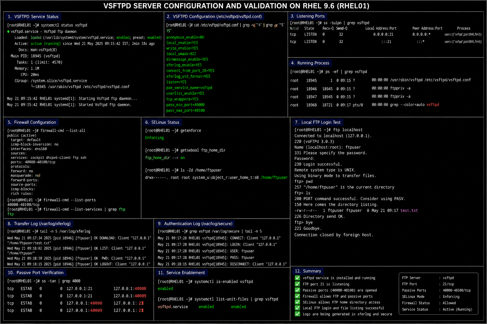
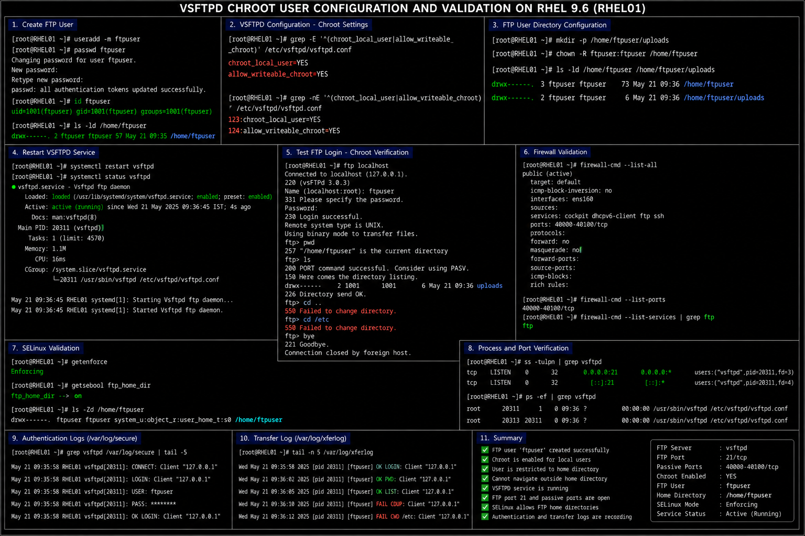

# VSFTPD Configuration Templates

## Overview

This directory contains enterprise-style VSFTPD configuration documentation used in the RHEL 9.6 Linux infrastructure lab environment.

The configurations demonstrate:

- VSFTPD server deployment
- secure FTP service management
- FTP login banner configuration
- chroot user isolation
- firewall and SELinux integration
- enterprise file transfer administration workflows

These documents are designed for:

- enterprise Linux administration
- infrastructure operations
- secure file transfer management
- operational validation
- portfolio documentation

---

# Environment Information

| Component | Value |
|---|---|
| Operating System | RHEL 9.6 |
| FTP Service | `vsftpd` |
| Configuration File | `/etc/vsftpd/vsftpd.conf` |
| FTP Port | `21/tcp` |
| Passive Port Range | `40000-40100/tcp` |

---

# Configuration Files

| File | Purpose |
|---|---|
| `vsftpd-server-configuration.md` | VSFTPD server deployment and validation |
| `ftp-banner.md` | FTP warning banner configuration |
| `chroot-users.md` | Chroot-restricted FTP user configuration |

---

# Enterprise Operational Areas

The VSFTPD configurations in this directory cover:

- secure FTP administration
- file transfer validation
- user isolation
- authentication controls
- passive FTP configuration
- firewall validation
- SELinux integration
- enterprise Linux operational security

---

# Administrative Validation Commands

## Verify VSFTPD Service Status

```bash
systemctl status vsftpd
```

## Verify Listening FTP Ports

```bash
ss -tulpn | grep vsftpd
```

## Verify Firewall Configuration

```bash
firewall-cmd --list-all
```

## Verify Passive FTP Ports

```bash
firewall-cmd --list-ports
```

## Review VSFTPD Logs

```bash
journalctl -u vsftpd
```

## Review Transfer Logs

```bash
tail -f /var/log/xferlog
```

---

# Common Enterprise Troubleshooting Areas

| Area | Validation |
|---|---|
| FTP connection refused | Verify VSFTPD service state |
| Passive mode failure | Validate passive port firewall rules |
| Authentication failure | Verify local FTP user account |
| Chroot restriction failure | Validate chroot settings |
| SELinux denial | Verify FTP SELinux booleans |
| Missing transfer logs | Validate xferlog configuration |

---

# Operational Quality Notes

These configurations are designed to simulate enterprise Linux FTP administration practices commonly used in RHEL 9.6 environments.

Enterprise administrators should always validate:

- FTP service availability
- user access restrictions
- passive mode connectivity
- firewall accessibility
- authentication logging
- transfer activity visibility
- SELinux policy state
- secure file transfer operations

FTP services should be monitored regularly for unauthorized access attempts, abnormal transfer activity, and insecure configuration changes.

---

# Screenshot Capture

| Screenshot Requirement | Filename |
|---|---|
| VSFTPD server validation | `vsftpd-server-validation.png` |
| FTP banner validation | `ftp-banner-validation.png` |
| VSFTPD chroot validation | `vsftpd-chroot-validation.png` |

---

# Screenshot References







