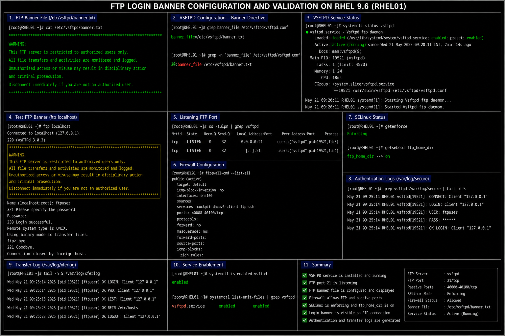

# FTP Login Banner Configuration

## Objective

Configure and validate a secure FTP login banner in a RHEL 9.6 enterprise Linux environment using VSFTPD to display authorized-use warnings and support enterprise security policies.

---

# Why It Matters

FTP login banners are commonly used in enterprise Linux environments to:

- display authorized-use warnings
- support compliance requirements
- discourage unauthorized access
- notify users about monitoring
- reinforce operational security policies
- identify managed infrastructure systems

Security banners are often required in enterprise and regulated environments.

---

# Environment Information

| Component | Value |
|---|---|
| Operating System | RHEL 9.6 |
| FTP Service | `vsftpd` |
| Configuration File | `/etc/vsftpd/vsftpd.conf` |
| Banner File | `/etc/vsftpd/banner.txt` |
| FTP Port | `21/tcp` |

---

# Create FTP Banner File

## Create Banner File

```bash
sudo vi /etc/vsftpd/banner.txt
```

## Example Enterprise FTP Banner

```text
***************************************************************************

WARNING:

This FTP server is restricted to authorized users only.

All file transfers and activities are monitored and logged.

Unauthorized access or misuse may result in disciplinary action
and criminal prosecution.

Disconnect immediately if you are not an authorized user.

***************************************************************************
```

---

# Configure VSFTPD Banner

## Edit VSFTPD Configuration

```bash
sudo vi /etc/vsftpd/vsftpd.conf
```

## Add Banner Configuration

```ini
banner_file=/etc/vsftpd/banner.txt
```

---

# Reload FTP Service

## Restart VSFTPD

```bash
sudo systemctl restart vsftpd
```

## Verify Service Status

```bash
systemctl status vsftpd
```

---

# Administrative Validation

## Verify Banner Configuration

```bash
grep banner_file /etc/vsftpd/vsftpd.conf
```

## Test FTP Banner

```bash
ftp localhost
```

## Verify Listening FTP Port

```bash
ss -tulpn | grep vsftpd
```

---

# Firewall Validation

## Verify FTP Access

```bash
sudo firewall-cmd --list-all
```

## Verify Passive Ports

```bash
sudo firewall-cmd --list-ports
```

---

# SELinux Validation

## Verify SELinux Mode

```bash
getenforce
```

## Verify FTP SELinux Boolean

```bash
getsebool ftp_home_dir
```

---

# Logging Validation

## Review VSFTPD Logs

```bash
sudo journalctl -u vsftpd
```

## Review Authentication Events

```bash
sudo grep vsftpd /var/log/secure
```

## Review Transfer Logs

```bash
sudo tail -f /var/log/xferlog
```

---

# Common Issues And Fixes

| Issue | Cause | Resolution |
|---|---|---|
| Banner not displayed | Missing banner directive | Verify `banner_file` setting |
| FTP login failure | VSFTPD service stopped | Restart service |
| FTP blocked | Firewall restriction | Allow FTP service |
| Banner file unreadable | Incorrect permissions | Verify banner file ownership |

---

# Operational Quality Notes

This FTP banner deployment reflects enterprise Linux security administration practices commonly used in RHEL 9.6 environments.

Enterprise administrators should validate:

- banner visibility
- warning message accuracy
- FTP accessibility
- firewall exposure
- authentication logging
- SELinux policy state

FTP warning banners should be reviewed periodically to ensure compliance with organizational security standards.

---

# Screenshot Capture

| Screenshot Requirement | Filename |
|---|---|
| FTP banner validation | `ftp-banner-validation.png` |

---

# Screenshot Reference


