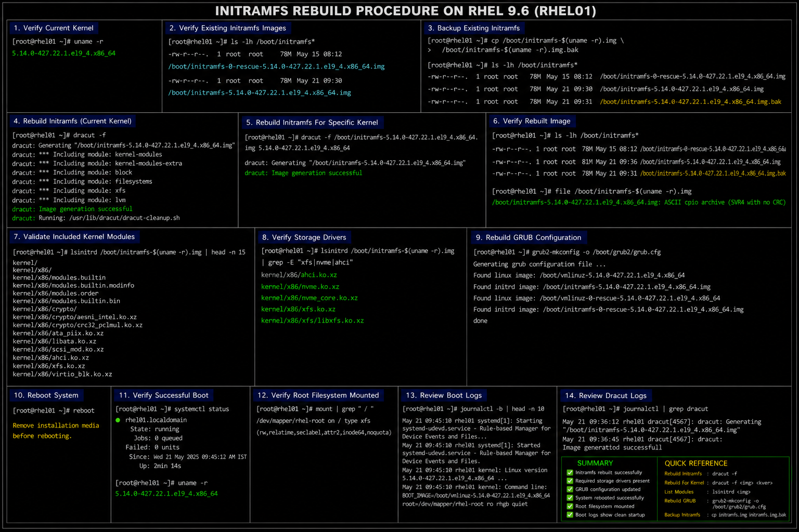
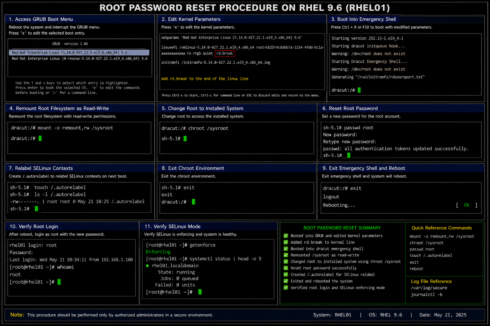

# Boot Recovery Procedures

## Overview

This directory contains enterprise-style Linux boot recovery documentation used in the RHEL 9.6 infrastructure lab environment.

The procedures demonstrate:

- UEFI boot recovery
- BIOS/MBR bootloader restoration
- initramfs rebuilding
- root password recovery
- GRUB2 troubleshooting
- enterprise Linux disaster recovery workflows

These recovery procedures are designed for:

- enterprise Linux administration
- infrastructure operations
- disaster recovery validation
- operational troubleshooting
- portfolio documentation

---

# Environment Information

| Component | Value |
|---|---|
| Operating System | RHEL 9.6 |
| Bootloader | GRUB2 |
| Boot Modes | UEFI and BIOS |
| Recovery Tool | `dracut` |
| Rescue Media | RHEL 9.6 ISO |

---

# Recovery Documents

| File | Purpose |
|---|---|
| `uefi-boot-recovery.md` | Recover corrupted UEFI bootloader |
| `bios-mbr-recovery.md` | Recover BIOS/MBR bootloader |
| `initramfs-rebuild.md` | Rebuild damaged initramfs images |
| `root-password-reset.md` | Reset root account password |

---

# Enterprise Recovery Areas

The recovery procedures in this directory cover:

- GRUB2 recovery
- EFI partition repair
- MBR restoration
- initramfs rebuilding
- kernel boot troubleshooting
- emergency shell recovery
- root credential recovery
- enterprise Linux disaster recovery operations

---

# Administrative Validation Commands

## Verify Running Kernel

```bash
uname -r
```

## Verify Boot Mode

### UEFI Validation

```bash
[ -d /sys/firmware/efi ] && echo UEFI
```

### BIOS Validation

```bash
[ ! -d /sys/firmware/efi ] && echo BIOS
```

## Review Boot Logs

```bash
journalctl -b
```

## Review Failed Services

```bash
systemctl --failed
```

## Verify GRUB Packages

```bash
rpm -qa | grep grub2
```

## Verify Mounted Filesystems

```bash
mount
```

---

# Common Enterprise Troubleshooting Areas

| Area | Validation |
|---|---|
| GRUB boot failure | Verify bootloader installation |
| Kernel panic | Validate initramfs image |
| Missing boot entry | Verify EFI configuration |
| Rescue shell loops | Validate root filesystem |
| Authentication failure | Verify SELinux relabel |
| Boot hangs | Review `journalctl -b` logs |

---

# Operational Quality Notes

These procedures are designed to simulate enterprise Linux disaster recovery practices commonly used in RHEL 9.6 environments.

Enterprise administrators should always validate:

- GRUB2 configuration integrity
- EFI or MBR bootloader installation
- initramfs image generation
- successful kernel boot
- filesystem mounting
- SELinux context integrity
- authentication functionality
- operational logging visibility

Recovery procedures should be tested regularly as part of enterprise operational continuity and disaster recovery exercises.

---

# Screenshot Capture

| Screenshot Requirement | Filename |
|---|---|
| UEFI boot recovery validation | `uefi-boot-recovery-validation.png` |
| BIOS MBR recovery validation | `bios-mbr-recovery-validation.png` |
| Initramfs rebuild validation | `initramfs-rebuild-validation.png` |
| Root password reset validation | `root-password-reset-validation.png` |

---

# Screenshot References







