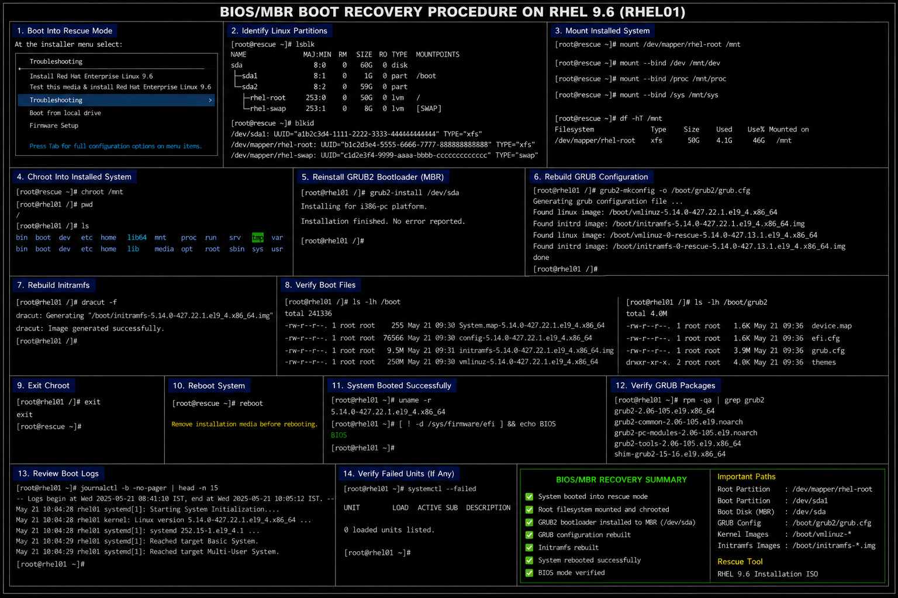

# BIOS MBR Boot Recovery Procedure

## Objective

Recover a failed BIOS/MBR bootloader in a RHEL 9.6 enterprise Linux environment using rescue mode and GRUB2 recovery procedures.

---

# Why It Matters

Legacy BIOS/MBR boot failures still occur in enterprise Linux environments due to:

- corrupted MBR boot records
- failed GRUB updates
- damaged boot partitions
- disk cloning issues
- accidental bootloader overwrite
- storage migration operations

Enterprise administrators must be able to restore boot functionality rapidly to reduce operational downtime.

---

# Environment Information

| Component | Value |
|---|---|
| Operating System | RHEL 9.6 |
| Boot Mode | BIOS / Legacy |
| Bootloader | GRUB2 |
| Boot Disk | `/dev/sda` |
| Rescue Media | RHEL 9.6 ISO |

---

# Common Failure Symptoms

| Symptom | Description |
|---|---|
| `grub>` prompt | Missing GRUB configuration |
| Black screen after BIOS | Corrupted MBR |
| Operating system not found | Bootloader missing |
| Kernel panic | Missing boot files |
| Rescue shell appears | Boot process failure |

---

# Boot Into Rescue Environment

## Attach RHEL Installation ISO

Mount the RHEL 9.6 installation ISO using the hypervisor or physical media.

---

## Boot Into Rescue Mode

At the installer menu select:

```text
Troubleshooting → Rescue a Red Hat Enterprise Linux system
```

---

# Identify Linux Partitions

## List Block Devices

```bash
lsblk
```

## Verify Filesystems

```bash
blkid
```

Typical root partition:

```text
/dev/mapper/rhel-root
```

Typical boot disk:

```text
/dev/sda
```

---

# Mount Installed System

## Mount Root Filesystem

```bash
mount /dev/mapper/rhel-root /mnt
```

## Mount Required Directories

```bash
mount --bind /dev /mnt/dev
mount --bind /proc /mnt/proc
mount --bind /sys /mnt/sys
```

---

# Chroot Into Installed System

## Enter Chroot Environment

```bash
chroot /mnt
```

---

# Reinstall GRUB2 Bootloader

## Install GRUB To MBR

```bash
grub2-install /dev/sda
```

Expected output:

```text
Installation finished. No error reported.
```

---

# Rebuild GRUB Configuration

## Generate GRUB Configuration

```bash
grub2-mkconfig -o /boot/grub2/grub.cfg
```

---

# Rebuild Initramfs

## Rebuild Initramfs Image

```bash
dracut -f
```

---

# Verify Boot Files

## Verify Kernel Files

```bash
ls -lh /boot
```

## Verify GRUB Files

```bash
ls -lh /boot/grub2
```

---

# Exit Recovery Environment

## Exit Chroot

```bash
exit
```

## Reboot System

```bash
reboot
```

Remove installation media before rebooting.

---

# Administrative Validation

## Verify Running Kernel

```bash
uname -r
```

## Verify Boot Mode

```bash
[ ! -d /sys/firmware/efi ] && echo BIOS
```

## Verify GRUB Packages

```bash
rpm -qa | grep grub2
```

## Verify Mounted Filesystems

```bash
mount
```

---

# Logging Validation

## Review Boot Logs

```bash
journalctl -b
```

## Review Failed Boot Units

```bash
systemctl --failed
```

---

# Common Issues And Fixes

| Issue | Cause | Resolution |
|---|---|---|
| `grub2-install` fails | Incorrect disk selection | Verify target disk |
| Boot still fails | Corrupted GRUB config | Rebuild using `grub2-mkconfig` |
| Kernel panic | Damaged initramfs | Rebuild using `dracut -f` |
| Rescue mode cannot detect system | Incorrect partition mapping | Verify using `lsblk` |

---

# Operational Quality Notes

This BIOS/MBR recovery workflow reflects enterprise Linux disaster recovery practices commonly used in RHEL 9.6 environments.

Enterprise administrators should validate:

- MBR integrity
- GRUB bootloader installation
- kernel file availability
- initramfs generation
- successful system boot
- filesystem mounting

Boot recovery procedures should be validated regularly as part of enterprise disaster recovery exercises.

---

# Screenshot Capture

| Screenshot Requirement | Filename |
|---|---|
| BIOS MBR recovery validation | `bios-mbr-recovery-validation.png` |

---

# Screenshot Reference


