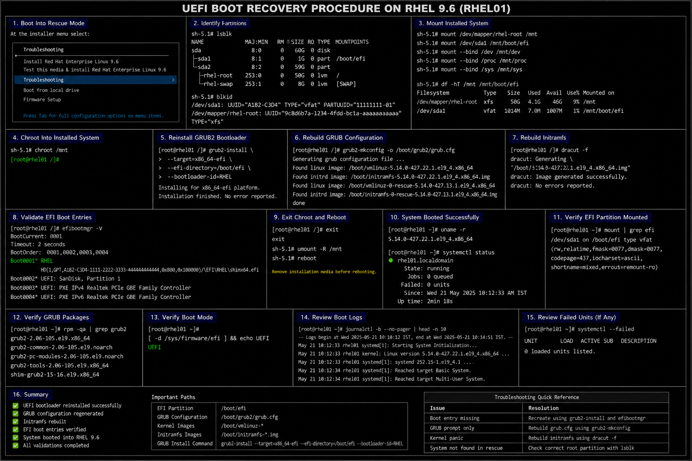

# UEFI Boot Recovery Procedure

## Objective

Recover a failed UEFI bootloader in a RHEL 9.6 enterprise Linux environment using rescue mode and GRUB2 recovery procedures.

---

# Why It Matters

UEFI boot failures are common in enterprise Linux environments due to:

- corrupted GRUB configuration
- failed kernel upgrades
- damaged EFI partitions
- bootloader misconfiguration
- filesystem corruption
- storage migration operations

Enterprise administrators must be able to restore boot functionality quickly to minimize downtime.

---

# Environment Information

| Component | Value |
|---|---|
| Operating System | RHEL 9.6 |
| Boot Mode | UEFI |
| Bootloader | GRUB2 |
| EFI Partition | `/boot/efi` |
| Rescue Media | RHEL 9.6 ISO |

---

# Common Failure Symptoms

| Symptom | Description |
|---|---|
| GRUB prompt appears | Missing boot configuration |
| Black screen during boot | EFI boot failure |
| Kernel panic | Missing initramfs or kernel |
| No boot entry found | Corrupted EFI partition |
| Emergency mode | Filesystem or boot issue |

---

# Boot Into Rescue Environment

## Attach RHEL Installation ISO

Mount the RHEL 9.6 ISO using the hypervisor or physical media.

---

## Boot Into Rescue Mode

At the installer menu select:

```text
Troubleshooting → Rescue a Red Hat Enterprise Linux system
```

---

# Identify Linux Partitions

## List Block Devices

```bash
lsblk
```

## Verify EFI Partition

```bash
blkid
```

Typical EFI partition:

```text
/dev/sda1
```

Typical root partition:

```text
/dev/mapper/rhel-root
```

---

# Mount Installed System

## Mount Root Filesystem

```bash
mount /dev/mapper/rhel-root /mnt
```

## Mount EFI Partition

```bash
mount /dev/sda1 /mnt/boot/efi
```

## Mount Required System Directories

```bash
mount --bind /dev /mnt/dev
mount --bind /proc /mnt/proc
mount --bind /sys /mnt/sys
```

---

# Chroot Into Installed System

## Enter Chroot Environment

```bash
chroot /mnt
```

---

# Reinstall GRUB2 Bootloader

## Install EFI Bootloader

```bash
grub2-install \
--target=x86_64-efi \
--efi-directory=/boot/efi \
--bootloader-id=RHEL
```

---

# Rebuild GRUB Configuration

## Generate GRUB Configuration

```bash
grub2-mkconfig -o /boot/grub2/grub.cfg
```

---

# Rebuild Initramfs

## Rebuild Initramfs Image

```bash
dracut -f
```

---

# Validate EFI Boot Entries

## Verify EFI Entries

```bash
efibootmgr -v
```

Expected output should show:

```text
Boot0001* RHEL
```

---

# Exit Recovery Environment

## Exit Chroot

```bash
exit
```

## Reboot System

```bash
reboot
```

Remove installation media before rebooting.

---

# Administrative Validation

## Verify Running Kernel

```bash
uname -r
```

## Verify Mounted EFI Partition

```bash
mount | grep efi
```

## Verify GRUB Packages

```bash
rpm -qa | grep grub2
```

## Verify Boot Mode

```bash
[ -d /sys/firmware/efi ] && echo UEFI
```

---

# Logging Validation

## Review Boot Logs

```bash
journalctl -b
```

## Review Failed Boot Units

```bash
systemctl --failed
```

---

# Common Issues And Fixes

| Issue | Cause | Resolution |
|---|---|---|
| `grub2-install` fails | EFI partition not mounted | Mount `/boot/efi` |
| Boot entry missing | EFI configuration corrupted | Recreate using `efibootmgr` |
| System still not booting | Initramfs corrupted | Rebuild with `dracut -f` |
| Rescue mode cannot find root filesystem | Incorrect partition mapping | Verify using `lsblk` |

---

# Operational Quality Notes

This UEFI recovery workflow reflects enterprise Linux disaster recovery practices commonly used in RHEL 9.6 environments.

Enterprise administrators should validate:

- EFI partition integrity
- GRUB bootloader installation
- initramfs availability
- boot entry visibility
- filesystem mounting
- successful kernel boot

Boot recovery procedures should be tested periodically as part of enterprise disaster recovery validation exercises.

---

# Screenshot Capture

| Screenshot Requirement | Filename |
|---|---|
| UEFI boot recovery validation | `uefi-boot-recovery-validation.png` |

---

# Screenshot Reference



