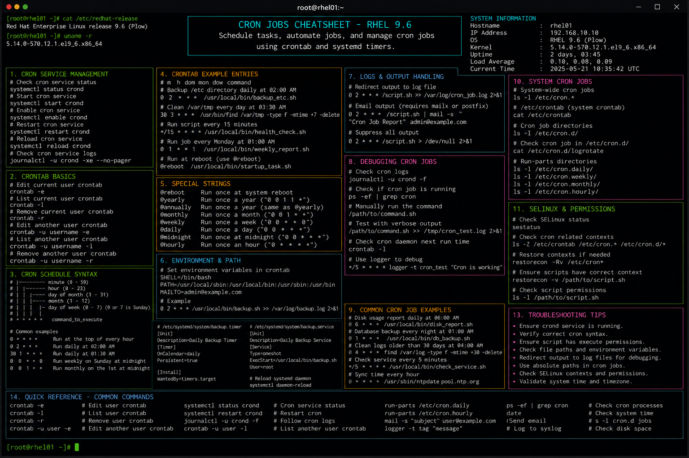

# cron-jobs.md

# Cron Job Administration Commands Cheat Sheet

## Overview

This document provides a practical enterprise Linux administration cheat sheet for scheduling automated tasks, recurring maintenance jobs, backup operations, and cron troubleshooting on Red Hat Enterprise Linux (RHEL) 9.6 systems.

The commands and workflows included are commonly used during infrastructure automation, operational maintenance, log rotation management, backup scheduling, monitoring tasks, and enterprise batch processing activities.

This reference is designed for fast operational lookup during production Linux administration tasks.

---

## Environment Information

| Component | Details |
|---|---|
| Operating System | RHEL 9.6 |
| Hostname | rhel01.lab.local |
| Scheduler Service | crond |
| Log Location | /var/log/cron |
| SELinux Mode | Enforcing |
| User Context | root / sudo administrator |
| Lab Platform | VMware Enterprise Lab |

---

## Common Commands

### Edit Current User Crontab

```bash
crontab -e
```

### List Current User Cron Jobs

```bash
crontab -l
```

### Remove Current User Crontab

```bash
crontab -r
```

### Edit Root Cron Jobs

```bash
sudo crontab -e
```

### Verify Cron Service Status

```bash
systemctl status crond
```

### Enable Cron Service at Boot

```bash
systemctl enable crond
```

### Restart Cron Service

```bash
systemctl restart crond
```

### View Cron Logs

```bash
journalctl -u crond
```

### Display Scheduled Jobs for User

```bash
crontab -u backupadmin -l
```

### Edit System-Wide Cron File

```bash
vim /etc/crontab
```

### Display Periodic Task Directories

```bash
ls -l /etc/cron.*
```

### Validate Cron Execution Logs

```bash
grep CRON /var/log/cron
```

---

## Administrative Examples

### Schedule Daily Backup Job

```cron
0 2 * * * /usr/local/scripts/backup.sh
```

### Schedule Log Cleanup Every Sunday

```cron
0 3 * * 0 /usr/local/scripts/log-cleanup.sh
```

### Schedule Health Check Every 5 Minutes

```cron
*/5 * * * * /usr/local/scripts/health-check.sh
```

### Redirect Job Output to Log File

```cron
*/10 * * * * /usr/local/scripts/monitor.sh >> /var/log/monitor.log 2>&1
```

### Execute Job at System Reboot

```cron
@reboot /usr/local/scripts/startup-check.sh
```

### Configure Root System Maintenance Job

```cron
30 1 * * * root /usr/local/scripts/system-maintenance.sh
```

### Validate Cron Syntax

```bash
crontab -l
```

---

## Validation Commands

### Verify Cron Service State

```bash
systemctl is-active crond
```

Example output:

```text
active
```

### Verify Scheduled Jobs

```bash
crontab -l
```

### Review Cron Execution Logs

```bash
tail -f /var/log/cron
```

### Verify Running Scheduled Processes

```bash
ps -ef | grep cron
```

### Validate Job Output Logs

```bash
cat /var/log/monitor.log
```

### Verify Script Permissions

```bash
ls -l /usr/local/scripts
```

### Validate SELinux Contexts

```bash
ls -Z /usr/local/scripts
```

### Review Failed Job Executions

```bash
journalctl -u crond -xe
```

---

## Troubleshooting Tips

### Cron Job Not Running

Verify cron service status:

```bash
systemctl status crond
```

Verify user crontab:

```bash
crontab -l
```

### Script Permission Issues

Ensure executable permissions:

```bash
chmod +x /usr/local/scripts/backup.sh
```

### Environment Variable Problems

Cron jobs run with limited environment variables.

Use full command paths:

```cron
*/5 * * * * /usr/bin/bash /usr/local/scripts/health-check.sh
```

### Missing Output or Logs

Redirect stdout and stderr:

```cron
*/5 * * * * /script.sh >> /var/log/script.log 2>&1
```

### SELinux Blocking Script Execution

Review SELinux denials:

```bash
ausearch -m avc -ts recent
```

Restore contexts:

```bash
restorecon -Rv /usr/local/scripts
```

### Incorrect Cron Syntax

Validate schedule fields carefully:

```text
* * * * * command
- - - - -
| | | | |
| | | | + day of week
| | | +--- month
| | +----- day of month
| +------- hour
+--------- minute
```

---

## Operational Notes

- Use centralized logging for scheduled automation tasks.
- Validate backup and maintenance jobs regularly.
- Maintain least-privilege execution principles.
- Document all enterprise scheduled jobs and dependencies.
- Redirect output for troubleshooting and auditing purposes.
- Use absolute paths in cron jobs to avoid execution failures.
- Validate SELinux contexts after deploying automation scripts.

Example operational audit commands:

```bash
crontab -l
journalctl -u crond
ls -l /etc/cron.*
```

---

## Screenshot Reference


