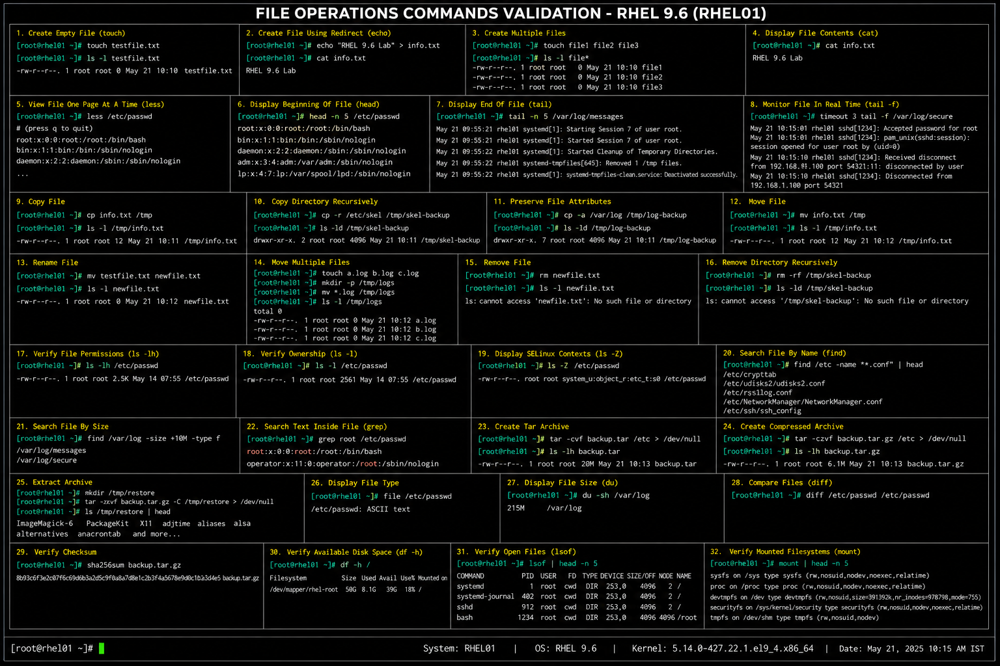

# File Operations Commands Cheat Sheet

## Overview

This cheat sheet contains commonly used file operation commands for RHEL 9.6 enterprise Linux administration and operational management.

These commands help administrators:

- create and manage files
- copy and move data
- archive files
- validate permissions
- inspect file contents
- troubleshoot storage and operational issues

---

# Environment Information

| Component | Value |
|---|---|
| Operating System | RHEL 9.6 |
| Default Shell | Bash |
| Filesystem Type | XFS |
| Temporary Workspace | `/tmp` |

---

# File Creation Commands

## Create Empty File

```bash
touch testfile.txt
```

## Create File Using Redirect

```bash
echo "RHEL 9.6 Lab" > info.txt
```

## Create Multiple Files

```bash
touch file1 file2 file3
```

---

# File Viewing Commands

## Display File Contents

```bash
cat info.txt
```

## View File One Page At A Time

```bash
less /var/log/messages
```

## Display Beginning Of File

```bash
head -n 10 /etc/passwd
```

## Display End Of File

```bash
tail -n 10 /var/log/messages
```

## Monitor File In Real Time

```bash
tail -f /var/log/secure
```

---

# File Copy Operations

## Copy File

```bash
cp info.txt /tmp
```

## Copy Directory Recursively

```bash
cp -r /etc/skel /tmp/skel-backup
```

## Preserve File Attributes

```bash
cp -a /var/log /tmp/log-backup
```

---

# File Move And Rename Operations

## Move File

```bash
mv info.txt /tmp
```

## Rename File

```bash
mv oldfile.txt newfile.txt
```

## Move Multiple Files

```bash
mv *.log /tmp/logs
```

---

# File Removal Commands

## Remove File

```bash
rm testfile.txt
```

## Remove Multiple Files

```bash
rm file1 file2
```

## Remove Directory Recursively

```bash
rm -rf /tmp/skel-backup
```

---

# File Permission Validation

## Verify File Permissions

```bash
ls -lh
```

## Verify Ownership

```bash
ls -l /etc/passwd
```

## Display SELinux Contexts

```bash
ls -Z
```

---

# File Search Operations

## Search File By Name

```bash
find /etc -name "*.conf"
```

## Search File By Size

```bash
find /var/log -size +10M
```

## Search Text Inside File

```bash
grep root /etc/passwd
```

---

# Compression And Archiving

## Create Tar Archive

```bash
tar -cvf backup.tar /etc
```

## Create Compressed Archive

```bash
tar -czvf backup.tar.gz /etc
```

## Extract Archive

```bash
tar -xzvf backup.tar.gz
```

---

# File Integrity And Information

## Display File Type

```bash
file /etc/passwd
```

## Display File Size

```bash
du -sh /var/log
```

## Compare Files

```bash
diff file1 file2
```

## Verify Checksum

```bash
sha256sum backup.tar.gz
```

---

# Administrative Validation Commands

## Verify Available Disk Space

```bash
df -h
```

## Verify Open Files

```bash
lsof | head
```

## Verify Mounted Filesystems

```bash
mount
```

---

# Troubleshooting Tips

| Issue | Validation Command |
|---|---|
| File missing | `find` |
| Permission denied | `ls -l` |
| Disk full | `df -h` |
| Corrupted archive | `tar -tvf` |
| SELinux issue | `ls -Z` |
| Locked file | `lsof` |

---

# Operational Notes

These commands reflect enterprise Linux file management practices commonly used in RHEL 9.6 environments.

Administrators should regularly validate:

- file ownership
- permissions
- archive integrity
- filesystem capacity
- file locations
- SELinux contexts
- backup operations
- file integrity checks

File operation skills are essential for enterprise Linux troubleshooting and infrastructure administration.

---

# Screenshot Capture

| Screenshot Requirement | Filename |
|---|---|
| File operations validation | `file-operations-validation.png` |

---

# Screenshot Reference


