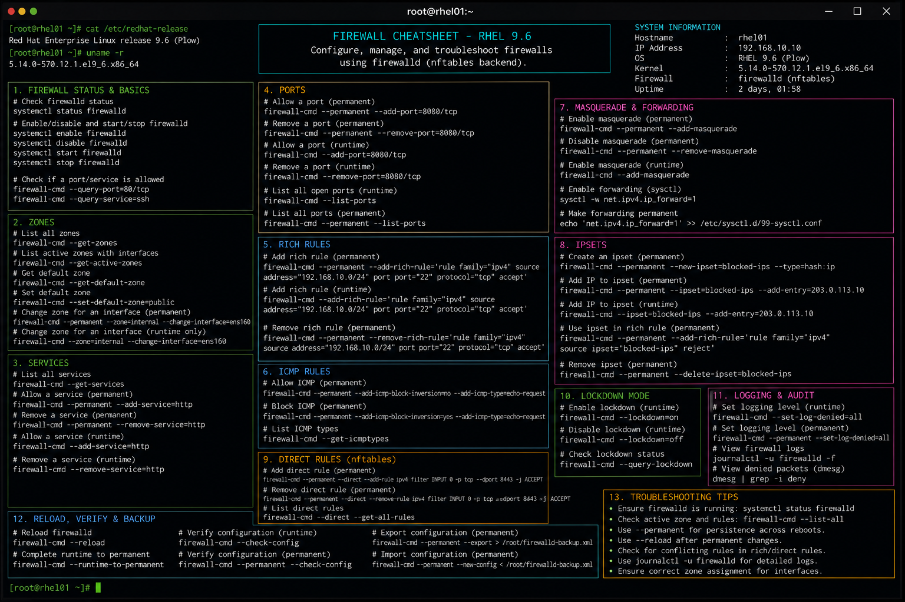

# firewall.md

# Firewalld Administration Commands Cheat Sheet

## Overview

This document provides a practical enterprise Linux administration cheat sheet for managing firewall policies, zones, services, ports, and packet filtering operations on Red Hat Enterprise Linux (RHEL) 9.6 systems.

The commands and workflows included are commonly used during infrastructure hardening, application deployment, network security validation, access control management, and operational troubleshooting activities.

This reference is designed for fast operational lookup during production Linux administration tasks.

---

## Environment Information

| Component | Details |
|---|---|
| Operating System | RHEL 9.6 |
| Hostname | rhel01.lab.local |
| Firewall Service | firewalld |
| Backend | nftables |
| SELinux Mode | Enforcing |
| User Context | root / sudo administrator |
| Lab Platform | VMware Enterprise Lab |

---

## Common Commands

### Check Firewall Status

```bash
systemctl status firewalld
```

### Start Firewall Service

```bash
systemctl start firewalld
```

### Enable Firewall at Boot

```bash
systemctl enable firewalld
```

### Display Active Zones

```bash
firewall-cmd --get-active-zones
```

### Display Current Rules

```bash
firewall-cmd --list-all
```

### Allow HTTP Service

```bash
firewall-cmd --permanent --add-service=http
```

### Allow HTTPS Service

```bash
firewall-cmd --permanent --add-service=https
```

### Open Specific Port

```bash
firewall-cmd --permanent --add-port=8080/tcp
```

### Remove Open Port

```bash
firewall-cmd --permanent --remove-port=8080/tcp
```

### Reload Firewall Rules

```bash
firewall-cmd --reload
```

### Display Allowed Services

```bash
firewall-cmd --list-services
```

### Display Open Ports

```bash
firewall-cmd --list-ports
```

---

## Administrative Examples

### Configure Web Server Access

```bash
firewall-cmd --permanent --add-service=http
firewall-cmd --permanent --add-service=https
firewall-cmd --reload
```

### Configure Custom Application Port

```bash
firewall-cmd --permanent --add-port=8443/tcp
firewall-cmd --reload
```

### Configure SSH Access Restriction

```bash
firewall-cmd --permanent --remove-service=ssh
firewall-cmd --reload
```

### Create Rich Rule for Trusted Subnet

```bash
firewall-cmd --permanent \
--add-rich-rule='rule family="ipv4" source address="192.168.10.0/24" service name="ssh" accept'
```

### Configure Masquerading

```bash
firewall-cmd --permanent --add-masquerade
```

### Configure Port Forwarding

```bash
firewall-cmd --permanent \
--add-forward-port=port=8080:proto=tcp:toport=80
```

### Validate Zone Configuration

```bash
firewall-cmd --get-default-zone
```

---

## Validation Commands

### Verify Firewall Service State

```bash
systemctl is-active firewalld
```

Example output:

```text
active
```

### Verify Active Rules

```bash
firewall-cmd --list-all
```

### Validate Allowed Services

```bash
firewall-cmd --list-services
```

### Verify Open Ports

```bash
firewall-cmd --list-ports
```

### Validate Runtime vs Permanent Rules

```bash
firewall-cmd --runtime-to-permanent
```

### Verify Listening Services

```bash
ss -tulpn
```

### Validate SELinux Port Contexts

```bash
semanage port -l | grep http
```

### Review Firewall Logs

```bash
journalctl -u firewalld
```

---

## Troubleshooting Tips

### Firewall Service Not Running

Verify service state:

```bash
systemctl status firewalld
```

Start service:

```bash
systemctl enable --now firewalld
```

### Port Still Blocked

Verify active rules:

```bash
firewall-cmd --list-all
```

Check listening process:

```bash
ss -tulpn
```

### Runtime Rule Lost After Reboot

Use permanent rule configuration:

```bash
firewall-cmd --permanent --add-service=http
```

Reload rules:

```bash
firewall-cmd --reload
```

### SELinux Blocking Service Access

Review SELinux denials:

```bash
ausearch -m avc -ts recent
```

Validate allowed ports:

```bash
semanage port -l
```

### Incorrect Zone Assignment

Verify interface zone mapping:

```bash
firewall-cmd --get-active-zones
```

Assign interface to zone:

```bash
firewall-cmd --zone=public --change-interface=ens160
```

### Application Connectivity Issues

Test remote connectivity:

```bash
nc -zv 192.168.10.20 443
```

---

## Operational Notes

- Use least-privilege firewall rules in enterprise environments.
- Validate runtime and permanent configurations after changes.
- Document custom ports and rich rules for audit compliance.
- Use zones to separate infrastructure trust boundaries.
- Validate SELinux and firewall integration for application deployments.
- Monitor listening services during security reviews.
- Maintain firewall backup and rollback procedures.

Example operational audit commands:

```bash
firewall-cmd --list-all-zones
ss -tulpn
journalctl -u firewalld
```

---

## Screenshot Reference


