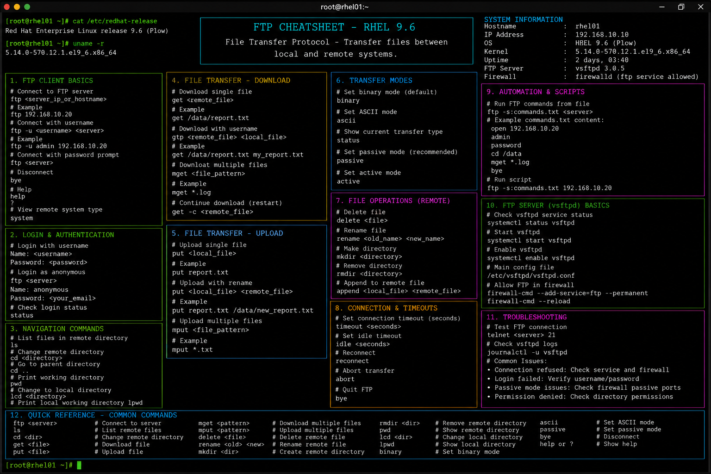

# ftp.md

# FTP Administration Commands Cheat Sheet

## Overview

This document provides a practical enterprise Linux administration cheat sheet for FTP service configuration, file transfer operations, user access management, security validation, and troubleshooting on Red Hat Enterprise Linux (RHEL) 9.6 systems.

The commands and workflows included are commonly used during enterprise file distribution, backup transfers, repository synchronization, application deployment support, and operational maintenance activities.

This reference is designed for fast operational lookup during production Linux administration tasks.

---

## Environment Information

| Component | Details |
|---|---|
| Operating System | RHEL 9.6 |
| Hostname | rhel01.lab.local |
| FTP Service | vsftpd |
| FTP Port | 21/TCP |
| SELinux Mode | Enforcing |
| User Context | root / sudo administrator |
| Lab Platform | VMware Enterprise Lab |

---

## Common Commands

### Install FTP Service

```bash
dnf install -y vsftpd
```

### Start FTP Service

```bash
systemctl start vsftpd
```

### Enable FTP Service at Boot

```bash
systemctl enable vsftpd
```

### Verify FTP Service Status

```bash
systemctl status vsftpd
```

### Connect to FTP Server

```bash
ftp 192.168.10.20
```

### Upload File Using FTP

```bash
put backup.tar.gz
```

### Download File Using FTP

```bash
get report.log
```

### List Remote Files

```bash
ls
```

### Exit FTP Session

```bash
bye
```

### Verify Listening FTP Ports

```bash
ss -tulpn | grep vsftpd
```

### Review FTP Logs

```bash
journalctl -u vsftpd
```

### Validate Firewall Rules

```bash
firewall-cmd --list-all
```

---

## Administrative Examples

### Install and Enable vsftpd

```bash
dnf install -y vsftpd
systemctl enable --now vsftpd
```

### Configure Anonymous FTP Access

Edit FTP configuration:

```bash
vim /etc/vsftpd/vsftpd.conf
```

Example configuration:

```ini
anonymous_enable=YES
local_enable=YES
write_enable=YES
```

### Configure Local User Access

```ini
local_enable=YES
chroot_local_user=YES
```

### Restart FTP Service After Changes

```bash
systemctl restart vsftpd
```

### Open FTP Service in Firewalld

```bash
firewall-cmd --permanent --add-service=ftp
firewall-cmd --reload
```

### Configure SELinux FTP Access

```bash
setsebool -P ftpd_full_access on
```

### Upload Backup Archive

```bash
ftp 192.168.10.20
put backup.tar.gz
```

---

## Validation Commands

### Verify FTP Service State

```bash
systemctl is-active vsftpd
```

Example output:

```text
active
```

### Validate FTP Listening Port

```bash
ss -tulpn | grep :21
```

### Verify FTP Firewall Access

```bash
firewall-cmd --list-services
```

### Validate SELinux FTP Booleans

```bash
getsebool -a | grep ftp
```

### Verify FTP Configuration Syntax

```bash
cat /etc/vsftpd/vsftpd.conf
```

### Review FTP Logs

```bash
journalctl -u vsftpd
```

### Test FTP Connectivity

```bash
nc -zv 192.168.10.20 21
```

### Validate Uploaded Files

```bash
ls -l /var/ftp/pub
```

---

## Troubleshooting Tips

### FTP Service Fails to Start

Review service status:

```bash
systemctl status vsftpd
```

Review logs:

```bash
journalctl -xe
journalctl -u vsftpd
```

### FTP Connection Refused

Verify service state:

```bash
systemctl status vsftpd
```

Verify listening ports:

```bash
ss -tulpn | grep vsftpd
```

### Firewall Blocking FTP Access

Verify firewall configuration:

```bash
firewall-cmd --list-all
```

Open FTP service:

```bash
firewall-cmd --permanent --add-service=ftp
firewall-cmd --reload
```

### SELinux Blocking FTP Transfers

Review SELinux denials:

```bash
ausearch -m avc -ts recent
```

Enable FTP SELinux boolean:

```bash
setsebool -P ftpd_full_access on
```

### FTP Upload Permission Denied

Verify filesystem permissions:

```bash
ls -ld /var/ftp/pub
```

### Passive FTP Connection Issues

Configure passive ports:

```ini
pasv_min_port=30000
pasv_max_port=31000
```

Open passive ports:

```bash
firewall-cmd --permanent --add-port=30000-31000/tcp
```

---

## Operational Notes

- Prefer secure transfer protocols such as SFTP where operationally possible.
- Validate firewall and SELinux integration after FTP deployments.
- Restrict anonymous access in enterprise production environments.
- Monitor FTP logs during file transfer operations.
- Maintain proper file ownership and permissions for upload directories.
- Use passive FTP mode carefully behind enterprise firewalls.
- Validate service exposure during security audits.

Example operational audit commands:

```bash
journalctl -u vsftpd
ss -tulpn | grep :21
firewall-cmd --list-all
```

---

## Screenshot Reference



