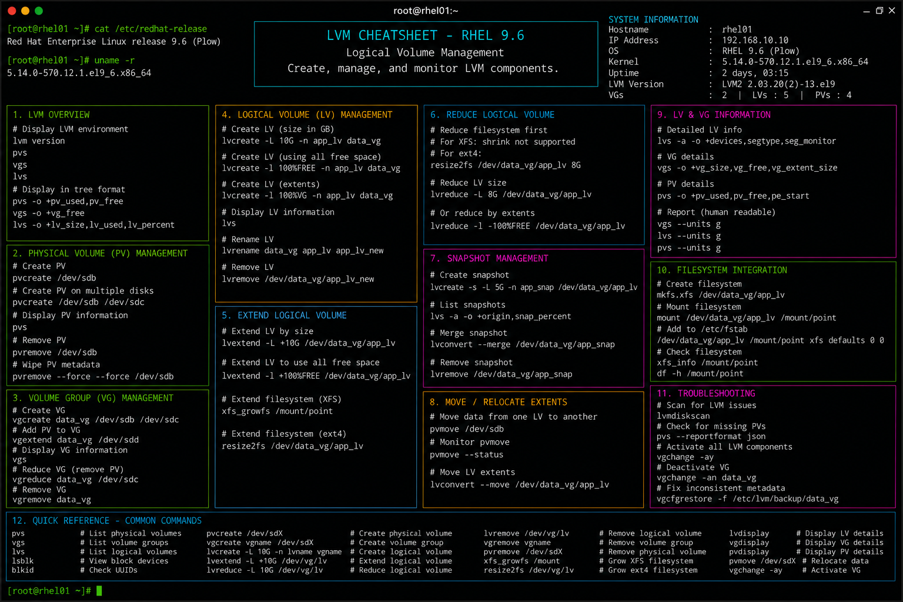

# lvm.md

# LVM Administration Commands Cheat Sheet

## Overview

This document provides a practical enterprise Linux administration cheat sheet for Logical Volume Manager (LVM) configuration, storage provisioning, filesystem expansion, snapshot management, and troubleshooting operations on Red Hat Enterprise Linux (RHEL) 9.6 systems.

The commands and workflows included are commonly used during enterprise storage administration, capacity planning, backup preparation, filesystem scaling, and infrastructure maintenance activities.

This reference is designed for fast operational lookup during production Linux administration tasks.

---

## Environment Information

| Component | Details |
|---|---|
| Operating System | RHEL 9.6 |
| Hostname | rhel01.lab.local |
| Storage Management | LVM2 |
| Filesystem Type | XFS / EXT4 |
| SELinux Mode | Enforcing |
| User Context | root / sudo administrator |
| Lab Platform | VMware Enterprise Lab |

---

## Common Commands

### Display Physical Volumes

```bash
pvs
```

### Display Volume Groups

```bash
vgs
```

### Display Logical Volumes

```bash
lvs
```

### Create Physical Volume

```bash
pvcreate /dev/sdb1
```

### Create Volume Group

```bash
vgcreate vg_data /dev/sdb1
```

### Create Logical Volume

```bash
lvcreate -L 10G -n lv_backup vg_data
```

### Format Logical Volume with XFS

```bash
mkfs.xfs /dev/vg_data/lv_backup
```

### Mount Logical Volume

```bash
mount /dev/vg_data/lv_backup /backup
```

### Extend Logical Volume

```bash
lvextend -L +5G /dev/vg_data/lv_backup
```

### Extend XFS Filesystem

```bash
xfs_growfs /backup
```

### Create Snapshot

```bash
lvcreate -s -L 2G -n lv_snapshot /dev/vg_data/lv_backup
```

### Remove Logical Volume

```bash
lvremove /dev/vg_data/lv_backup
```

---

## Administrative Examples

### Create New LVM Storage Pool

```bash
pvcreate /dev/sdb1
vgcreate vg_data /dev/sdb1
lvcreate -L 20G -n lv_archive vg_data
```

### Format and Mount Logical Volume

```bash
mkfs.xfs /dev/vg_data/lv_archive
mkdir -p /archive
mount /dev/vg_data/lv_archive /archive
```

### Configure Persistent Mount

```bash
blkid
vim /etc/fstab
```

Example fstab entry:

```fstab
/dev/vg_data/lv_archive /archive xfs defaults 0 0
```

### Extend Existing Logical Volume

```bash
lvextend -L +10G /dev/vg_data/lv_archive
xfs_growfs /archive
```

### Create Snapshot Before Maintenance

```bash
lvcreate -s -L 5G -n lv_archive_snap /dev/vg_data/lv_archive
```

### Display Detailed LVM Information

```bash
lvdisplay
vgdisplay
pvdisplay
```

### Remove Snapshot

```bash
lvremove /dev/vg_data/lv_archive_snap
```

---

## Validation Commands

### Verify Physical Volumes

```bash
pvs
```

Example output:

```text
PV         VG       Fmt  Attr PSize   PFree
/dev/sdb1  vg_data  lvm2 a--  <50.00g 20.00g
```

### Validate Volume Groups

```bash
vgs
```

### Verify Logical Volumes

```bash
lvs
```

### Validate Mounted Filesystems

```bash
mount | grep archive
```

### Verify Filesystem Usage

```bash
df -h
```

### Validate Filesystem Type

```bash
lsblk -f
```

### Verify SELinux Contexts

```bash
ls -Zd /archive
```

### Review Kernel Storage Logs

```bash
journalctl -k
```

---

## Troubleshooting Tips

### Logical Volume Not Mounting

Verify filesystem type:

```bash
lsblk -f
```

Validate mount configuration:

```bash
mount -a
```

### Volume Group Not Found

Scan for volume groups:

```bash
vgscan
```

Activate volume group:

```bash
vgchange -ay
```

### Filesystem Expansion Issues

Verify free space availability:

```bash
vgs
```

Extend filesystem after LV resize:

```bash
xfs_growfs /archive
```

### Snapshot Full Errors

Display snapshot usage:

```bash
lvs
```

Remove unused snapshots:

```bash
lvremove /dev/vg_data/lv_archive_snap
```

### SELinux Access Problems

Review contexts:

```bash
ls -Z /archive
```

Restore default contexts:

```bash
restorecon -Rv /archive
```

### Disk Device Not Detected

Rescan SCSI devices:

```bash
echo "- - -" > /sys/class/scsi_host/host0/scan
```

Review storage logs:

```bash
dmesg | tail
```

---

## Operational Notes

- Use snapshots before major filesystem or application maintenance activities.
- Monitor free space availability in volume groups regularly.
- Validate filesystem growth after logical volume expansion.
- Maintain backup procedures before LVM modifications.
- Use UUID-based mounts for persistent enterprise storage consistency.
- Validate SELinux contexts after storage migrations.
- Monitor kernel and storage logs during troubleshooting operations.

Example operational audit commands:

```bash
pvs
vgs
lvs
df -Th
```

---

## Screenshot Reference



