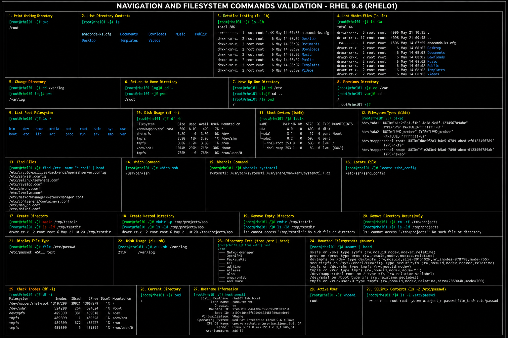

# Navigation And Filesystem Commands Cheat Sheet

## Overview

This cheat sheet contains commonly used filesystem navigation and directory management commands for RHEL 9.6 enterprise Linux administration.

These commands help administrators:

- navigate filesystems
- inspect directories
- identify storage locations
- verify mounted filesystems
- troubleshoot path issues
- manage enterprise Linux environments efficiently

---

# Environment Information

| Component | Value |
|---|---|
| Operating System | RHEL 9.6 |
| Default Shell | Bash |
| Filesystem Type | XFS |
| Root Filesystem | `/` |

---

# Basic Navigation Commands

## Display Current Directory

```bash
pwd
```

## List Directory Contents

```bash
ls
```

## List Detailed Directory Information

```bash
ls -lh
```

## List Hidden Files

```bash
ls -la
```

---

# Directory Navigation

## Change Directory

```bash
cd /var/log
```

## Return To Home Directory

```bash
cd ~
```

## Move Up One Directory

```bash
cd ..
```

## Return To Previous Directory

```bash
cd -
```

---

# Filesystem Structure Exploration

## List Root Filesystem

```bash
ls /
```

## Display Mounted Filesystems

```bash
df -h
```

## Display Block Devices

```bash
lsblk
```

## Display Filesystem Types

```bash
blkid
```

---

# File Discovery Commands

## Locate Files

```bash
find /etc -name "*.conf"
```

## Search Binary Location

```bash
which ssh
```

## Search Command Documentation

```bash
whereis systemctl
```

## Locate Files Using Database

```bash
locate sshd_config
```

---

# Directory Management

## Create Directory

```bash
mkdir /tmp/testdir
```

## Create Nested Directories

```bash
mkdir -p /tmp/projects/app
```

## Remove Empty Directory

```bash
rmdir /tmp/testdir
```

## Remove Directory Recursively

```bash
rm -rf /tmp/projects
```

---

# File Inspection

## Display File Type

```bash
file /etc/passwd
```

## Display Disk Usage

```bash
du -sh /var/log
```

## Display Directory Tree

```bash
tree /etc
```

---

# Filesystem Validation

## Verify Mount Points

```bash
mount
```

## Verify Available Inodes

```bash
df -i
```

## Verify Current User Location

```bash
pwd
```

---

# Administrative Validation Commands

## Verify System Hostname

```bash
hostnamectl
```

## Verify Active User

```bash
whoami
```

## Verify SELinux Contexts

```bash
ls -Z
```

---

# Troubleshooting Tips

| Issue | Validation Command |
|---|---|
| Cannot locate file | `find` |
| Unknown command location | `which` |
| Disk full | `df -h` |
| Filesystem issue | `lsblk` |
| Wrong directory | `pwd` |
| Mount point issue | `mount` |

---

# Operational Notes

These commands reflect enterprise Linux filesystem administration practices commonly used in RHEL 9.6 environments.

Administrators should regularly validate:

- mounted filesystems
- directory permissions
- filesystem capacity
- file locations
- mount points
- storage layout
- active paths
- filesystem integrity

Filesystem navigation skills are essential for enterprise Linux troubleshooting and infrastructure administration.

---

# Screenshot Capture

| Screenshot Requirement | Filename |
|---|---|
| Navigation and filesystem validation | `navigation-filesystem-validation.png` |

---

# Screenshot Reference


