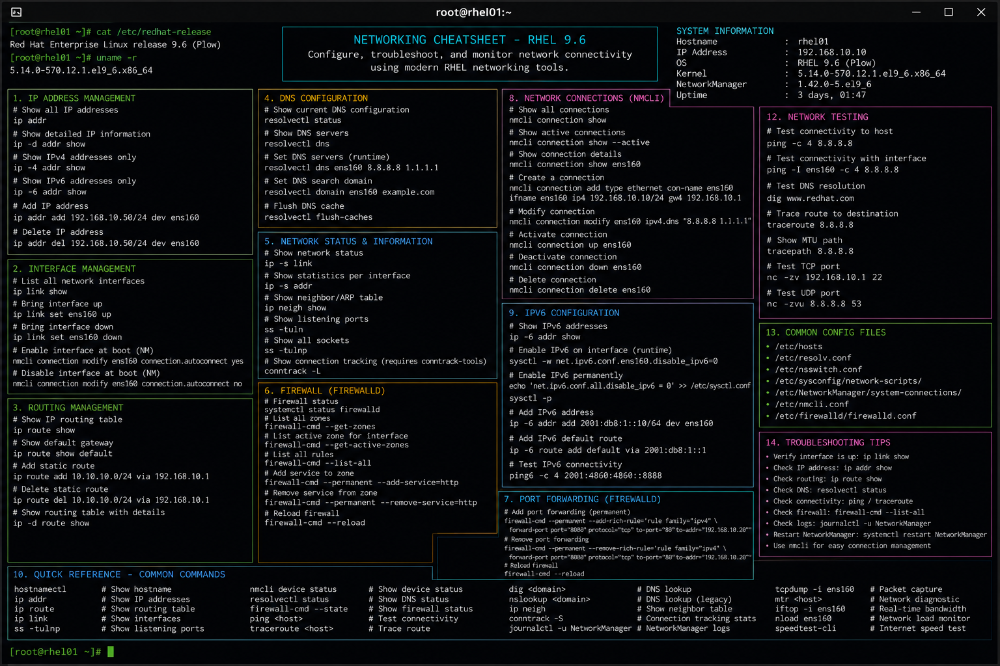

# networking.md

# Networking Commands Cheat Sheet

## Overview

This document provides a practical enterprise Linux administration cheat sheet for network configuration, interface management, connectivity validation, routing analysis, and troubleshooting operations on Red Hat Enterprise Linux (RHEL) 9.6 systems.

The commands and workflows included are commonly used during infrastructure deployment, connectivity troubleshooting, VLAN validation, DNS diagnostics, routing investigations, and enterprise operational maintenance activities.

This reference is designed for fast operational lookup during production Linux administration tasks.

---

## Environment Information

| Component | Details |
|---|---|
| Operating System | RHEL 9.6 |
| Hostname | rhel01.lab.local |
| Network Manager | NetworkManager |
| Primary Interface | ens160 |
| SELinux Mode | Enforcing |
| User Context | root / sudo administrator |
| Lab Platform | VMware Enterprise Lab |

---

## Common Commands

### Display IP Address Information

```bash
ip addr show
```

### Display Routing Table

```bash
ip route show
```

### Display Interface Statistics

```bash
ip -s link
```

### Restart NetworkManager

```bash
systemctl restart NetworkManager
```

### Test Network Connectivity

```bash
ping -c 4 8.8.8.8
```

### Perform DNS Lookup

```bash
dig google.com
```

### Display Listening Ports

```bash
ss -tulpn
```

### Trace Network Route

```bash
traceroute google.com
```

### Display Active Connections

```bash
nmcli connection show
```

### Configure Interface Using nmcli

```bash
nmcli connection modify ens160 ipv4.addresses 192.168.10.20/24
```

### Bring Interface Up

```bash
nmcli connection up ens160
```

### Capture Network Traffic

```bash
tcpdump -i ens160
```

---

## Administrative Examples

### Configure Static IP Address

```bash
nmcli connection modify ens160 \
ipv4.addresses 192.168.10.20/24 \
ipv4.gateway 192.168.10.1 \
ipv4.dns 8.8.8.8 \
ipv4.method manual
```

### Restart Network Connection

```bash
nmcli connection down ens160
nmcli connection up ens160
```

### Validate DNS Resolution

```bash
host github.com
```

### Monitor Active Network Connections

```bash
ss -tunap
```

### Display ARP Table

```bash
ip neigh show
```

### Validate Interface MTU

```bash
ip link show ens160
```

### Perform Port Connectivity Test

```bash
nc -zv 192.168.10.50 443
```

### Capture HTTP Traffic

```bash
tcpdump -i ens160 port 80
```

---

## Validation Commands

### Verify Interface State

```bash
nmcli device status
```

Example output:

```text
DEVICE   TYPE      STATE      CONNECTION
ens160   ethernet  connected  ens160
```

### Validate IP Address Assignment

```bash
ip addr show ens160
```

### Verify Routing Configuration

```bash
ip route
```

### Validate DNS Configuration

```bash
cat /etc/resolv.conf
```

### Verify Open Ports

```bash
ss -tulpn
```

### Test External Connectivity

```bash
ping -c 4 redhat.com
```

### Review Network Logs

```bash
journalctl -u NetworkManager
```

### Validate SELinux Network Contexts

```bash
semanage port -l | grep http
```

---

## Troubleshooting Tips

### Interface Down or Disconnected

Verify interface state:

```bash
nmcli device status
```

Bring interface online:

```bash
nmcli connection up ens160
```

### DNS Resolution Failures

Validate DNS configuration:

```bash
cat /etc/resolv.conf
```

Perform DNS query:

```bash
dig redhat.com
```

### Connectivity Issues

Verify routing table:

```bash
ip route
```

Test gateway reachability:

```bash
ping -c 4 192.168.10.1
```

### Port Accessibility Problems

Check listening services:

```bash
ss -tulpn
```

Validate firewall rules:

```bash
firewall-cmd --list-all
```

### Packet Loss or Network Latency

Perform route tracing:

```bash
traceroute redhat.com
```

Capture traffic:

```bash
tcpdump -i ens160
```

### SELinux Blocking Network Service

Review SELinux denials:

```bash
ausearch -m avc -ts recent
```

Validate allowed ports:

```bash
semanage port -l
```

---

## Operational Notes

- Maintain consistent IP addressing standards across enterprise infrastructure.
- Validate DNS and routing after network configuration changes.
- Monitor listening ports during security audits.
- Use packet captures for advanced troubleshooting investigations.
- Validate firewall and SELinux integration during service deployments.
- Maintain documentation for VLANs, gateways, and subnet assignments.
- Use `nmcli` for standardized NetworkManager administration.

Example operational audit commands:

```bash
ss -tulpn
ip route show
nmcli connection show
```

---

## Screenshot Reference



