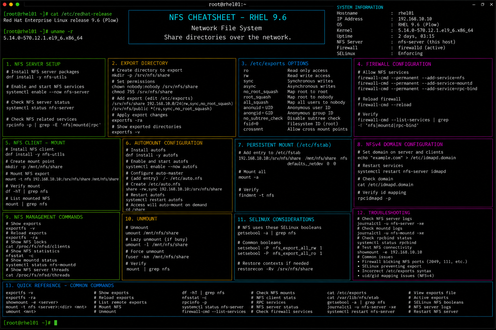

# nfs.md

# NFS Administration Commands Cheat Sheet

## Overview

This document provides a practical enterprise Linux administration cheat sheet for Network File System (NFS) configuration, shared storage management, client mounting, access validation, and troubleshooting operations on Red Hat Enterprise Linux (RHEL) 9.6 systems.

The commands and workflows included are commonly used during enterprise shared storage deployments, centralized backup operations, application data sharing, infrastructure automation, and operational maintenance activities.

This reference is designed for fast operational lookup during production Linux administration tasks.

---

## Environment Information

| Component | Details |
|---|---|
| Operating System | RHEL 9.6 |
| Hostname | rhel01.lab.local |
| Storage Service | NFS Server |
| NFS Version | NFSv4 |
| SELinux Mode | Enforcing |
| User Context | root / sudo administrator |
| Lab Platform | VMware Enterprise Lab |

---

## Common Commands

### Install NFS Utilities

```bash
dnf install -y nfs-utils
```

### Start NFS Server Service

```bash
systemctl start nfs-server
```

### Enable NFS Server at Boot

```bash
systemctl enable nfs-server
```

### Verify NFS Service Status

```bash
systemctl status nfs-server
```

### Display Exported Shares

```bash
exportfs -v
```

### Reload NFS Exports

```bash
exportfs -ra
```

### Display Available Remote Shares

```bash
showmount -e 192.168.10.20
```

### Mount NFS Share

```bash
mount -t nfs 192.168.10.20:/shared /mnt/shared
```

### Unmount NFS Share

```bash
umount /mnt/shared
```

### Verify Mounted NFS Filesystems

```bash
mount | grep nfs
```

### Review NFS Logs

```bash
journalctl -u nfs-server
```

### Verify NFS Listening Ports

```bash
ss -tulpn | grep nfs
```

---

## Administrative Examples

### Install and Enable NFS Server

```bash
dnf install -y nfs-utils
systemctl enable --now nfs-server
```

### Create Shared Directory

```bash
mkdir -p /shared/data
chmod 777 /shared/data
```

### Configure NFS Export

Edit export configuration:

```bash
vim /etc/exports
```

Example configuration:

```exports
/shared/data 192.168.10.0/24(rw,sync,no_root_squash)
```

### Apply Export Configuration

```bash
exportfs -ra
```

### Configure Firewalld for NFS

```bash
firewall-cmd --permanent --add-service=nfs
firewall-cmd --permanent --add-service=mountd
firewall-cmd --permanent --add-service=rpc-bind
firewall-cmd --reload
```

### Configure SELinux for Shared Directory

```bash
chcon -Rt public_content_rw_t /shared/data
```

### Mount Remote NFS Share

```bash
mount -t nfs 192.168.10.20:/shared/data /mnt/shared
```

---

## Validation Commands

### Verify NFS Server State

```bash
systemctl is-active nfs-server
```

Example output:

```text
active
```

### Validate Exported Shares

```bash
exportfs -v
```

### Verify Client Mounts

```bash
mount | grep nfs
```

### Validate NFS Firewall Access

```bash
firewall-cmd --list-services
```

### Verify SELinux Contexts

```bash
ls -Zd /shared/data
```

### Validate NFS Connectivity

```bash
showmount -e 192.168.10.20
```

### Verify Disk Usage on NFS Mount

```bash
df -h /mnt/shared
```

### Review NFS Service Logs

```bash
journalctl -u nfs-server
```

---

## Troubleshooting Tips

### NFS Share Not Accessible

Verify exports:

```bash
exportfs -v
```

Reload exports:

```bash
exportfs -ra
```

### Mount Permission Denied

Verify client subnet permissions:

```bash
cat /etc/exports
```

### Firewall Blocking NFS Access

Verify firewall rules:

```bash
firewall-cmd --list-all
```

Allow required services:

```bash
firewall-cmd --permanent --add-service=nfs
```

### SELinux Blocking Shared Access

Review SELinux denials:

```bash
ausearch -m avc -ts recent
```

Restore or modify contexts:

```bash
restorecon -Rv /shared/data
```

### Stale NFS File Handle Errors

Remount filesystem:

```bash
umount /mnt/shared
mount -t nfs 192.168.10.20:/shared/data /mnt/shared
```

### NFS Service Fails to Start

Review logs:

```bash
journalctl -xe
journalctl -u nfs-server
```

Verify rpcbind:

```bash
systemctl status rpcbind
```

---

## Operational Notes

- Use restricted export rules in enterprise environments.
- Validate firewall and SELinux integration after NFS deployments.
- Monitor shared storage utilization regularly.
- Use persistent mounts carefully in production systems.
- Validate network connectivity before troubleshooting NFS mounts.
- Avoid overly permissive export configurations in sensitive environments.
- Maintain backup procedures for enterprise shared storage.

Example operational audit commands:

```bash
exportfs -v
mount | grep nfs
journalctl -u nfs-server
```

---

## Screenshot Reference



