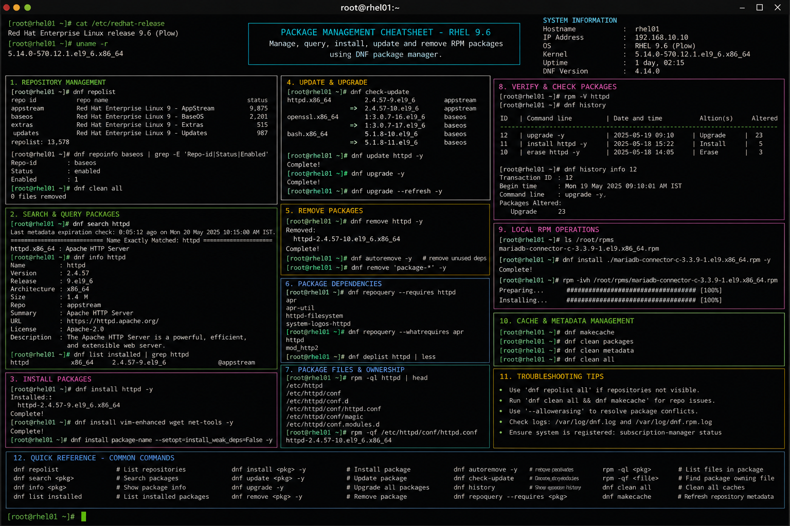

# package-management.md

# Package Management Commands Cheat Sheet

## Overview

This document provides a practical enterprise Linux administration cheat sheet for package installation, repository administration, software lifecycle management, and RPM validation operations on Red Hat Enterprise Linux (RHEL) 9.6 systems.

The commands and workflows included are commonly used during enterprise server provisioning, patch management, dependency troubleshooting, software auditing, and operational maintenance activities.

This reference is designed for fast operational lookup during production Linux administration tasks.

---

## Environment Information

| Component | Details |
|---|---|
| Operating System | RHEL 9.6 |
| Hostname | rhel01.lab.local |
| Package Manager | DNF / RPM |
| Repository Type | RHEL BaseOS and AppStream |
| SELinux Mode | Enforcing |
| User Context | root / sudo administrator |
| Lab Platform | VMware Enterprise Lab |

---

## Common Commands

### Check Installed Package

```bash
rpm -q httpd
```

### Install Package

```bash
dnf install -y httpd
```

### Remove Package

```bash
dnf remove -y httpd
```

### Update All Packages

```bash
dnf update -y
```

### Search Repository Packages

```bash
dnf search nginx
```

### Display Package Information

```bash
dnf info haproxy
```

### List Enabled Repositories

```bash
dnf repolist
```

### Clean Repository Cache

```bash
dnf clean all
```

### Rebuild Package Cache

```bash
dnf makecache
```

### Display Package Dependencies

```bash
repoquery --requires httpd
```

### Verify RPM Package Integrity

```bash
rpm -V openssh-server
```

### Display Package Files

```bash
rpm -ql httpd
```

---

## Administrative Examples

### Install Apache Web Server

```bash
dnf install -y httpd mod_ssl
```

### Install Performance Monitoring Utilities

```bash
dnf install -y sysstat iotop tuned
```

### Install Development Tools Group

```bash
dnf groupinstall -y "Development Tools"
```

### Verify Installed Services

```bash
rpm -qa | grep httpd
```

### Configure Repository Validation

```bash
dnf repolist all
```

### Download Package Without Installation

```bash
dnf download nginx
```

### Check Available Security Updates

```bash
dnf updateinfo list security
```

### Display Transaction History

```bash
dnf history
```

---

## Validation Commands

### Verify Package Installation

```bash
rpm -q httpd
```

Example output:

```text
httpd-2.4.57-8.el9.x86_64
```

### Verify Repository Availability

```bash
dnf repolist
```

### Validate Installed Binary

```bash
which httpd
```

### Verify Package Ownership of File

```bash
rpm -qf /usr/sbin/httpd
```

### Verify RPM Database Integrity

```bash
rpm --verifydb
```

### Review DNF Logs

```bash
cat /var/log/dnf.log
```

### Validate SELinux Contexts

```bash
ls -Z /usr/sbin/httpd
```

---

## Troubleshooting Tips

### Repository Metadata Errors

Clear repository cache:

```bash
dnf clean all
```

Rebuild metadata:

```bash
dnf makecache
```

### Package Dependency Failures

Validate dependencies:

```bash
dnf deplist httpd
```

Attempt dependency resolution:

```bash
dnf distro-sync
```

### RPM Database Corruption

Rebuild RPM database:

```bash
rpm --rebuilddb
```

### Package Verification Failures

Verify modified package files:

```bash
rpm -V openssh-server
```

### Subscription or Repository Access Issues

Verify repository configuration:

```bash
subscription-manager repos --list-enabled
```

### SELinux Access Issues

Review SELinux denials:

```bash
ausearch -m avc -ts recent
```

Restore package file contexts:

```bash
restorecon -Rv /usr/sbin/httpd
```

---

## Operational Notes

- Maintain regular enterprise patch management schedules.
- Validate packages before production deployment.
- Monitor security advisories and vulnerability updates.
- Use repository controls to maintain package consistency.
- Validate installed package integrity during audits.
- Document custom repository configurations.
- Maintain operational rollback procedures using DNF history.

Example operational audit commands:

```bash
dnf history
rpm -qa --last | head
```

---

## Screenshot Reference



