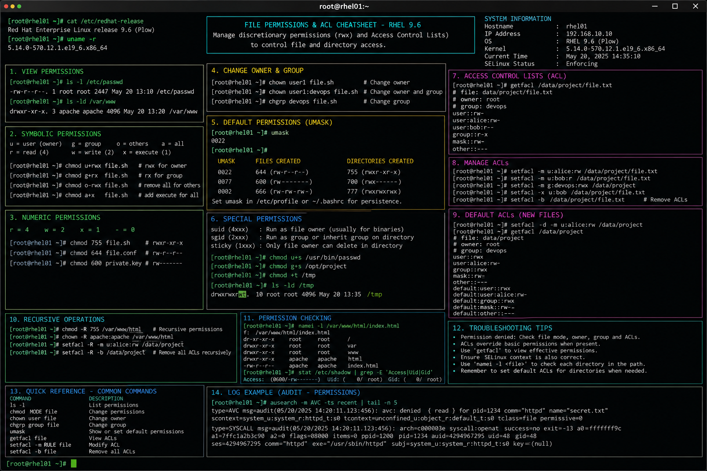

# permissions-acl.md

# Linux Permissions and ACL Administration Cheat Sheet

## Overview

This document provides a practical enterprise Linux administration cheat sheet for managing standard file permissions, ownership controls, special permissions, and Access Control Lists (ACLs) on Red Hat Enterprise Linux (RHEL) 9.6 systems.

The commands and workflows included are commonly used during enterprise infrastructure administration, multi-user access management, application deployment validation, storage security hardening, and operational troubleshooting.

This reference is designed for fast operational lookup during production Linux administration tasks.

---

## Environment Information

| Component | Details |
|---|---|
| Operating System | RHEL 9.6 |
| Hostname | rhel01.lab.local |
| Filesystem Type | XFS |
| SELinux Mode | Enforcing |
| ACL Support | Enabled |
| User Context | root / sudo administrator |
| Lab Platform | VMware Enterprise Lab |

---

## Common Commands

### Display File Permissions

```bash
ls -l /var/www/html
```

### Display SELinux Contexts

```bash
ls -Z /var/www/html
```

### Change File Permissions

```bash
chmod 644 application.conf
```

### Change Executable Permissions

```bash
chmod +x deploy.sh
```

### Change Directory Permissions

```bash
chmod 755 /srv/application
```

### Change File Ownership

```bash
chown apache:apache index.html
```

### Change Directory Ownership Recursively

```bash
chown -R backupadmin:backupadmin /backup
```

### Set Default ACL

```bash
setfacl -m d:g:developers:rwx /shared/projects
```

### Set User ACL Permissions

```bash
setfacl -m u:devopsuser:rwx deployment.log
```

### View ACL Permissions

```bash
getfacl deployment.log
```

### Remove ACL Entry

```bash
setfacl -x u:devopsuser deployment.log
```

### Remove All ACLs

```bash
setfacl -b deployment.log
```

---

## Administrative Examples

### Configure Web Application Directory Permissions

```bash
mkdir -p /srv/webapp
chown -R apache:apache /srv/webapp
chmod -R 755 /srv/webapp
```

### Configure Shared Operations Directory

```bash
mkdir -p /shared/operations
chgrp linuxadmins /shared/operations
chmod 2775 /shared/operations
```

### Configure ACL Access for Backup Team

```bash
setfacl -m g:backupteam:rwx /backup
```

### Configure Default ACL Inheritance

```bash
setfacl -m d:g:backupteam:rwx /backup
```

### Validate ACL Configuration

```bash
getfacl /backup
```

Example output:

```text
# file: backup
# owner: root
# group: backupteam
user::rwx
group::rwx
group:backupteam:rwx
mask::rwx
other::r-x
default:group:backupteam:rwx
```

### Configure Sticky Bit on Shared Directory

```bash
chmod +t /shared/operations
```

---

## Validation Commands

### Verify Standard Permissions

```bash
ls -ld /shared/operations
```

### Verify ACL Configuration

```bash
getfacl /shared/operations
```

### Verify SELinux Labels

```bash
ls -Zd /srv/webapp
```

### Validate Filesystem ACL Support

```bash
mount | grep acl
```

### Verify Effective User Access

```bash
sudo -u devopsuser touch /shared/operations/testfile
```

### Validate Special Permissions

```bash
find /shared -perm /1000
```

### Review Audit Logs

```bash
journalctl -xe
```

---

## Troubleshooting Tips

### Permission Denied Errors

Possible causes:

- incorrect ownership
- missing execute permissions
- restrictive ACL entries
- SELinux denial
- filesystem mount restrictions

Validation commands:

```bash
ls -l
getfacl filename
ls -Z filename
```

### ACLs Not Working

Verify ACL package installation:

```bash
rpm -q acl
```

Verify filesystem ACL support:

```bash
mount | grep acl
```

### SELinux Blocking Access

Review AVC denials:

```bash
ausearch -m avc -ts recent
```

Restore default contexts:

```bash
restorecon -Rv /srv/webapp
```

### Incorrect Group Inheritance

Verify SGID bit configuration:

```bash
ls -ld /shared/operations
```

Expected example:

```text
drwxrwsr-x
```

### Sticky Bit Validation

Verify sticky bit:

```bash
ls -ld /shared/operations
```

Expected example:

```text
drwxrwxr-t
```

---

## Operational Notes

- Use ACLs for granular multi-user access management.
- Maintain least-privilege permission assignments.
- Validate SELinux contexts alongside standard permissions.
- Use SGID directories for collaborative enterprise teams.
- Use sticky bit protection on shared operational directories.
- Regularly audit privileged filesystem locations.
- Validate permissions before application deployment activities.

Example operational audit commands:

```bash
find /srv -perm -4000
find /shared -type d -exec getfacl {} \;
```

---

## Screenshot Capture

Recommended screenshot content:

- chmod operations
- chown administration tasks
- ACL configuration examples
- getfacl validation output
- SGID and sticky bit examples
- SELinux validation commands
- shared directory access validation
- enterprise RHEL administration workflow

Example commands shown in screenshot:

```bash
chmod 755 /srv/webapp
chown apache:apache /srv/webapp
setfacl -m g:backupteam:rwx /backup
getfacl /backup
ls -Zd /srv/webapp
```

---

## Screenshot Reference



