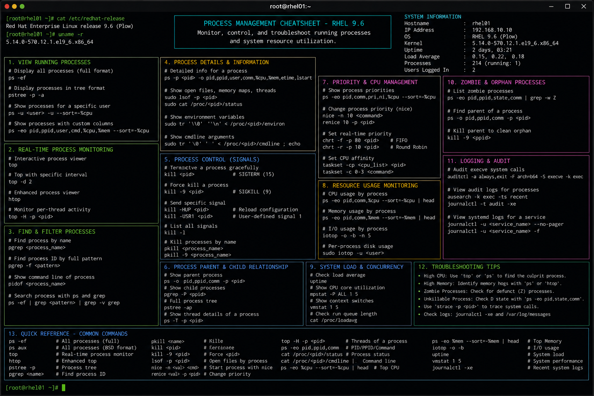

# process-management.md

# Process Management Commands Cheat Sheet

## Overview

This document provides a practical enterprise Linux administration cheat sheet for process monitoring, task management, resource analysis, and operational troubleshooting on Red Hat Enterprise Linux (RHEL) 9.6 systems.

The commands and workflows included are commonly used during enterprise infrastructure administration, application diagnostics, performance investigations, capacity analysis, and incident response activities.

This reference is designed for fast operational lookup during production Linux administration tasks.

---

## Environment Information

| Component | Details |
|---|---|
| Operating System | RHEL 9.6 |
| Hostname | rhel01.lab.local |
| Kernel Version | 5.14.x |
| SELinux Mode | Enforcing |
| Monitoring Utilities | procps-ng / sysstat |
| User Context | root / sudo administrator |
| Lab Platform | VMware Enterprise Lab |

---

## Common Commands

### Display Running Processes

```bash
ps -ef
```

### Display Process Tree

```bash
pstree
```

### Interactive Process Monitor

```bash
top
```

### Enhanced Interactive Monitoring

```bash
htop
```

### Display CPU and Memory Usage

```bash
top -o %CPU
```

### Search for Specific Process

```bash
pgrep httpd
```

### Display Process Details

```bash
ps -fp 1024
```

### Terminate Process Gracefully

```bash
kill 1024
```

### Force Kill Process

```bash
kill -9 1024
```

### Kill Processes by Name

```bash
pkill nginx
```

### Display Real-Time Resource Usage

```bash
vmstat 2
```

### Monitor Per-Process I/O Usage

```bash
iotop
```

---

## Administrative Examples

### Identify High CPU Utilization Process

```bash
top -o %CPU
```

### Monitor Apache Worker Processes

```bash
ps -ef | grep httpd
```

### Display Memory Consumption

```bash
ps aux --sort=-%mem | head
```

### Investigate Zombie Processes

```bash
ps aux | grep Z
```

### Monitor System Load

```bash
uptime
```

Example output:

```text
14:10:22 up 5 days,  2:44,  3 users,  load average: 0.21, 0.18, 0.11
```

### Trace Running Service Process

```bash
systemctl status httpd
```

### Capture Process Resource Statistics

```bash
pidstat 2 5
```

### Identify Open Files by Process

```bash
lsof -p 1024
```

---

## Validation Commands

### Verify Running Service Process

```bash
pgrep -a httpd
```

### Validate Parent and Child Processes

```bash
pstree -p
```

### Verify Listening Process Ports

```bash
ss -tulpn
```

### Monitor CPU Statistics

```bash
mpstat
```

### Verify Memory Utilization

```bash
free -h
```

### Validate I/O Activity

```bash
iostat -x 2
```

### Review Process Audit Logs

```bash
journalctl -xe
```

### Verify SELinux Contexts for Running Processes

```bash
ps -eZ | grep httpd
```

---

## Troubleshooting Tips

### High CPU Utilization

Identify top CPU-consuming processes:

```bash
ps aux --sort=-%cpu | head
```

Monitor continuously:

```bash
top
```

### High Memory Consumption

Display memory-intensive processes:

```bash
ps aux --sort=-%mem | head
```

### Unresponsive Processes

Attempt graceful termination first:

```bash
kill PID
```

Force terminate if necessary:

```bash
kill -9 PID
```

### Excessive I/O Usage

Monitor disk-intensive processes:

```bash
iotop
```

### Service Process Missing

Verify service state:

```bash
systemctl status httpd
```

Review logs:

```bash
journalctl -u httpd
```

### SELinux Blocking Processes

Review AVC denials:

```bash
ausearch -m avc -ts recent
```

Validate SELinux contexts:

```bash
ps -eZ
```

---

## Operational Notes

- Monitor resource utilization during production maintenance windows.
- Investigate abnormal CPU, memory, and I/O patterns proactively.
- Use process monitoring tools during application troubleshooting.
- Validate service process ownership and SELinux contexts.
- Avoid force-killing critical enterprise services without impact analysis.
- Monitor system load trends for capacity planning.
- Use `journalctl` for process-related operational investigations.

Example operational audit commands:

```bash
ps -eo pid,ppid,user,%cpu,%mem,cmd --sort=-%cpu | head
sar -u 1 5
```

---

## Screenshot Reference



