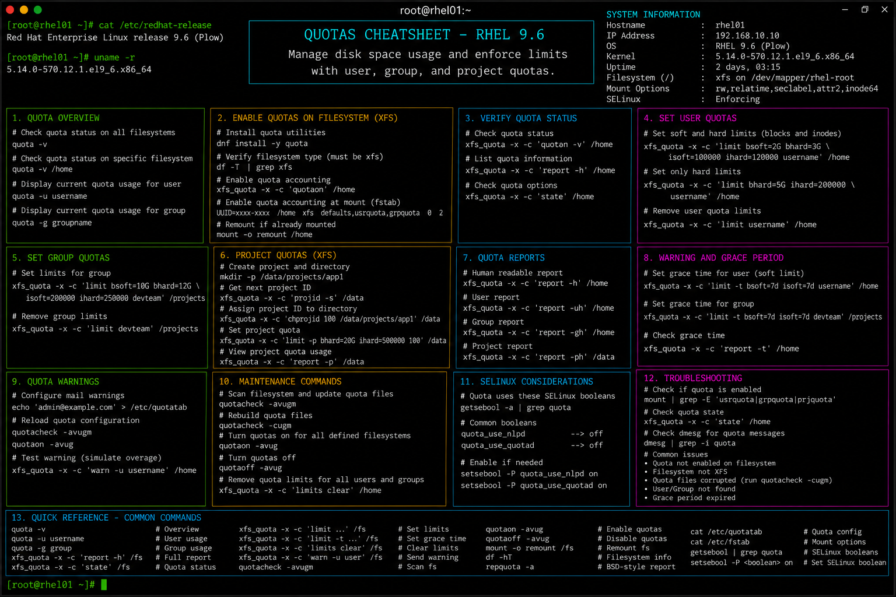

# quotas.md

# Filesystem Quotas Administration Commands Cheat Sheet

## Overview

This document provides a practical enterprise Linux administration cheat sheet for configuring filesystem quotas, user and group storage limits, quota reporting, and troubleshooting operations on Red Hat Enterprise Linux (RHEL) 9.6 systems.

The commands and workflows included are commonly used during enterprise storage governance, multi-user server administration, shared filesystem management, compliance validation, and operational maintenance activities.

This reference is designed for fast operational lookup during production Linux administration tasks.

---

## Environment Information

| Component | Details |
|---|---|
| Operating System | RHEL 9.6 |
| Hostname | rhel01.lab.local |
| Filesystem Type | XFS / EXT4 |
| Quota Management | userquota / groupquota |
| SELinux Mode | Enforcing |
| User Context | root / sudo administrator |
| Lab Platform | VMware Enterprise Lab |

---

## Common Commands

### Install Quota Utilities

```bash
dnf install -y quota
```

### Display Filesystem Usage

```bash
df -h
```

### Verify Mounted Filesystems

```bash
mount
```

### Edit Filesystem Mount Options

```bash
vim /etc/fstab
```

### Remount Filesystem

```bash
mount -o remount /data
```

### Initialize Quota Database

```bash
quotacheck -cug /data
```

### Enable Quotas

```bash
quotaon /data
```

### Disable Quotas

```bash
quotaoff /data
```

### Edit User Quotas

```bash
edquota devopsuser
```

### Display User Quota Usage

```bash
quota -u devopsuser
```

### Generate Quota Report

```bash
repquota /data
```

### Display Group Quota Usage

```bash
quota -g developers
```

---

## Administrative Examples

### Configure User Quotas in fstab

Edit mount configuration:

```bash
vim /etc/fstab
```

Example configuration:

```fstab
UUID=1234abcd-5678-efgh-9012 /data xfs defaults,uquota,gquota 0 0
```

### Remount Filesystem with Quotas Enabled

```bash
mount -o remount /data
```

### Initialize Quota Database

```bash
quotacheck -cug /data
```

### Enable Quota Enforcement

```bash
quotaon /data
```

### Configure User Soft and Hard Limits

```bash
edquota devopsuser
```

Example limits:

```text
soft block limit: 5G
hard block limit: 6G
```

### Generate Storage Usage Report

```bash
repquota /data
```

### Verify Quota Usage for User

```bash
quota -u devopsuser
```

---

## Validation Commands

### Verify Quota Mount Options

```bash
mount | grep quota
```

Example output:

```text
/dev/sdb1 on /data type xfs (rw,relatime,uquota,gquota)
```

### Validate Quota Status

```bash
quotaon -p /data
```

### Verify User Quota Usage

```bash
quota -u devopsuser
```

### Validate Group Quota Usage

```bash
quota -g developers
```

### Generate Detailed Quota Report

```bash
repquota -a
```

### Verify Filesystem Utilization

```bash
df -h
```

### Validate SELinux Contexts

```bash
ls -Zd /data
```

### Review Kernel and Storage Logs

```bash
journalctl -k
```

---

## Troubleshooting Tips

### Quotas Not Enforced

Verify mount options:

```bash
mount | grep quota
```

Verify quota status:

```bash
quotaon -p /data
```

### Missing Quota Database Files

Rebuild quota database:

```bash
quotacheck -cug /data
```

### User Exceeding Limits

Display quota usage:

```bash
quota -u devopsuser
```

Modify quota limits:

```bash
edquota devopsuser
```

### Filesystem Remount Issues

Validate fstab syntax:

```bash
mount -a
```

Review filesystem configuration:

```bash
cat /etc/fstab
```

### SELinux Access Problems

Review contexts:

```bash
ls -Z /data
```

Restore contexts:

```bash
restorecon -Rv /data
```

### Quota Utilities Missing

Verify package installation:

```bash
rpm -q quota
```

Install quota tools:

```bash
dnf install -y quota
```

---

## Operational Notes

- Use quotas to enforce enterprise storage governance policies.
- Monitor shared filesystem utilization regularly.
- Configure both soft and hard limits for operational flexibility.
- Validate quota enforcement after filesystem maintenance activities.
- Maintain backup procedures before modifying production storage configurations.
- Use quota reporting during compliance and audit reviews.
- Validate SELinux contexts after storage migrations or restorations.

Example operational audit commands:

```bash
repquota -a
quota -u devopsuser
df -Th
```

---

## Screenshot Reference


