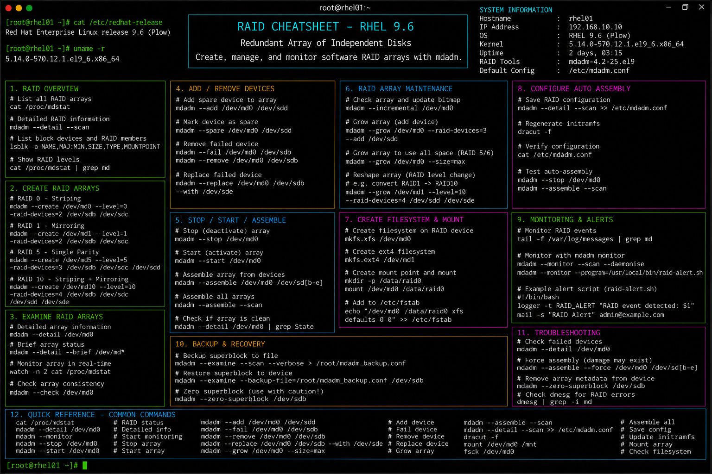

# raid.md

# RAID Administration Commands Cheat Sheet

## Overview

This document provides a practical enterprise Linux administration cheat sheet for software RAID configuration, array management, monitoring, recovery procedures, and troubleshooting operations on Red Hat Enterprise Linux (RHEL) 9.6 systems.

The commands and workflows included are commonly used during enterprise storage deployments, redundancy planning, high-availability infrastructure management, disaster recovery preparation, and operational maintenance activities.

This reference is designed for fast operational lookup during production Linux administration tasks.

---

## Environment Information

| Component | Details |
|---|---|
| Operating System | RHEL 9.6 |
| Hostname | rhel01.lab.local |
| RAID Management | mdadm |
| Storage Type | Software RAID |
| SELinux Mode | Enforcing |
| User Context | root / sudo administrator |
| Lab Platform | VMware Enterprise Lab |

---

## Common Commands

### Install RAID Utilities

```bash
dnf install -y mdadm
```

### Display RAID Array Status

```bash
cat /proc/mdstat
```

### Create RAID1 Array

```bash
mdadm --create /dev/md0 --level=1 --raid-devices=2 /dev/sdb1 /dev/sdc1
```

### Create RAID5 Array

```bash
mdadm --create /dev/md1 --level=5 --raid-devices=3 /dev/sdb1 /dev/sdc1 /dev/sdd1
```

### Display Detailed RAID Information

```bash
mdadm --detail /dev/md0
```

### Stop RAID Array

```bash
mdadm --stop /dev/md0
```

### Assemble RAID Array

```bash
mdadm --assemble /dev/md0 /dev/sdb1 /dev/sdc1
```

### Add Disk to RAID Array

```bash
mdadm --add /dev/md0 /dev/sdd1
```

### Remove Failed Disk

```bash
mdadm --remove /dev/md0 /dev/sdb1
```

### Mark Disk as Failed

```bash
mdadm --fail /dev/md0 /dev/sdb1
```

### Monitor RAID Synchronization

```bash
watch cat /proc/mdstat
```

### Review RAID Logs

```bash
journalctl -k | grep md
```

---

## Administrative Examples

### Create RAID1 Mirror

```bash
mdadm --create /dev/md0 \
--level=1 \
--raid-devices=2 \
/dev/sdb1 /dev/sdc1
```

### Format RAID Array with XFS

```bash
mkfs.xfs /dev/md0
```

### Mount RAID Filesystem

```bash
mkdir -p /raid-data
mount /dev/md0 /raid-data
```

### Save RAID Configuration

```bash
mdadm --detail --scan >> /etc/mdadm.conf
```

### Configure Persistent Mount

```bash
blkid
vim /etc/fstab
```

Example configuration:

```fstab
/dev/md0 /raid-data xfs defaults 0 0
```

### Simulate Disk Failure

```bash
mdadm --fail /dev/md0 /dev/sdb1
```

### Replace Failed Disk

```bash
mdadm --remove /dev/md0 /dev/sdb1
mdadm --add /dev/md0 /dev/sde1
```

---

## Validation Commands

### Verify RAID Status

```bash
cat /proc/mdstat
```

Example output:

```text
md0 : active raid1 sdb1[0] sdc1[1]
```

### Validate RAID Details

```bash
mdadm --detail /dev/md0
```

### Verify Mounted RAID Filesystem

```bash
mount | grep md0
```

### Validate Filesystem Usage

```bash
df -h
```

### Verify RAID Device UUIDs

```bash
blkid
```

### Validate SELinux Contexts

```bash
ls -Zd /raid-data
```

### Review Kernel RAID Logs

```bash
journalctl -k | grep raid
```

### Verify Block Device Layout

```bash
lsblk
```

---

## Troubleshooting Tips

### RAID Array Not Assembling

Scan for arrays:

```bash
mdadm --assemble --scan
```

Review array details:

```bash
mdadm --examine /dev/sdb1
```

### Degraded RAID Array

Verify failed disks:

```bash
cat /proc/mdstat
```

Replace failed device:

```bash
mdadm --remove /dev/md0 /dev/sdb1
mdadm --add /dev/md0 /dev/sde1
```

### RAID Synchronization Slow

Monitor rebuild progress:

```bash
watch cat /proc/mdstat
```

### Filesystem Mount Failure

Verify filesystem integrity:

```bash
xfs_repair /dev/md0
```

Validate mount configuration:

```bash
mount -a
```

### SELinux Access Problems

Review contexts:

```bash
ls -Z /raid-data
```

Restore contexts:

```bash
restorecon -Rv /raid-data
```

### Missing RAID Utilities

Verify package installation:

```bash
rpm -q mdadm
```

Install RAID tools:

```bash
dnf install -y mdadm
```

---

## Operational Notes

- Use RAID for redundancy, not as a replacement for backups.
- Monitor RAID synchronization and rebuild operations regularly.
- Validate array health during enterprise maintenance windows.
- Maintain spare disks for rapid failure replacement.
- Save RAID configurations after array modifications.
- Validate SELinux contexts after storage migrations.
- Monitor kernel logs for storage and RAID-related warnings.

Example operational audit commands:

```bash
cat /proc/mdstat
mdadm --detail /dev/md0
lsblk
```

---

## Screenshot Reference



