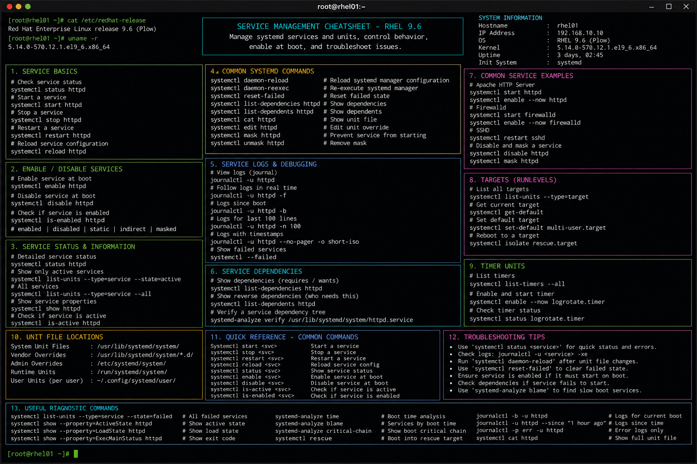

# service-management.md

# Service Management Commands Cheat Sheet

## Overview

This document provides a practical enterprise Linux administration cheat sheet for managing system services, daemon operations, startup configuration, and service troubleshooting on Red Hat Enterprise Linux (RHEL) 9.6 systems.

The commands and workflows included are commonly used during infrastructure operations, application deployment, service recovery, monitoring validation, and enterprise maintenance activities.

This reference is designed for fast operational lookup during production Linux administration tasks.

---

## Environment Information

| Component | Details |
|---|---|
| Operating System | RHEL 9.6 |
| Hostname | rhel01.lab.local |
| Init System | systemd |
| SELinux Mode | Enforcing |
| User Context | root / sudo administrator |
| Logging Framework | journald |
| Lab Platform | VMware Enterprise Lab |

---

## Common Commands

### Start Service

```bash
systemctl start httpd
```

### Stop Service

```bash
systemctl stop httpd
```

### Restart Service

```bash
systemctl restart httpd
```

### Reload Service Configuration

```bash
systemctl reload httpd
```

### Check Service Status

```bash
systemctl status httpd
```

### Enable Service at Boot

```bash
systemctl enable httpd
```

### Disable Service

```bash
systemctl disable httpd
```

### View Failed Services

```bash
systemctl --failed
```

### List Running Services

```bash
systemctl list-units --type=service
```

### Display Service Dependencies

```bash
systemctl list-dependencies httpd
```

### View Service Logs

```bash
journalctl -u httpd
```

### Reload systemd Configuration

```bash
systemctl daemon-reload
```

---

## Administrative Examples

### Deploy and Enable Apache Service

```bash
dnf install -y httpd
systemctl enable --now httpd
```

### Validate Service Startup

```bash
systemctl status httpd
```

### Restart SSH Service After Configuration Changes

```bash
sshd -t
systemctl restart sshd
```

### Configure Custom Application Service

```bash
vim /etc/systemd/system/custom-app.service
```

Example unit file:

```ini
[Unit]
Description=Custom Application Service
After=network.target

[Service]
ExecStart=/usr/local/bin/custom-app
Restart=always

[Install]
WantedBy=multi-user.target
```

### Reload systemd After Unit File Changes

```bash
systemctl daemon-reload
```

### Enable Custom Service

```bash
systemctl enable --now custom-app
```

### Review Service Boot Performance

```bash
systemd-analyze blame
```

---

## Validation Commands

### Verify Service State

```bash
systemctl is-active httpd
```

Example output:

```text
active
```

### Verify Boot Enablement

```bash
systemctl is-enabled httpd
```

### Review Service Logs

```bash
journalctl -u httpd -n 20
```

### Validate Listening Ports

```bash
ss -tulpn | grep httpd
```

### Verify SELinux Contexts

```bash
ls -Z /usr/sbin/httpd
```

### Review Failed Services

```bash
systemctl --failed
```

### Analyze Boot Timing

```bash
systemd-analyze
```

---

## Troubleshooting Tips

### Service Fails to Start

Possible causes:

- invalid configuration syntax
- missing dependencies
- permission issues
- SELinux denials
- incorrect systemd unit configuration

Validation commands:

```bash
systemctl status httpd
journalctl -xe
```

### Configuration Syntax Errors

Validate service configuration before restart:

```bash
httpd -t
sshd -t
haproxy -c -f /etc/haproxy/haproxy.cfg
```

### SELinux Blocking Service Access

Review SELinux denials:

```bash
ausearch -m avc -ts recent
```

Restore SELinux contexts:

```bash
restorecon -Rv /var/www/html
```

### Service Port Conflicts

Check active ports:

```bash
ss -tulpn
```

### Failed Custom Unit File

Validate unit syntax:

```bash
systemd-analyze verify /etc/systemd/system/custom-app.service
```

Reload daemon after changes:

```bash
systemctl daemon-reload
```

---

## Operational Notes

- Validate service configurations before production restarts.
- Use `journalctl` for centralized service troubleshooting.
- Maintain startup dependency awareness for critical applications.
- Enable only required services to reduce attack surface.
- Validate SELinux integration after service deployments.
- Monitor failed services during infrastructure maintenance windows.
- Use systemd unit files for enterprise application standardization.

Example operational audit commands:

```bash
systemctl list-unit-files --type=service
journalctl -p err -b
```

---

## Screenshot Reference


