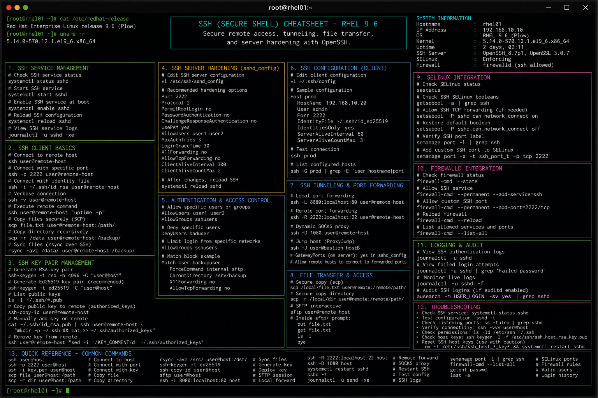

# ssh.md

# SSH Administration Commands Cheat Sheet

## Overview

This document provides a practical enterprise Linux administration cheat sheet for Secure Shell (SSH) configuration, remote access management, authentication hardening, and troubleshooting operations on Red Hat Enterprise Linux (RHEL) 9.6 systems.

The commands and workflows included are commonly used during infrastructure administration, secure remote management, automation deployments, key-based authentication setup, and enterprise operational maintenance activities.

This reference is designed for fast operational lookup during production Linux administration tasks.

---

## Environment Information

| Component | Details |
|---|---|
| Operating System | RHEL 9.6 |
| Hostname | rhel01.lab.local |
| SSH Service | OpenSSH Server |
| SSH Port | 22/TCP |
| SELinux Mode | Enforcing |
| User Context | root / sudo administrator |
| Lab Platform | VMware Enterprise Lab |

---

## Common Commands

### Connect to Remote Server

```bash
ssh admin@192.168.10.20
```

### Connect Using Specific Port

```bash
ssh -p 2222 admin@192.168.10.20
```

### Generate SSH Key Pair

```bash
ssh-keygen -t rsa -b 4096
```

### Copy Public Key to Remote Host

```bash
ssh-copy-id admin@192.168.10.20
```

### Transfer File Using SCP

```bash
scp backup.tar.gz admin@192.168.10.20:/backup
```

### Transfer Directory Recursively

```bash
scp -r /data admin@192.168.10.20:/backup
```

### Open Interactive SFTP Session

```bash
sftp admin@192.168.10.20
```

### Restart SSH Service

```bash
systemctl restart sshd
```

### Verify SSH Configuration

```bash
sshd -t
```

### Display Active SSH Sessions

```bash
who
```

### Display SSH Listening Ports

```bash
ss -tulpn | grep sshd
```

### Review SSH Logs

```bash
journalctl -u sshd
```

---

## Administrative Examples

### Disable Root SSH Login

Edit SSH configuration:

```bash
vim /etc/ssh/sshd_config
```

Example configuration:

```ini
PermitRootLogin no
PasswordAuthentication no
MaxAuthTries 3
ClientAliveInterval 300
```

### Validate SSH Configuration

```bash
sshd -t
```

### Restart SSH Service After Changes

```bash
systemctl restart sshd
```

### Configure Custom SSH Port

```ini
Port 2222
```

### Allow SSH Port in Firewalld

```bash
firewall-cmd --permanent --add-port=2222/tcp
firewall-cmd --reload
```

### Configure SELinux for Custom SSH Port

```bash
semanage port -a -t ssh_port_t -p tcp 2222
```

### Verify Key-Based Authentication

```bash
ssh admin@192.168.10.20
```

---

## Validation Commands

### Verify SSH Service State

```bash
systemctl status sshd
```

Example output:

```text
Active: active (running)
```

### Validate SSH Listening Port

```bash
ss -tulpn | grep sshd
```

### Verify SSH Configuration Syntax

```bash
sshd -t
```

### Validate SELinux SSH Port Context

```bash
semanage port -l | grep ssh
```

### Verify Firewall Access

```bash
firewall-cmd --list-all
```

### Review Failed Login Attempts

```bash
journalctl -u sshd | grep Failed
```

### Display Active Remote Sessions

```bash
w
```

---

## Troubleshooting Tips

### SSH Service Fails to Start

Validate configuration syntax:

```bash
sshd -t
```

Review service logs:

```bash
journalctl -xe
journalctl -u sshd
```

### Connection Refused Errors

Verify service state:

```bash
systemctl status sshd
```

Verify listening ports:

```bash
ss -tulpn | grep sshd
```

### Firewall Blocking SSH Access

Verify firewall rules:

```bash
firewall-cmd --list-all
```

Open SSH port:

```bash
firewall-cmd --permanent --add-service=ssh
firewall-cmd --reload
```

### SELinux Blocking Custom SSH Port

Review SELinux denials:

```bash
ausearch -m avc -ts recent
```

Add custom SSH port context:

```bash
semanage port -a -t ssh_port_t -p tcp 2222
```

### Authentication Failures

Verify user account:

```bash
id admin
```

Validate SSH key permissions:

```bash
chmod 700 ~/.ssh
chmod 600 ~/.ssh/authorized_keys
```

### Slow SSH Login

Verify DNS resolution:

```bash
host $(hostname)
```

---

## Operational Notes

- Disable direct root SSH access in enterprise environments.
- Use SSH key-based authentication instead of passwords.
- Validate firewall and SELinux integration after SSH changes.
- Monitor failed login attempts during security audits.
- Use strong cryptographic algorithms and secure configuration baselines.
- Restrict SSH access to trusted administrative networks.
- Maintain backup console access before modifying SSH configurations.

Example operational audit commands:

```bash
sshd -T
journalctl -u sshd
last -a
```

---

## Screenshot Reference



