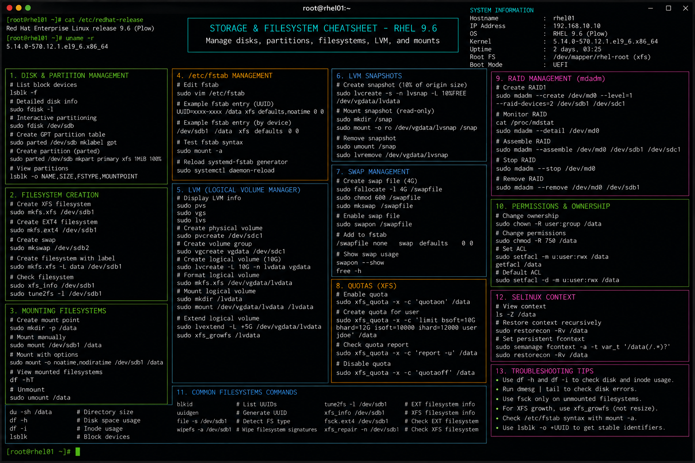

# storage-filesystem.md

# Storage and Filesystem Commands Cheat Sheet

## Overview

This document provides a practical enterprise Linux administration cheat sheet for disk management, filesystem administration, mount operations, storage validation, and troubleshooting workflows on Red Hat Enterprise Linux (RHEL) 9.6 systems.

The commands and workflows included are commonly used during enterprise storage provisioning, filesystem expansion, disk troubleshooting, mount validation, backup operations, and infrastructure maintenance activities.

This reference is designed for fast operational lookup during production Linux administration tasks.

---

## Environment Information

| Component | Details |
|---|---|
| Operating System | RHEL 9.6 |
| Hostname | rhel01.lab.local |
| Filesystem Type | XFS / EXT4 |
| Storage Platform | VMware Virtual Disk |
| SELinux Mode | Enforcing |
| User Context | root / sudo administrator |
| Lab Platform | VMware Enterprise Lab |

---

## Common Commands

### Display Block Devices

```bash
lsblk
```

### Display Filesystem Usage

```bash
df -h
```

### Display Filesystem Type Information

```bash
blkid
```

### Display Mounted Filesystems

```bash
mount
```

### Create XFS Filesystem

```bash
mkfs.xfs /dev/sdb1
```

### Create EXT4 Filesystem

```bash
mkfs.ext4 /dev/sdb1
```

### Mount Filesystem

```bash
mount /dev/sdb1 /data
```

### Unmount Filesystem

```bash
umount /data
```

### Create Mount Point

```bash
mkdir -p /data
```

### Display Disk Partition Layout

```bash
fdisk -l
```

### Check XFS Filesystem

```bash
xfs_repair /dev/sdb1
```

### Check EXT4 Filesystem

```bash
fsck.ext4 /dev/sdb1
```

---

## Administrative Examples

### Create New Partition

```bash
fdisk /dev/sdb
```

### Format and Mount New Disk

```bash
mkfs.xfs /dev/sdb1
mkdir -p /backup
mount /dev/sdb1 /backup
```

### Configure Persistent Mount in fstab

```bash
vim /etc/fstab
```

Example configuration:

```fstab
UUID=3f6d2a11-9c44-4c20-b8f7-abc123456789 /backup xfs defaults 0 0
```

### Reload Mount Configuration

```bash
mount -a
```

### Display UUID Information

```bash
blkid
```

### Extend XFS Filesystem

```bash
xfs_growfs /backup
```

### Check Mounted Filesystem Usage

```bash
df -Th
```

---

## Validation Commands

### Verify Mounted Filesystems

```bash
mount | grep backup
```

Example output:

```text
/dev/sdb1 on /backup type xfs (rw,relatime)
```

### Validate Disk Utilization

```bash
df -h
```

### Verify Block Device Information

```bash
lsblk -f
```

### Validate Persistent Mount Configuration

```bash
cat /etc/fstab
```

### Verify Filesystem UUIDs

```bash
blkid
```

### Validate SELinux Contexts

```bash
ls -Zd /backup
```

### Review Storage Logs

```bash
journalctl -k
```

### Validate Disk I/O Statistics

```bash
iostat -x 2
```

---

## Troubleshooting Tips

### Filesystem Fails to Mount

Verify filesystem type:

```bash
blkid
```

Validate fstab configuration:

```bash
mount -a
```

### Incorrect UUID in fstab

Verify UUID values:

```bash
blkid
```

Update configuration:

```bash
vim /etc/fstab
```

### Disk Space Utilization Issues

Identify large directories:

```bash
du -sh /*
```

Display filesystem usage:

```bash
df -h
```

### Filesystem Corruption

Unmount filesystem first:

```bash
umount /dev/sdb1
```

Run filesystem repair:

```bash
xfs_repair /dev/sdb1
```

### SELinux Access Problems

Review SELinux contexts:

```bash
ls -Z /backup
```

Restore default contexts:

```bash
restorecon -Rv /backup
```

### Device Not Detected

Rescan SCSI bus:

```bash
echo "- - -" > /sys/class/scsi_host/host0/scan
```

Review kernel logs:

```bash
dmesg | tail
```

---

## Operational Notes

- Use UUID-based mounts for persistent storage consistency.
- Validate filesystem integrity before production deployment.
- Monitor disk utilization regularly during operations.
- Maintain backup procedures before filesystem maintenance.
- Validate SELinux contexts after storage migrations.
- Use XFS for enterprise RHEL default filesystem deployments.
- Review kernel and storage logs during disk troubleshooting.

Example operational audit commands:

```bash
lsblk -f
df -Th
cat /etc/fstab
```

---

## Screenshot Reference



