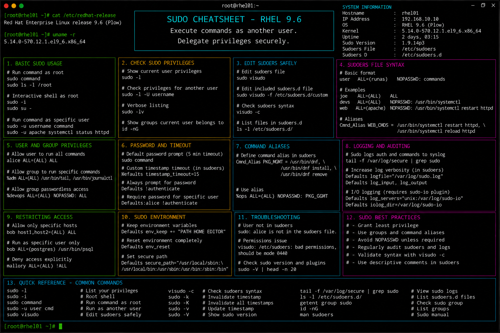

# sudo.md

# Sudo Administration Commands Cheat Sheet

## Overview

This document provides a practical enterprise Linux administration cheat sheet for sudo privilege delegation, administrative access control, command authorization, audit validation, and troubleshooting operations on Red Hat Enterprise Linux (RHEL) 9.6 systems.

The commands and workflows included are commonly used during enterprise access management, privileged operations, security hardening, compliance auditing, and infrastructure administration activities.

This reference is designed for fast operational lookup during production Linux administration tasks.

---

## Environment Information

| Component | Details |
|---|---|
| Operating System | RHEL 9.6 |
| Hostname | rhel01.lab.local |
| Privilege Management | sudo |
| Sudoers File | /etc/sudoers |
| SELinux Mode | Enforcing |
| User Context | root / sudo administrator |
| Lab Platform | VMware Enterprise Lab |

---

## Common Commands

### Execute Command as Root

```bash
sudo dnf update
```

### Open Root Shell

```bash
sudo -i
```

### Execute Command as Another User

```bash
sudo -u apache whoami
```

### Display Allowed Sudo Commands

```bash
sudo -l
```

### Edit Sudoers Configuration Safely

```bash
visudo
```

### Add User to Wheel Group

```bash
usermod -aG wheel devopsuser
```

### Verify User Group Membership

```bash
id devopsuser
```

### Display Current User Identity

```bash
whoami
```

### Validate Sudo Configuration Syntax

```bash
visudo -c
```

### Review Authentication Logs

```bash
journalctl -u sshd
```

### Display Sudo Logs

```bash
journalctl | grep sudo
```

### Lock Root Account

```bash
passwd -l root
```

---

## Administrative Examples

### Grant Full Administrative Access

Edit sudoers configuration:

```bash
visudo
```

Example configuration:

```sudoers
%wheel ALL=(ALL) ALL
```

### Grant Passwordless Sudo Access

```sudoers
backupadmin ALL=(ALL) NOPASSWD: ALL
```

### Restrict User to Specific Commands

```sudoers
devopsuser ALL=(ALL) /usr/bin/systemctl, /usr/bin/journalctl
```

### Add User to Administrative Group

```bash
usermod -aG wheel devopsuser
```

### Verify User Sudo Permissions

```bash
sudo -l -U devopsuser
```

### Validate Sudoers Syntax

```bash
visudo -c
```

### Review Privileged Command Usage

```bash
journalctl | grep sudo
```

---

## Validation Commands

### Verify Wheel Group Membership

```bash
id devopsuser
```

Example output:

```text
uid=1001(devopsuser) gid=1001(devopsuser) groups=1001(devopsuser),10(wheel)
```

### Validate Sudo Access

```bash
sudo -l
```

### Verify Sudoers Syntax

```bash
visudo -c
```

### Review Sudo Logs

```bash
journalctl | grep sudo
```

### Verify Authentication Attempts

```bash
journalctl -u sshd
```

### Validate SELinux Contexts

```bash
ls -Z /etc/sudoers
```

### Display Current User Privileges

```bash
whoami
```

### Verify Group Memberships

```bash
groups devopsuser
```

---

## Troubleshooting Tips

### User Cannot Run sudo

Verify wheel group membership:

```bash
id devopsuser
```

Verify sudoers configuration:

```bash
visudo -c
```

### Incorrect Sudoers Syntax

Always use:

```bash
visudo
```

Validate configuration:

```bash
visudo -c
```

### Password Authentication Failures

Verify user account status:

```bash
passwd -S devopsuser
```

Review authentication logs:

```bash
journalctl -u sshd
```

### SELinux Restricting Access

Review SELinux denials:

```bash
ausearch -m avc -ts recent
```

Restore file contexts:

```bash
restorecon -Rv /etc/sudoers
```

### User Permissions Not Applied

Force new login session:

```bash
su - devopsuser
```

### Excessive Privilege Assignment

Review sudo privileges:

```bash
sudo -l -U devopsuser
```

---

## Operational Notes

- Follow least-privilege principles for all enterprise administrative access.
- Use wheel group membership for centralized sudo delegation.
- Validate sudoers syntax before saving production changes.
- Monitor sudo usage during security audits.
- Restrict passwordless sudo usage to operationally required cases.
- Maintain proper documentation for privileged account access.
- Review authentication and sudo logs regularly.

Example operational audit commands:

```bash
sudo -l
journalctl | grep sudo
getent group wheel
```

---

## Screenshot Reference




