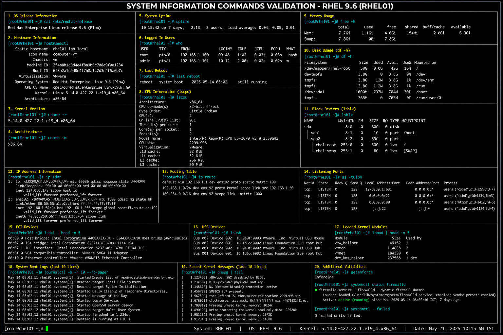

# System Information Commands Cheat Sheet

## Overview

This cheat sheet contains commonly used system information commands for RHEL 9.6 enterprise Linux administration and operational troubleshooting.

These commands help administrators:

- identify system hardware
- verify operating system details
- monitor uptime
- validate kernel information
- review CPU and memory usage
- troubleshoot infrastructure issues

---

# Environment Information

| Component | Value |
|---|---|
| Operating System | RHEL 9.6 |
| Kernel Series | 5.14.x |
| Shell | Bash |
| Architecture | x86_64 |

---

# Operating System Information

## Display OS Release Information

```bash
cat /etc/redhat-release
```

## Display Hostname Information

```bash
hostnamectl
```

## Verify Kernel Version

```bash
uname -r
```

## Verify System Architecture

```bash
uname -m
```

---

# System Uptime And Load

## Display System Uptime

```bash
uptime
```

## Display Current Logged-In Users

```bash
who
```

## Display Last Reboot Information

```bash
last reboot
```

---

# CPU Information

## Display CPU Information

```bash
lscpu
```

## Display Processor Details

```bash
cat /proc/cpuinfo
```

## Display CPU Usage

```bash
top
```

---

# Memory Information

## Display Memory Usage

```bash
free -h
```

## Display Detailed Memory Information

```bash
cat /proc/meminfo
```

---

# Disk Information

## Display Mounted Filesystems

```bash
df -h
```

## Display Block Devices

```bash
lsblk
```

## Display Disk Usage

```bash
du -sh /var/log
```

---

# Network Information

## Display IP Address Information

```bash
ip addr
```

## Display Routing Table

```bash
ip route
```

## Display Listening Ports

```bash
ss -tulpn
```

---

# Hardware Information

## Display PCI Devices

```bash
lspci
```

## Display USB Devices

```bash
lsusb
```

## Display Loaded Kernel Modules

```bash
lsmod
```

---

# System Logging

## View System Boot Logs

```bash
journalctl -b
```

## View Recent System Messages

```bash
dmesg | tail
```

---

# Administrative Validation Commands

## Verify SELinux Mode

```bash
getenforce
```

## Verify Firewall Status

```bash
systemctl status firewalld
```

## Verify Running Services

```bash
systemctl list-units --type=service
```

---

# Troubleshooting Tips

| Issue | Validation Command |
|---|---|
| High CPU usage | `top` |
| Low memory | `free -h` |
| Disk full | `df -h` |
| Network issue | `ip addr` |
| Boot problems | `journalctl -b` |
| Failed services | `systemctl --failed` |

---

# Operational Notes

These commands reflect enterprise Linux operational practices commonly used in RHEL 9.6 environments.

Administrators should regularly validate:

- system uptime
- CPU utilization
- memory usage
- filesystem capacity
- network connectivity
- kernel version consistency
- active services
- system logs

System information commands are essential for infrastructure troubleshooting and operational monitoring.

---

# Screenshot Capture

| Screenshot Requirement | Filename |
|---|---|
| System information command validation | `system-info-validation.png` |

---

# Screenshot Reference


