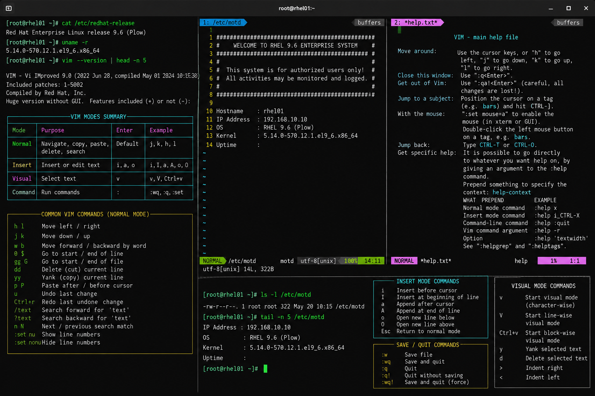

# text-editing-vim.md

# Vim Text Editing Commands Cheat Sheet

## Overview

This document provides a practical enterprise Linux administration cheat sheet for using the Vim text editor on Red Hat Enterprise Linux (RHEL) 9.6 systems. The commands and examples included are commonly used during infrastructure administration, service configuration management, troubleshooting, and operational maintenance.

The objective is to provide fast operational reference material suitable for production-style Linux administration workflows.

---

## Environment Information

| Component | Details |
|---|---|
| Operating System | RHEL 9.6 |
| Hostname | rhel01.lab.local |
| User Context | root / privileged administrator |
| Terminal | GNOME Terminal / SSH Session |
| Editor Version | Vim 9.x |
| SELinux Mode | Enforcing |
| Lab Platform | VMware Workstation Enterprise Lab |

---

## Common Commands

### Open Existing File

```bash
vim /etc/ssh/sshd_config
```

### Open New File

```bash
vim /root/application-notes.txt
```

### Enter Insert Mode

```vim
Press i
```

### Save File

```vim
:w
```

### Save and Quit

```vim
:wq
```

### Quit Without Saving

```vim
:q!
```

### Search Text

```vim
/error
```

### Search Next Result

```vim
n
```

### Delete Current Line

```vim
dd
```

### Copy Current Line

```vim
yy
```

### Paste Copied Content

```vim
p
```

### Undo Last Change

```vim
u
```

### Redo Change

```vim
Ctrl+r
```

### Display Line Numbers

```vim
:set number
```

### Exit to Command Mode

```vim
Press ESC
```

---

## Administrative Examples

### Edit SSH Daemon Configuration

```bash
vim /etc/ssh/sshd_config
```

Example operational modifications:

```ini
PermitRootLogin no
PasswordAuthentication no
ClientAliveInterval 300
```

### Edit HAProxy Backend Configuration

```bash
vim /etc/haproxy/haproxy.cfg
```

### Edit Firewalld Rich Rules Script

```bash
vim /usr/local/scripts/fw-maintenance.sh
```

### Edit Systemd Service Unit

```bash
vim /etc/systemd/system/custom-backup.service
```

### Edit Cron Job Definitions

```bash
vim /etc/crontab
```

---

## Validation Commands

### Verify Vim Installation

```bash
rpm -q vim-enhanced
```

Example output:

```text
vim-enhanced-9.0.2092-8.el9.x86_64
```

### Verify File Modifications

```bash
cat /etc/ssh/sshd_config | grep PermitRootLogin
```

### Display Modified File Timestamp

```bash
ls -l /etc/ssh/sshd_config
```

### Verify Syntax Before Service Restart

```bash
sshd -t
```

### Validate SELinux Contexts

```bash
ls -Z /etc/ssh/sshd_config
```

---

## Troubleshooting Tips

### File Opened in Read-Only Mode

Possible causes:

- insufficient privileges
- immutable file attributes
- mounted filesystem in read-only mode

Validation:

```bash
lsattr /etc/ssh/sshd_config
mount | grep ' / '
```

### Swap File Warning

Vim may display swap recovery warnings after unexpected session termination.

Recovery options:

```bash
vim -r /etc/ssh/sshd_config
```

Remove stale swap file:

```bash
rm -f /etc/ssh/.sshd_config.swp
```

### Syntax Errors After Configuration Edits

Always validate configuration syntax before restarting production services.

Examples:

```bash
sshd -t
haproxy -c -f /etc/haproxy/haproxy.cfg
```

### SELinux Context Issues

If configuration files are restored from backup or copied manually:

```bash
restorecon -Rv /etc/ssh
```

---

## Operational Notes

- Always create configuration backups before editing production service files.
- Validate syntax before restarting critical infrastructure services.
- Use Vim search functionality for faster log analysis and configuration review.
- Enable line numbering during troubleshooting sessions for easier collaboration.
- Maintain configuration consistency across enterprise Linux nodes.
- Use version control systems where operationally applicable.

Example backup workflow:

```bash
cp /etc/ssh/sshd_config /etc/ssh/sshd_config.bak
```

---

## Screenshot Capture

Recommended screenshot content:

- editing `/etc/ssh/sshd_config`
- line numbering enabled
- SSH hardening directives
- Vim command mode examples
- SELinux validation commands
- successful syntax validation output
- enterprise RHEL shell prompt
- operational workflow visibility

Example commands shown in screenshot:

```bash
vim /etc/ssh/sshd_config
:set number
sshd -t
ls -Z /etc/ssh/sshd_config
```

---

## Screenshot Reference



